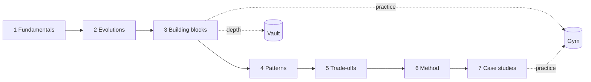

# learn system design

> *Architecture is judgment under constraints. Components are just how the judgment shows up.*

A course-first rebuild of the hld-architect-copilot: a path through 67 short chapters, each with a simulator you can run, backed by a 265-note vault and a practice gym. Nothing here is a memorised diagram. Every chapter shows what breaks and what you give up to fix it.

## The architect's loop

Every chapter walks the same four beats, in its README and in its simulator's frames:

**constraints → component → failure → trade-off**

Start from what the system must survive, add the one component that answers it, watch it fail, then price what the fix costs.

## The 7 tracks

| # | Track | Motto |
|---|---|---|
| 1 | Fundamentals (f01-f08) | The bedrock: what a system is, how it talks, and how to measure it |
| 2 | Evolutions (e01-e04) | Watch one system grow, one bottleneck at a time |
| 3 | Building blocks (b01-b12) | The parts you combine to build any system |
| 4 | Patterns (p01-p19) | Reusable answers to problems distributed systems keep having |
| 5 | Trade-offs (t01-t07) | Every choice gives something up; price it before you pick |
| 6 | Method (m01-m06) | How to think, estimate and decide like an architect |
| 7 | Case studies (c01-c11) | Put the whole loop to work on a real system |



## Quick start

Needs Node 22+.

```bash
npm install
npm run dev          # the site, at the URL Vite prints
node course/3_building_blocks/b04_caching/sim.mjs --readRps=40000   # run one simulator in the terminal
npm test             # contract tests for every chapter
```

Every `sim.mjs` runs alone with `node`, and the same file runs live in the browser on the Simulate tab. The live site link is pending: the repo is private for now, so GitHub Pages is not enabled yet.

## What happened to the old app

The original 13-tab app stays live. Its tabs (Today, Skills, Drill, Bug Finder, Outage, Failure, Capacity, Library, Vocabulary, Workspaces, Review, Proposal, Notes) moved here:

| Old tab | Now |
|---|---|
| (Level picker and 14-lesson starter path, not a tab) | The chapters, `#/tracks` and `#/timeline` |
| Today | `#/practice/today` |
| Skills | `#/practice/skills` |
| Drill (including its napkin-math quiz) | `#/practice/drill`, `#/practice/napkin` |
| Bug Finder | `#/practice/bugs` |
| Outage | `#/practice/outage` |
| Failure | `#/practice/failure` |
| Capacity | `#/practice/capacity` |
| Workspaces | `#/practice/workspaces` |
| Review (the Review Queue was reached from Today) | `#/practice/review`, `#/practice/review-queue` |
| Proposal | `#/practice/proposal` |
| Notes | `#/practice/notes` |
| Vocabulary | `#/practice/vocab` |
| Library | `#/library` |

## Layout

- `course/`: the chapters. Each is a folder with `README.md`, `sim.mjs` and `meta.json`.
- `vault/`: the source notes, one click from any chapter in the Library.
- `web/`: the site. It only renders what `course/` and `vault/` contain.
- `docs/`: the plan and task board.

See [CONTRIBUTING.md](CONTRIBUTING.md) to add a chapter.
