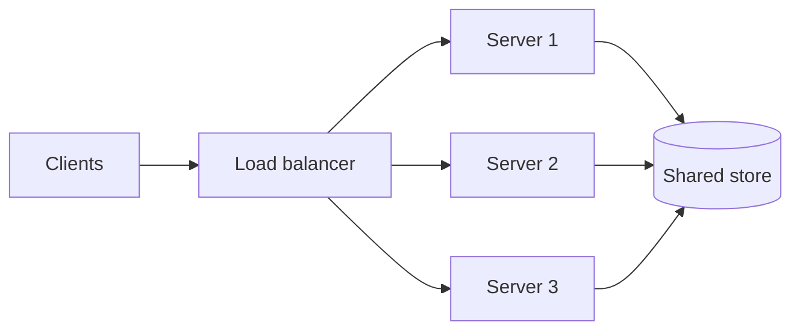

# f01: Client-Server — Clients ask, servers answer, and the state has to live somewhere

Fundamentals · **f01** → f02

> *"Make servers forgettable, so any one of them can fail"*
>
> **Concern**: scalability · availability

## The Problem

Your app has 10,000 active users, each making about six requests a minute. That is 1,000 requests a second. One server handles 400, so it runs at 250% utilization and most requests time out.

You add servers, and a new problem appears. A user logs in on server 1. Their next request lands on server 3, which has never heard of them. Where does the login session live?

## The Idea

Think of a restaurant. You (the **client**) sit at a table and ask for food. The kitchen (the **server**) prepares it and sends it back. You do not need to know how to cook, only how to order. The waiter is the protocol (HTTP) and the menu is the API.

Why not let every user talk to every other user directly? It works for 10 users. At 10,000 nobody can find anyone, data drifts out of sync, and there is no central authority to enforce rules or check who you are. A server gives you one place that coordinates, enforces policy and holds the source of truth.

This course uses one loop for every chapter, and the player above steps through it:

1. **Constraints**: state the requirement and the numbers.
2. **Component**: add the building block that helps.
3. **Failure**: break it and see what happens.
4. **Trade-off**: name what the fix cost.



## How It Works

1. **A client sends a request and the server returns a response.** The client and server agree on a protocol such as HTTP, and the API is the menu of what can be asked.
2. **A stateless server remembers nothing between requests.** Each request carries what the server needs, such as an auth token, so any server can answer it.
3. **A stateful server remembers the session in its own memory.** That is faster per request, but the same user must keep returning to the same server.
4. **Load is users times requests per minute divided by 60, and capacity is servers times what one server handles.** Compare them at each step:

```js
// sim.mjs
  const alone = measure(load, 1, serverRps);
  const spread = measure(load, servers, serverRps);
  const crashed = measure(load, servers - 1, serverRps, { sessionsLostPct: 100 / servers });
  const shared = measure(load, servers - 1, serverRps, { extraLatencyMs: storeMs });
```

With four servers utilization falls from 250% to 62.5%. That is the component step.

## When It Breaks

A stateful server crashes and takes its users' sessions with it. With four servers, 25% of users are logged out at once. The three survivors also have to absorb its traffic, so they jump from 62.5% to 83.3% utilization. If you had sized the fleet for exactly the load, they would now be overloaded, which is why teams plan for N+1: one more server than the load needs.

## The Trade-off

Move the session out of the server into a shared store, and the server becomes forgettable. A crash loses no sessions and any server can serve any user. The price is a store lookup on every request (2 ms in the sim), a larger request that carries a token, and one more system that must stay up.

| | Stateless | Stateful |
|---|---|---|
| Where state lives | Client or a shared store | Server memory |
| Scaling | Any server can take any request | Needs sticky sessions |
| A server crash | Nothing is lost | Its sessions are lost |
| Cost | Store lookup and a bigger request | Harder to scale and to fail over |

## In The Wild

Real-time messaging apps such as WhatsApp hold a long-lived connection to each phone, so they are stateful by nature and are built to reconnect quickly. Search front ends are the opposite: stateless, so any machine in a huge fleet can answer any query.

## Try It

```sh
node course/1_fundamentals/f01_client_server/sim.mjs --servers=6
```

You should see four frames. The second reports `utilizationPct=41.7` for six servers, and the failure frame reports `sessionsLostPct=16.7`, because each server holds a sixth of the sessions. Try `--servers=2` to see a crash overload the lone survivor.

## Say It In The Interview

1. Define the model: clients request, servers respond, over a protocol such as HTTP.
2. Prefer stateless services and keep state in a shared store, so you can scale out and survive a crash.
3. Size for failure: plan N+1 capacity so losing a server does not overload the rest.
4. Name the trade-off of each choice, such as the extra lookup for stateless or sticky sessions for stateful.

## Boundary

This chapter covers who holds state and how a fleet shares load. How a load balancer picks a server is b01, and how to grow past one machine is f05.

## What's Next

Every request in this chapter crossed a network. What does that trip cost? That is f02, Networking.

## Source notes

- [Client-server architecture](../../../vault/system_design/01_fundamentals/client_server_architecture.md)
