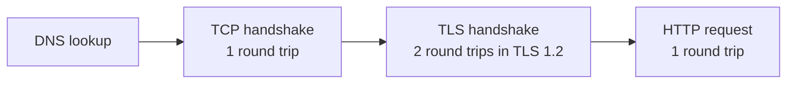

# f02: Networking — A request is a stack of round trips, and each one costs time

Fundamentals · f01 → **f02** → f03

> *"Count the round trips"*
>
> **Concern**: latency · availability

## The Problem

Your app works perfectly on localhost. You deploy it and users see "Connection timeout". The server is running and the code is fine. The trouble is somewhere on the path between them: a firewall blocks the port, DNS does not resolve, or the load balancer is not set up.

And when it does work, it can still be slow. A page with 30 resources, opened over the old HTTP/1.0, takes a full second at 50 ms per round trip, because every resource pays for its own handshake before it sends a byte.

## The Idea

Sending a letter takes an envelope (a packet), an address (an IP), a choice between registered mail and a postcard (TCP or UDP), and a route through sorting centers (routers).

A web request adds a few steps before the request itself, and each step is a round trip that costs the full network delay:



**TCP** guarantees delivery and order, at the cost of setup and retransmission. **UDP** skips the guarantees and is faster to start, and it is what HTTP/3's QUIC transport is built on.

## How It Works

1. **DNS turns a name into an IP address.** The answer is cached for its TTL, so most lookups never leave your machine.
2. **A new connection needs a TCP handshake (1 round trip) and a TLS handshake (2 in TLS 1.2)** before the first request can be sent.
3. **HTTP/1.0 opened a new connection for every resource.** A browser runs six at a time, so 30 resources make five waves of handshake plus request, 20 round trips:

```js
// sim.mjs
  const waves = Math.ceil(resources / PARALLEL);
  const http1 = result(waves * (TCP_SETUP + TLS_SETUP + 1), 0, rttMs);
```

4. **HTTP/2 multiplexes every request over one connection.** It pays the setup once: 4 round trips, 200 ms.
5. **HTTP/3 replaces TCP with QUIC** and needs one round trip to set up.

## When It Breaks

Over TCP, a lost packet blocks every stream on the connection until it is retransmitted (head-of-line blocking). At 2% packet loss, the 30-resource page expects about six stalls of one round trip each. That adds 300 ms and takes HTTP/2 from 200 ms to 500 ms:

```js
// sim.mjs
  const http2Lossy = result(TCP_SETUP + TLS_SETUP + 1, loss * resources * PACKETS_PER_RESOURCE, rttMs);
```

DNS is its own single point of failure. In 2016 an attack on the DNS provider Dyn made major sites unreachable even though their servers were healthy. In 2021 Facebook's own DNS servers became unreachable after a routing change, and the site vanished for hours.

## The Trade-off

HTTP/3 takes the same page to 110 ms: one round trip to set up, and loss only stalls the affected stream. The cost is the tail. About 5% of networks block UDP, and those users wait 300 ms before falling back, so their worst case is 800 ms, worse than staying on HTTP/2. You also give up years of tooling built around TCP.

## In The Wild

Content delivery networks such as Cloudflare exist largely to shorten this path: they answer DNS near you and terminate the connection at an edge close to you, so the expensive round trips are short ones.

## Try It

```sh
node course/1_fundamentals/f02_networking/sim.mjs --rttMs=150
```

You should see four frames. The first reports `pageLoadMs=3000` for HTTP/1.0 at 150 ms per round trip, and the HTTP/2 frame reports `pageLoadMs=600`. Try `--lossPct=0` to remove the stalls, or `--udpBlockedPct=30` to see the cost of the HTTP/3 fallback.

## Say It In The Interview

1. Walk the path of a request: DNS, then TCP, then TLS, then HTTP. Say where each round trip goes.
2. Explain TCP versus UDP: reliable and ordered against fast and lossy.
3. Explain why HTTP/2 helps (multiplexing on one connection) and what HTTP/3 fixes (head-of-line blocking at the transport).
4. Mention keep-alive and connection reuse: latency is mostly round trips, not bandwidth.

## Boundary

This chapter counts round trips and shows how protocol versions cut them. Distributing traffic across servers is b01, and moving content closer to users is b06.

## What's Next

Once requests reach your server, what should the interface look like? That is f03, API Design.

## Source notes

- [Networking basics](../../../vault/system_design/01_fundamentals/networking_basics.md)
