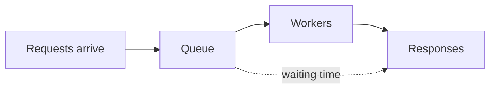

# f04: Latency & Throughput — Latency is what one request feels; throughput is what the system sustains

Fundamentals · f03 → **f04** → f05

> *"Waiting time explodes long before capacity runs out"*
>
> **Concern**: latency · scalability

## The Problem

Your API does 10 ms of work per request, and ten workers serve it. That is a capacity of 1,000 requests a second, and at 800 a second everything looks healthy: about 50 ms per request.

Then a sale triples traffic to 2,400 requests a second. Capacity is still 1,000. The queue never drains, and roughly 1,400 requests a second time out. Nothing crashed and the code did not change. You optimized how fast one request runs, not how many the system can absorb.

## The Idea

Think of a highway. **Latency** is how long one car takes to get from A to B. **Throughput** is how many cars pass a checkpoint per hour. A sports car on a one-lane road has low latency and low throughput. Eight lanes with traffic have higher latency per car and far more throughput.

Requests wait in a queue before a worker picks them up, so latency is waiting time plus work time:



The fuller the workers, the longer the queue. That is why the two metrics are linked even though they measure different things.

## How It Works

1. **Capacity** is what the workers can finish per second: workers times one second divided by the work per request.
2. **Utilization** is arrivals divided by capacity. Average time in the system is the work time divided by the spare fraction, so it explodes as utilization nears 1.
3. **Timeouts** cap the damage: once utilization reaches 100%, the queue grows without bound and clients give up.

```js
// sim.mjs
function measure(arrival, serviceMs, workers, extraMs = 0) {
  const capacity = (workers * 1000) / serviceMs;
  const utilization = arrival / capacity;
  const avg = utilization >= 1 ? TIMEOUT_MS : Math.min(serviceMs / (1 - utilization) + extraMs, TIMEOUT_MS);
  const throughput = Math.min(arrival, capacity);
```

Two more facts fall out of the same queue. First, watch the **tail**, not the average. With this queue the p99 is about 4.6 times the average, so a healthy-looking 50 ms average hides 1% of users waiting over 230 ms. Second, **Little's Law** ties the metrics together: requests in flight equal throughput times latency.

```js
// sim.mjs
    p99LatencyMs: round1(Math.min(avg * P99_FACTOR, TIMEOUT_MS)),
    throughputRps: round1(throughput),
    inFlight: round1((throughput * avg) / 1000), // Little's Law: L = throughput x latency
```

At 800 requests a second and 50 ms each, that is 40 requests in flight. If a server holds 100 concurrent requests, one server is enough for now, and you still want a second for redundancy.

## When It Breaks

The cliff is steep. At 80% utilization the average is 50 ms. At 95% it is 200 ms and the p99 passes 900 ms. At 100% the queue never empties and clients see timeouts.

The classic mistake is optimizing the wrong metric: a 5 ms endpoint that can only serve 100 requests a second looks great in a benchmark and collapses on launch day.

## The Trade-off

Some optimizations help both metrics, like caching and indexes. Others trade one for the other. **Batching** makes each request cheaper to serve, so capacity rises, but each request now waits for its batch to fill:

```js
// sim.mjs
  const offPeak = arrivalRate / 8;
  const fillMs = ((batchSize - 1) / (2 * offPeak)) * 1000;
  const factor = batchSize > 1 ? BATCH_SAVING : 1;
```

With batches of 20, capacity goes from 1,000 to about 1,667 requests a second. At quiet-hour traffic each request waits 95 ms for its batch to fill, so an 11 ms average becomes 101 ms. Pick the metric your users feel.

## In The Wild

Latency has a price. Figures like "100 ms more latency costs about 1% of revenue" are quoted widely, so treat them as folklore rather than measurement. What is not folklore: teams alert on p99 latency, not the average, and track saturation (pool usage, CPU) because latency spikes right before capacity runs out.

## Try It

```sh
node course/1_fundamentals/f04_latency_throughput/sim.mjs --arrivalRate=950
```

You should see four frames. The first reports `utilizationPct=95  avgLatencyMs=200  p99LatencyMs=921`. The failure frame reports `droppedRps=1850` because triple traffic is 2,850 requests a second against a capacity of 1,000. Try `--workers=20` to see how much headroom removes the cliff.

## Say It In The Interview

1. Define both: latency is time for one request, throughput is requests per second, and you can have one without the other.
2. Quote percentiles (p50, p95, p99), not averages, and say why: one slow request hides in an average.
3. Use Little's Law for sizing: 1,000 requests a second at 200 ms means 200 in flight, so plan servers with headroom.
4. Name the trade-off: batching raises throughput and adds latency.

## Boundary

This chapter defines the two metrics and shows how they interact. Choosing between them as a design decision belongs to t02.

## What's Next

If waiting time depends on spare capacity, how do you add capacity without redesigning the whole system? That is f05, Scalability.

## Source notes

- [Latency and throughput](../../../vault/system_design/01_fundamentals/latency_and_throughput.md)
