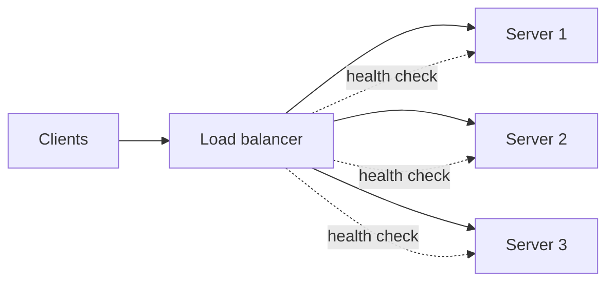

# b01: Load Balancers — A load balancer is only as good as its idea of which servers are alive

Building blocks · e04 → **b01** → b02

> *"Spread the traffic, and stop sending it to the dead"*
>
> **Concern**: availability · scalability

## The Problem

Your shop has four servers, but DNS points at only one of them. Black Friday hits with 1,200 requests a second. That one server handles 500, so it runs at 240% and 700 requests a second fail, while the other three sit idle. Then it crashes and every user is down.

Adding a load balancer fixes that. But the next failure is quieter: one server dies, and the balancer keeps sending it a quarter of the traffic.

## The Idea

A load balancer is a restaurant host seating guests at open tables. Instead of everyone crowding one table, the host distributes guests evenly and checks which tables are actually in service.

It sits in front of a pool of servers and does two jobs: **choose** a server for each request, and **know** which servers can take it.



## How It Works

1. **Layer 4 or layer 7.** A layer 4 balancer routes by IP and port and is very fast. A layer 7 balancer reads the HTTP request, so it can route by path or header, terminate TLS and stick a session to a server, at some extra cost.
2. **Pick a server by an algorithm.** The vault note's table:

| Algorithm | How it works | Best for |
|---|---|---|
| Round robin | S1, S2, S3, then S1 again | Equal servers, stateless requests |
| Weighted round robin | More requests to bigger servers | A mixed fleet |
| Least connections | The server with the fewest active connections | Long-lived connections, WebSockets |
| IP hash | Hash of the client IP picks the server | Session affinity, cache locality |
| Consistent hashing | Few requests move when a server is added or removed | Cache layers |

3. **Check health.** The balancer probes each server and stops routing to one that fails.
4. **Round robin gives four servers a quarter each**, so 1,200 requests a second becomes 300 each, 60% utilization.

## When It Breaks

A server dies and nobody notices. Round robin still sends it a quarter of the traffic, and all of it fails:

```js
// sim.mjs
  const deadShare = loadRps / servers;
  const blind = outcome({ busiest: share / serverRps, failedPerSec: deadShare, incidentFailures: deadShare * HUMAN_NOTICE_SEC, active: servers });
```

That is 300 failed requests a second, about 90,000 before a person notices five minutes later.

The vault note lists the common pitfalls: the balancer itself as a single point of failure, sticky sessions without shared state, weak health checks, the wrong algorithm for the workload, no connection draining on deploys, and TLS overhead.

## The Trade-off

Health checks cap the damage. A check every 10 seconds that must fail 3 times removes the server after 30 seconds:

```js
// sim.mjs
  const detectionSec = checkIntervalSec * failuresToRemove;
```

That still loses 9,000 requests, and the three survivors now run at 80%. Faster or fewer-strike checks lose fewer requests but risk pulling a healthy server out on a network blip, which shifts its load onto the others. Make the health check test something real (a dependency, not just "the port is open"), and drain connections before removing a server on purpose.

## In The Wild

The balancer must not become the single point of failure it was hired to remove, so production runs it as a redundant pair or a managed service. Cloud balancers such as AWS's ALB handle millions of requests a second, and the same idea appears inside service meshes and API gateways.

## Try It

```sh
node course/3_building_blocks/b01_load_balancers/sim.mjs --checkIntervalSec=5
```

You should see four frames. With a 5-second check the last frame reports `incidentFailures=4500  activeServers=3`, half the failures of the default 10-second check. Try `--servers=3` to see the survivors run out of headroom.

## Say It In The Interview

1. State what a load balancer does: distributes traffic, checks health and removes failed servers.
2. Choose an algorithm for the workload: round robin for equal stateless servers, least connections for long-lived ones.
3. Prefer stateless servers, and mention that sticky sessions only paper over shared state.
4. Cover the balancer's own failure: run it redundantly, and drain connections during deploys.

## Boundary

This chapter covers spreading traffic and detecting failure. The gateway that adds authentication and rate limiting is b08, and finding servers dynamically is b11.

## What's Next

Servers are stateless; the data behind them is not. The most common home for it is a relational database: b02.

## Source notes

- [Load balancers](../../../vault/system_design/02_building_blocks/load_balancers.md)
