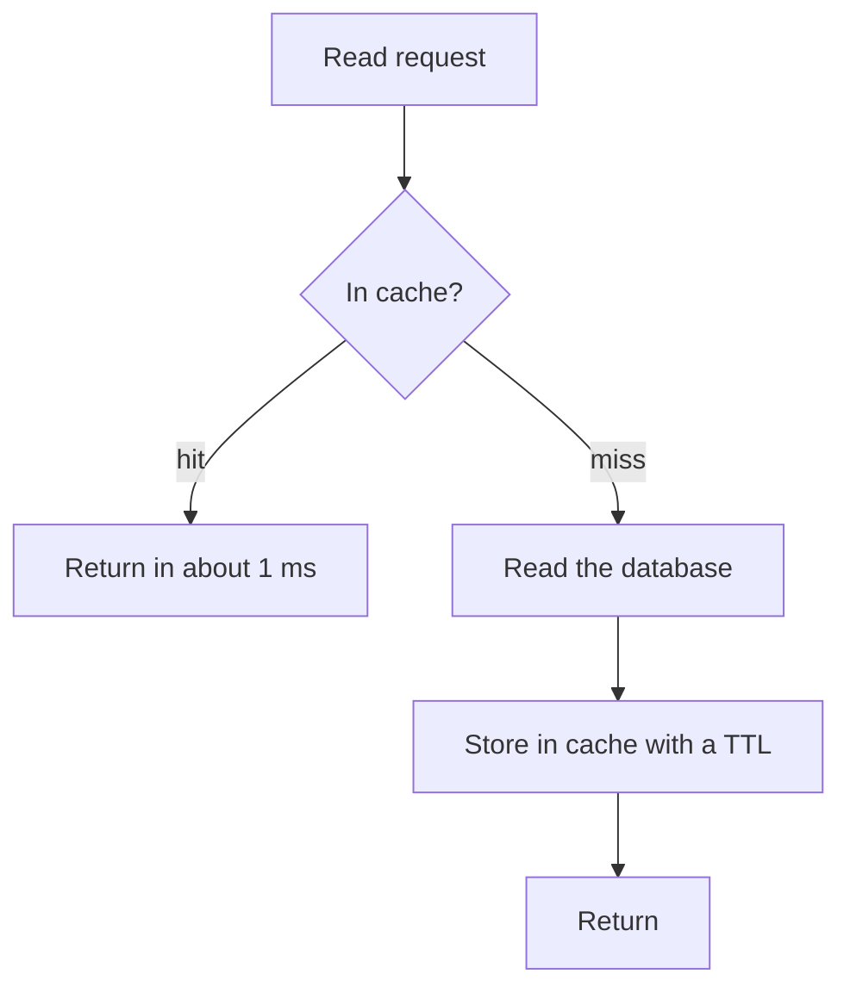

# b04: Caching — A cache is a bet that reads repeat

Building blocks · b03 → **b04** → b05

> *"A cache is a bet on repetition"*
>
> **Concern**: latency · scalability

## The Problem

Your product page does 20,000 reads a second. Your database handles 5,000. Every page load runs several queries, every query goes to the database, and the database drowns: 15,000 reads a second have nowhere to go and time out.

The data is not changing that fast. The same popular products are being read again and again, and you are paying the database price every time.

## The Idea

You look up a phone number in a phone book, which is slow. You write it on a sticky note on your desk, which is fast. Next time you check the sticky note first. That sticky note is a cache.

A cache is a small, fast store in front of a slow one. It works only if reads repeat, which is why it is a bet: when the bet pays off most reads never reach the database.



This pattern is called **cache-aside**: the application checks the cache, and on a miss it loads from the database and fills the cache itself. It is the most common strategy.

## How It Works

1. **A read checks the cache.** A hit returns in about 1 ms. A miss reads the database (about 6 ms when it is idle) and stores the result with a **TTL**, a time after which the entry expires.
2. **The hit rate depends on repetition.** If a key is read about once every 20 seconds and its TTL is 120 seconds, only the first read after expiry misses. Averaged over a key's TTL window, that gives a hit rate of `r*T / (1 + r*T)`:

```js
// sim.mjs
const hitRate = (keyRate, ttlSeconds) => (keyRate * ttlSeconds) / (1 + keyRate * ttlSeconds);
```

3. **The database only sees misses.** With 20,000 reads a second and an 85.7% hit rate, the database takes about 2,857 reads a second, well inside its 5,000 capacity.
4. **Latency is a mix.** Hits are 1 ms, misses queue at the database. As in f04, a database near capacity gets slow, so the average depends on how much load the misses leave behind:

```js
// sim.mjs
  const dbRps = readRps * (1 - hit);
  const utilization = dbRps / dbCapacity;
  // A loaded database queues (see f04): read time grows as utilization nears 1.
  const dbMs = utilization >= 1 ? TIMEOUT_MS : Math.min(DB_MS / (1 - utilization), TIMEOUT_MS);
```

With the defaults the average read takes about 2.9 ms instead of timing out.

## When It Breaks

The worst day for a cache is the day it is empty. After a restart, every read is a miss, and the database takes the full 20,000 reads a second again: utilization 400%, 15,000 reads a second dropped. The same happens to a single hot key: when it expires, thousands of readers miss at once and hit the database for the same row. This is a **cache stampede**.

Three standard fixes, in the order most teams reach for them:

- **Stale-while-revalidate**: serve the expired value while one background refresh runs. Nobody waits. This is a good default for user-facing reads.
- **Lock (single flight)**: the first miss takes a lock and refills the cache, and everyone else waits for the fill.
- **Probabilistic early refresh**: refresh a key a little before its TTL ends, with the odds rising near expiry, so refreshes spread out.

Also plan for a cold start: warm the cache before sending it traffic.

## The Trade-off

TTL is the dial. A longer TTL means a higher hit rate and less database load, but stale data. Raising the TTL from 120 to 600 seconds lifts the hit rate from 85.7% to 96.8% and cuts database load from 2,857 to 645 reads a second, but a cached value can now be 10 minutes out of date.

The other choice is how writes reach the cache:

| Strategy | How it works | Good when |
|---|---|---|
| Cache-aside | App reads cache, then database on a miss | General purpose, the usual default |
| Write-through | Writes go to the cache and database together | Reads must never be stale |
| Write-back | Write to cache, flush to database later | Very high write rates; risks data loss if the cache dies |
| Write-around | Write to the database only; the cache fills on read | Data is written a lot and rarely re-read |

## In The Wild

Facebook's TAO caches the social graph in front of sharded MySQL, and the vault note reports hit ratios above 99%. At 99.8% only 1 read in 500 reaches the database.

The cache tier is also a single point of failure. In the 2021 Fastly outage a valid customer configuration triggered a latent bug in the edge software, and most edge locations returned errors. Sites that depended on the CDN went dark with their own servers healthy.

## Try It

```sh
node course/3_building_blocks/b04_caching/sim.mjs --ttlSeconds=300
```

You should see four frames. The second reports `hitRatePct=93.8  dbLoadRps=1250` for a 300 second TTL, and the failure frame reports `dbLoadRps=20000  droppedRps=15000` because the cold cache sends everything to the database. Try `--keyRate=0.01` to see what happens when reads rarely repeat.

## Say It In The Interview

1. Define cache-aside in one breath: check the cache, on a miss load from the database and store it with a TTL.
2. Name the cost: staleness, and a cold cache that sends full load to the database.
3. Prevent stampedes: stale-while-revalidate, a lock, or early refresh.
4. Ask about the hit rate you would need, and whether the workload repeats enough for a cache to pay off.

## Boundary

This chapter covers a cache in front of a database and how TTL trades freshness for load. Invalidating entries when data changes is a harder problem, and choosing between caching and other ways to shed read load is covered in t05.

## What's Next

A cache helps reads, but what about work that does not need to happen right now? That is b05, Queues.

## Source notes

- [Caching](../../../vault/system_design/02_building_blocks/caching.md)
