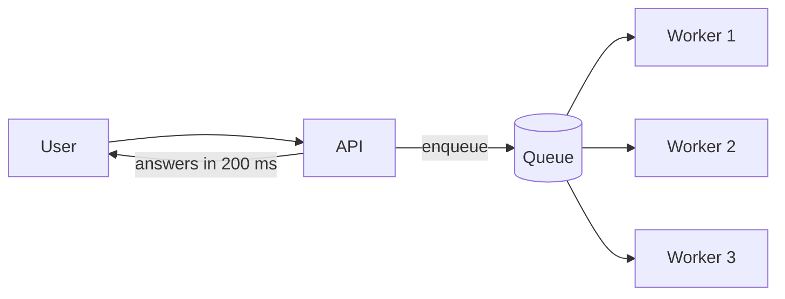

# b05: Message Queues — A queue turns "do it now" into "do it soon", and asks you to handle "twice"

Building blocks · b04 → **b05** → b06

> *"Answer fast, work later, and expect duplicates"*
>
> **Concern**: latency · scalability

## The Problem

A user uploads a video. Your API validates it (5 s), transcodes five formats (30 s), generates thumbnails (10 s), updates the database and sends a notification, all before it answers. The user stares at a spinner for 45 seconds, and if transcoding fails the whole request fails.

Slow work is holding up a fast answer, and one step failing takes everything with it.

## The Idea

A restaurant waiter writes orders on slips and puts them on a rail. The kitchen picks them up one at a time. If the kitchen is slow, orders pile up on the rail instead of the waiter standing at the pass. That rail is a **queue**.

A **producer** puts a message on it (here, "transcode this video") and a **consumer** takes it off and does the work. The producer does not wait, and the two sides do not need to be up or fast at the same moment. A **consumer group** shares the work between many workers, and each message goes to one of them.



## How It Works

1. **The API enqueues and answers.** The user gets a response in about 200 ms instead of 45 seconds.
2. **Workers process in parallel.** 1,200 workers with a 45-second job finish 26.7 jobs a second, against 20 arriving, so the queue stays empty:

```js
// sim.mjs
  const capacity = workers / jobSec; // jobs the workers finish per second
```

3. **The queue absorbs bursts** by holding work until workers catch up. It also decouples the two sides, so a failing consumer does not fail the request.
4. **Delivery guarantees** decide what happens when a worker crashes mid-job:

| Guarantee | Meaning | Trade-off |
|---|---|---|
| At-most-once | Delivered 0 or 1 times | Fast, but may lose messages |
| At-least-once | Delivered 1 or more times, retried on failure | No loss, but duplicates |
| Exactly-once | Delivered once | Hardest and slowest to achieve |

## When It Breaks

A queue hides overload; it does not remove it. A 5x spike for 2 minutes brings 100 jobs a second against 26.7 finishing. The backlog grows by about 73 jobs a second:

```js
// sim.mjs
  const spikeRate = uploadsPerSec * spikeMultiplier;
  const backlog = Math.max(0, (spikeRate - capacity) * spikeSec);
```

That is 8,800 jobs waiting, and the last one waits 330 seconds. Users still get an instant answer, but the work is late. Watch queue depth and consumer lag, add workers when the backlog grows, and shed or delay low-priority work. A message that always crashes its consumer (a poison message) needs a retry limit and a dead-letter queue, or it blocks everything behind it.

## The Trade-off

The industry default is **at-least-once delivery with idempotent consumers**. If a worker crashes after doing the work but before acknowledging, the job is redelivered. At 2% crashes and 20 uploads a second that is about 1,440 duplicates an hour. At-most-once would lose those 1,440 jobs instead. Duplicates are recoverable if processing the same message twice is safe (p11), and lost jobs are not.

Choosing a broker is a trade-off too. The vault note compares Kafka (a distributed log: millions of messages a second, replayable, more to operate), RabbitMQ (a broker with rich routing) and SQS (a managed queue with almost no operations work and lower throughput).

## In The Wild

Anything slow or unreliable belongs behind a queue: video transcoding, email, payment webhooks, image resizing. The notification service in the Practice tab is a design where the queue's retry limits, dead-letter queue and lag alarms decide whether the system stays healthy.

## Try It

```sh
node course/3_building_blocks/b05_queues/sim.mjs --workers=2400
```

You should see four frames. With 2,400 workers the spike frame reports `backlogJobs=5600  waitSec=105`, down from 8,800 jobs and 330 seconds. Try `--crashPct=0` to see the duplicates disappear.

## Say It In The Interview

1. Explain why: async work keeps the request fast and isolates failures.
2. Define the vocabulary: producer, consumer, consumer group, offset, dead-letter queue.
3. State the guarantee you choose: at-least-once with idempotent consumers.
4. Discuss back pressure and monitoring: queue depth, consumer lag, and a retry limit.

## Boundary

This chapter covers a queue between two parts of a system. Making the consumer safe to repeat is p11, slowing a producer down is p14, and broadcasting one event to many consumers is p16.

## What's Next

Some content never needs to reach your servers at all. How do you serve files from near the user? That is b06, the CDN.

## Source notes

- [Message queues](../../../vault/system_design/02_building_blocks/message_queues.md)
