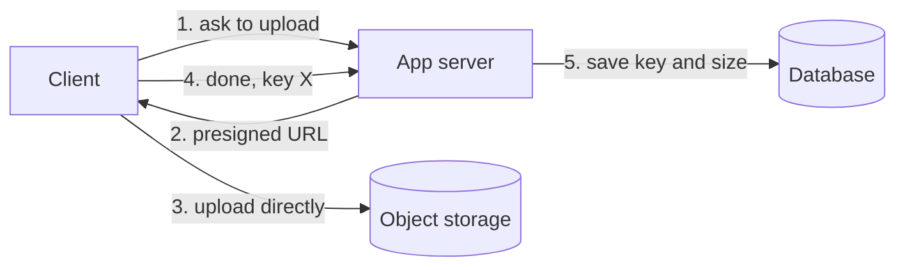

# b07: Blob Storage — Files belong in object storage, and the database keeps only the key

Building blocks · b06 → **b07** → b08

> *"Store bytes where bytes are cheap, and keep the pointer where queries are"*
>
> **Concern**: cost · scalability

## The Problem

You store user-uploaded images in your PostgreSQL database as BLOBs. At a million images the database is 500 GB, queries are slow, and a backup takes six hours. Images need no joins and no transactions. They need cheap storage and fast delivery, and you are paying database prices and database backup times for them.

Even after moving them, one more mistake is easy: routing every upload through your app servers.

## The Idea

Blob storage is a warehouse with numbered lockers. You hand it a file (a **blob**) and it gives you a locker number, the **key**. You get the file back by its key. There are no folders, only flat unique keys inside a **bucket**.

Amazon S3 and Google Cloud Storage are the common examples. The database stores the key and a little metadata, and the file itself lives in object storage:



## How It Works

1. **Object storage is built for large files.** It is cheap per gigabyte, spreads data over many machines, and promises 11 nines of durability (the chance of losing an object is tiny) with about 99.99% availability.
2. **The database holds the key.** A million images become about a gigabyte of metadata:

```js
// sim.mjs
  const totalGb = (images * imageMb) / 1000;
  const metadataGb = (images * METADATA_KB) / 1e6;
  const uploadMbps = uploadsPerSec * imageMb * 8;
```

3. **The database drops from 500 GB to 1 GB** and its backup from six hours to minutes. Storing the files costs about $12 a month.
4. **Big uploads use multipart upload**, so a failed part is retried instead of the whole file.

## When It Breaks

Object storage does not fix the path the bytes take. If clients upload through your app servers, every byte flows through them: 50 uploads a second of 0.5 MB is 200 Mbit/s, and a 10x spike is 2,000 Mbit/s. That needs two servers' network links just to carry uploads, before they do any real work. The bottleneck has moved from the database to the app tier.

## The Trade-off

**Presigned URLs** fix it. The server signs a time-limited URL and the client uploads straight to storage, so the app carries almost nothing (0 Mbit/s here). The price is a small piece of protocol: expiry, permissions, and a step where the client tells the server the upload is done.

Storage classes trade cost for retrieval speed. The note's S3 prices per GB-month: Standard $0.023, Glacier Instant Retrieval $0.004, Deep Archive $0.00099. Moving the 80% of images nobody opens to a cold tier cuts the sim's bill from $12 to $4, but reading one takes about five minutes and adds a retrieval fee. **Lifecycle policies** automate the move by age.

*Note: the sim's database storage price ($0.115 per GB-month) is an assumption for fast disk. The vault note does not give one.*

## In The Wild

The vault note follows Instagram, with over 100 petabytes of photos and videos, and Netflix, with petabytes of video. Both keep the media in object storage and put a CDN in front (b06). The database only ever holds the pointers.

## Try It

```sh
node course/3_building_blocks/b07_blob_storage/sim.mjs --images=5000000
```

You should see four frames. With five million images the first frame reports `dbSizeGb=2500  backupHours=30.1  storageCostUsd=288`, a database that takes more than a day to back up. Try `--coldPct=95` to see how much of the bill the cold tier removes.

## Say It In The Interview

1. Say files do not belong in the database: use object storage and store the key.
2. Give the upload path: a presigned URL so clients bypass the app servers.
3. Mention storage classes, lifecycle policies and 11 nines of durability.
4. Put a CDN in front for delivery.

## Boundary

This chapter covers where files live and how they get there. Delivering them close to users is b06, and searching inside them is b10.

## What's Next

Many clients now talk to many services. Where do authentication and rate limiting go? At an API gateway: b08.

## Source notes

- [Blob storage](../../../vault/system_design/02_building_blocks/blob_storage.md)
