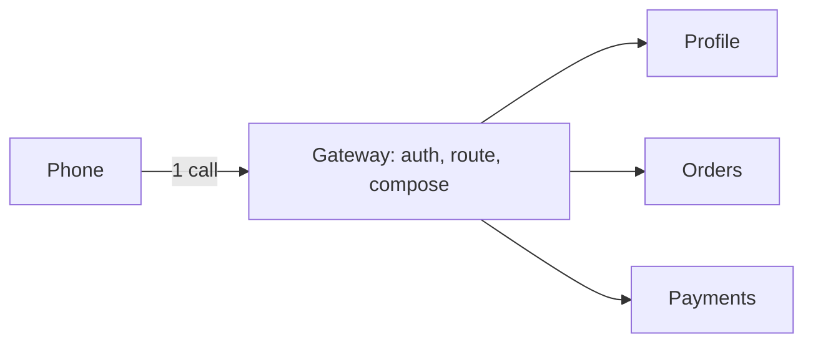

# b08: API Gateway — One front door turns eight phone calls into one, and becomes a single point of failure

Building blocks · b07 → **b08** → b09

> *"Put the cross-cutting work at one door, and then keep the door open"*
>
> **Concern**: latency · availability

## The Problem

You have 15 microservices. One mobile screen needs data from eight of them, so the app makes eight calls, each to a different service address. Each service checks the user's token on its own, and each answers in its own format. The screen takes 240 ms with an 80 ms phone round trip. Then one team moves its service to a new address, and the app breaks for every user until they update it.

## The Idea

An API gateway is the reception desk of an office building. Visitors talk to one desk. The desk checks who they are, sends them to the right floor, and can collect several answers into one. Inside the building the floors talk to each other on fast internal links.

The gateway is the single entry point. It does routing, authentication, rate limiting (b09), composition of several calls into one, and often a circuit breaker. Kong and Spring Cloud Gateway are common examples. A **backend for frontend** (BFF) is one gateway shaped for one kind of client, such as mobile.



## How It Works

1. **The phone makes one call.** It pays the phone round trip once, not once per service.
2. **The gateway checks auth once**, then passes the identity on. Services stop repeating it.
3. **The gateway fans out inside the data centre**, where a round trip costs about 2 ms, and merges the answers:

```js
// sim.mjs
  const composedMs = mobileRttMs + gatewayHopMs + AUTH_MS + INTERNAL_RTT_MS + serviceMs;
  const composed = outcome({ latencyMs: composedMs, clientCalls: 1, authChecks: 1, availability: services, blastPct: 100 / TOTAL_SERVICES });
```

4. **Services can move.** The phone knows one address; the gateway maps a route to wherever the service now lives.

Without the gateway, the phone pays its round trip in rounds:

```js
// sim.mjs
  const rounds = Math.ceil(calls / parallel);
  const direct = outcome({
    latencyMs: rounds * (mobileRttMs + AUTH_MS + serviceMs),
```

## When It Breaks

Every screen now needs the gateway. With one copy at 99.95% availability it adds about 21.6 minutes of downtime a month on top of the services' own. The bigger change is the blast radius: when one service fails, 6.7% of screens are hurt (one service in 15). When the gateway fails, 100% are.

The gateway also adds a hop to every request, and it tends to collect business logic until one team owns a bottleneck.

## The Trade-off

Run several copies behind a load balancer (b01). Losing one copy then hits 0% of screens in the sim, and monthly downtime drops from 365.8 to 344.4 minutes. You still pay the 5 ms hop on every request, and a bad deploy of the gateway reaches all copies at once.

Composition also has a cost: the gateway waits for the slowest service it calls. A screen that needs only one service gains little from it. Use a gateway when many clients or many services make repeated work worth centralising.

*Note: the 10 ms per-service auth check, the 2 ms internal round trip, the 99.9% per-service and 99.95% gateway availability, and the limit of 4 parallel requests on the phone are assumptions. The vault note gives the scenario, not these numbers.*

## In The Wild

The vault note names Kong and Spring Cloud Gateway as gateways, and the BFF variant for separate mobile and web clients. AWS API Gateway is also a common managed choice (b09 lists it as a rate-limiting user). The old-app scenario `premature-microservices` shows the flip side: many services without a plan for their entry point.

## Try It

```sh
node course/3_building_blocks/b08_api_gateway/sim.mjs
```

The first frame reports `screenLatencyMs=240  clientCalls=8  authChecks=8`, and the second `screenLatencyMs=127  clientCalls=1  authChecks=1`. The third shows `blastRadiusPct=100`. Try `--calls=12 --mobileRttMs=200` for a slow network: direct calls take 720 ms.

## Say It In The Interview

1. Name the gateway as the single entry point for routing, auth, rate limiting and composition.
2. Say it cuts client round trips and keeps services free to move.
3. Raise the cost yourself: it is a single point of failure, so run several copies.
4. Mention a BFF when web and mobile need different responses.

## Boundary

This chapter covers the front door. Deciding who is let through and how often is b09, and finding where a service lives behind the door is b11.

## What's Next

A buggy client can send 10,000 requests a second to `/search`. How does the gateway say no fairly? With a rate limiter: b09.

## Source notes

- [API gateway](../../../vault/system_design/02_building_blocks/api_gateway.md)
