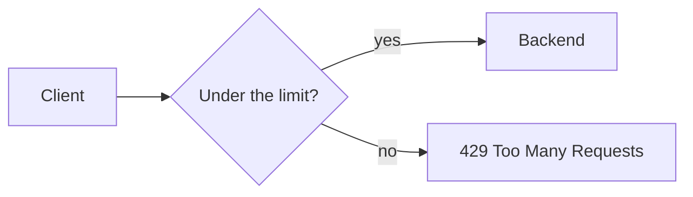

# b09: Rate Limiter — A simple counter lets double the limit through at the window edge, and a token bucket does not

Building blocks · b08 → **b09** → b10

> *"Say no early, say it fairly, and say it in one place"*
>
> **Concern**: availability · cost

## The Problem

A buggy client starts sending 10,000 requests a second to `/search`. Every request is valid, so nothing looks wrong to your code, but the backend can serve only a few hundred a second. Real users now wait behind the flood, and the service falls over.

You need to reject the excess early, with an HTTP 429 (Too Many Requests), before it reaches the backend.

## The Idea

A rate limiter is a bouncer with a clicker. Each client gets an allowance. Within it, requests pass. Over it, they hear "not now". The limit is per client (an API key, a user or an IP), so one bad caller cannot spend everyone's share.

It usually sits at the gateway (b08). What is hard is the counting rule, because different rules let different bursts through.



## How It Works

The sim sends the same buggy burst at a backend that can serve 150 requests a second. Load is the worst burst in any 100 ms, scaled to a second.

1. **No limit.** The client sends 50 requests at 0.9 s and 50 more at 1.0 s. All 100 arrive within 100 ms, and the backend sees 667% of its capacity.
2. **Fixed window** keeps one counter per second and rejects above 10:

```js
// sim.mjs
function fixedWindow(limit) {
  const counts = new Map();
  return (t) => {
    const w = Math.floor(t / 1000);
    const n = counts.get(w) ?? 0;
    counts.set(w, n + 1);
    return n < limit;
  };
}
```

3. **Token bucket** holds up to 10 tokens and refills 2 a second. Each request takes a token, and with none left it is rejected:

```js
// sim.mjs
function tokenBucket(capacity, refillPerSec) {
  let tokens = capacity;
  let last = 0;
  return (t) => {
    tokens = Math.min(capacity, tokens + ((t - last) / 1000) * refillPerSec);
    last = t;
    if (tokens < 1) return false;
    tokens -= 1;
    return true;
  };
}
```

The state is two values: the token count and the last refill time. The vault note says AWS API Gateway, Stripe and Google Cloud use this algorithm.

## When It Breaks

The fixed window resets at every whole second. Ten requests at 0.9 s fill the first window, and ten more at 1.0 s fill the next. That is 20 requests in 100 ms, twice the limit. In the sim the backend then runs at 133% of capacity, even though every second stays within the limit.

Distributed limiters add a second failure. If several servers keep counters in Redis and do a read followed by a write, two requests can both read "9" and both pass. The check and the increment must be one atomic step.

## The Trade-off

**Sliding window** fixes the edge by weighting the previous window: for example (5 × 50%) + 8 = 10.5 rejects a new request against a limit of 10. It is smooth and memory-efficient.

**Token bucket** lets a well-behaved client burst up to the bucket size, then holds the average. The same boundary trick lets only 10 requests through, so the worst burst is 10 and the backend load is 67%.

**Leaky bucket** puts requests in a queue of 10 and releases them at 2 a second. Output is smooth with no bursts, but in the sim the last queued request waits 5 seconds, so it suits work that can wait.

*Note: the sim's client pattern, the 150 requests a second backend, and the 100 ms burst window are assumptions. The sim does not model the sliding window or the leaky bucket; their numbers come from the vault note.*

## In The Wild

The vault note names AWS API Gateway, Stripe and Google Cloud as token-bucket users. It also covers limiters kept in Redis so every server shares one count, which brings back the atomic-update problem above.

## Try It

```sh
node course/3_building_blocks/b09_rate_limiter/sim.mjs
```

You should see `allowed=100  rejected=0  worstBurst=100  backendLoadPct=667` with no limit, `worstBurst=20  backendLoadPct=133` in the boundary frame, and `worstBurst=10  backendLoadPct=67` for the token bucket. Try `--refillPerSec=10`: the bucket refills one token between the bursts, so the last frame lets 11 through (`worstBurst=11`).

## Say It In The Interview

1. Say where it lives (the gateway) and what it returns: HTTP 429, ideally with a retry-after hint.
2. Name the algorithms and one trait each: fixed window is simple but bursts at the edge, sliding window is smooth, token bucket allows bursts, leaky bucket smooths output.
3. Limit per client, not globally.
4. For a distributed limiter, make the check and the increment atomic.

## Boundary

This chapter covers the single-limiter algorithms. Designing a limiter that spans many servers is the case study c02, and what a client does after a 429 is retry with backoff (p10).

## What's Next

You have rate limiting, but your users search products with `LIKE '%wireless headphone%'` and each query takes 8 seconds. How does a search engine avoid scanning everything? With an inverted index: b10.

## Source notes

- [Rate limiter](../../../vault/system_design/02_building_blocks/rate_limiter.md)
