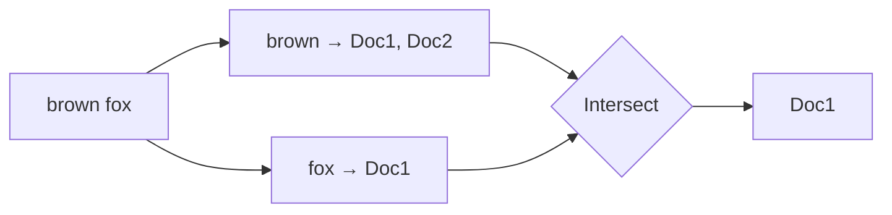

# b10: Search — An inverted index turns an 8-second scan into a few milliseconds, at the cost of a second copy of the data

Building blocks · b09 → **b10** → b11

> *"Index the words, not the rows"*
>
> **Concern**: latency · scalability

## The Problem

Your shop has 10 million products, and search is a SQL query: `WHERE name LIKE '%wireless headphone%'`. It takes 8 seconds. A leading `%` means the database cannot use a normal index, because the match could start anywhere. It reads every row, every time, and a handful of concurrent searches use up the database.

## The Idea

The index at the back of a book lists each word and the pages it appears on. To find "fox" you do not read the book; you read one line. An **inverted index** does this for documents: it maps each term to the list of documents that contain it (a **posting list**).

To search two words, fetch two lists and intersect them. If "brown" appears in Doc1 and Doc2, and "fox" in Doc1, the answer is Doc1. Elasticsearch, Lucene and Solr are built on this.



## How It Works

1. **Analyze the text.** Split it into terms (tokenizing) and reduce them to a base form (stemming), so "headphones" and "headphone" match.
2. **Build the index**, one posting list per term.
3. **Answer a query** by reading the lists for its terms. The work depends on the list lengths, not on the table size:

```js
// sim.mjs
  const rarePostings = 2 * docs * (rareTermPct / 100);
  const indexed = outcome({
    docsTouched: rarePostings,
    queryMs: INDEX_OVERHEAD_MS + (rarePostings / POSTINGS_PER_SEC) * 1000,
```

   With two words that each match 1% of 10 million products, the query reads 200,000 ids and takes 5 ms, against 8,000 ms for the scan.
4. **Rank the matches.** TF-IDF scores a document by term frequency times inverse document frequency, so a word found in 99% of documents counts for almost nothing. BM25 improves it with saturation and length normalisation. The vault gives the formula, with k1 = 1.2 and b = 0.75, and notes it is the default in Elasticsearch, Lucene and Solr:

```js
// sim.mjs
const idf = (docs, df) => Math.log(1 + (docs - df + 0.5) / (df + 0.5));
const bm25Tf = (tf) => (tf * (K1 + 1)) / (tf + K1);
```

5. **Shard for size.** Elasticsearch splits an index over shards and merges their results.

## When It Breaks

The index is only quick for selective words. A stop word like "the" appears in 99% of documents, so its posting list is as long as the table. In the sim that query reads 10,000,000 ids and takes 201 ms, 40 times slower than the selective query, and its IDF is 0.01, so it says almost nothing about relevance. Search engines drop or down-weight such words.

## The Trade-off

Search is a second copy of your data. It costs storage (about 2 GB for these 10 million products) and it trails the source: new rows appear only after the next refresh, up to one second behind in the default sim. You now have two systems that must be kept in step (b05 queues are the usual way).

Ranking has a payoff too. BM25 makes 30 occurrences of a word score 2.12, against 1.57 for 3, not ten times more, so keyword stuffing does not win.

*Note: the scan and index speeds (1.25 million rows and 50 million postings a second), the 200 bytes per document and the Lucene form of IDF are assumptions. The vault note gives the 8 s scenario, TF-IDF and the BM25 formula, not these numbers.*

## In The Wild

The vault note's Elasticsearch example covers shards and analyzers, and it names Lucene and Solr as engines with the same idea. The old-app scenario `search-via-sql` is exactly this failure: search built on a SQL scan.

## Try It

```sh
node course/3_building_blocks/b10_search/sim.mjs
```

You should see `queryMs=8000` for the scan, `queryMs=5` for the index and `queryMs=201` for the stop word. Try `--docs=100000000`: the scan reaches 80,000 ms, but the index still answers in 41 ms.

## Say It In The Interview

1. Say `LIKE '%x%'` cannot use an index and scans everything.
2. Name the inverted index (term → documents) and the intersection of posting lists.
3. Mention ranking: TF-IDF, then BM25 as the modern default.
4. Say the index is a second, slightly stale copy, and how you feed it.

## Boundary

This chapter covers full-text lookup and ranking. Autocomplete as a whole system is the case study c04, and general indexing in a database is p01.

## What's Next

You now have many services, and hard-coded IP addresses break at 3 AM when one moves. How does a service find another? With service discovery: b11.

## Source notes

- [Search systems](../../../vault/system_design/02_building_blocks/search_systems.md)
