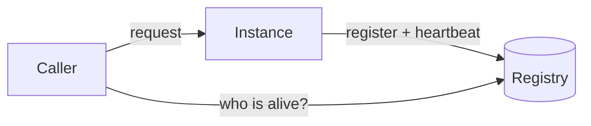

# b11: Service Discovery — A registry replaces hard-coded addresses, and you must choose whether it prefers stale answers or none

Building blocks · b10 → **b11** → b12

> *"Ask who is alive, do not remember where they used to be"*
>
> **Concern**: availability · consistency

## The Problem

Your 20 microservices call each other by hard-coded IP addresses. At 3 AM one instance dies, or is replaced by a deploy with a new address. Every caller keeps sending it traffic. Nothing in the code knows the address is wrong, so someone gets paged and edits configuration by hand. With ten instances of one service, one dead address takes 10% of that service's traffic, for as long as the fix takes: in the sim, 45 minutes and 270,000 failed requests.

## The Idea

Service discovery is a phone directory that keeps itself up to date. Each instance writes its own entry when it starts and says "still here" at intervals. A caller asks the directory instead of remembering numbers.

There are two ways to ask. In **client-side** discovery the caller queries the registry and picks an instance itself. In **server-side** discovery a load balancer (b01) asks the registry, and the caller sees one stable name.



## How It Works

1. **Register.** An instance adds its address to the registry on startup.
2. **Heartbeat.** It reports in every few seconds. A health check can also probe it.
3. **Expire.** After several missed beats the registry drops it, so callers stop using it:

```js
// sim.mjs
  const detectSec = heartbeatSec * missedBeats;
  const registry = outcome({ staleWindowSec: detectSec, share: oneInstance, rps });
```

   With a 10 s heartbeat and 3 missed beats, that is 30 seconds and 3,000 failed requests, against 270,000 with hard-coded addresses.
4. **Shut down gracefully.** An instance deregisters first, then drains its in-flight requests, so callers stop using it before it stops answering.

## When It Breaks

A registry is now a component that every service depends on. Two failures matter.

Stale entries: a dead instance stays listed until its beats expire, and callers waste one request finding out.

The registry itself going down. How that plays out depends on its design (next section). If it refuses lookups it cannot confirm, callers are blind: in the sim a 10 minute outage fails 100% of calls that need a lookup, 600,000 requests. The Roblox 73-hour outage in the vault started with a Consul problem, so this is not a corner case.

## The Trade-off

This is the CAP choice from f06, made for a registry.

**AP** registries keep answering from their last known list. Netflix's Eureka does this: stale data beats no data. In the sim about 1.7% of entries are stale after 10 minutes, each costs a failed request plus a retry, and 10,000 requests fail. A registry that is down blinds every service; a stale entry costs one request.

**CP** registries refuse to answer when they cannot be sure. Kafka uses ZooKeeper for this: two partition leaders would mean split brain, so brief unavailability is better than inconsistency.

The vault's guide: HTTP microservices → AP; a database partition leader → CP; DNS → AP (TTL caching); configuration (Consul, etcd) → CP; a sidecar service mesh → AP.

*Note: the 45 minute human fix, the instance counts, the 10% hourly churn and the assumption that CP callers fail completely are the sim's numbers. The vault note gives the AP and CP guide, not these figures.*

## In The Wild

Netflix Eureka (AP) and Kafka with ZooKeeper (CP) are the note's two examples, chosen for opposite reasons. The `roblox_2021` outage replay is a service-discovery failure in production.

## Try It

```sh
node course/3_building_blocks/b11_service_discovery/sim.mjs
```

You should see `failedRequests=270000` for hard-coded addresses, `failedRequests=3000` with the registry, `failedRequests=600000` for the CP outage and `failedRequests=10000` for the AP outage. Try `--heartbeatSec=30` to see the detection window grow to 90 seconds and the failures to 9,000.

## Say It In The Interview

1. Say hard-coded addresses break when instances move, and that services register with a registry and send heartbeats.
2. Name client-side and server-side discovery.
3. Say graceful shutdown means deregister first, then drain.
4. Raise the CAP choice for the registry: AP for HTTP services, CP where a stale answer is dangerous.

## Boundary

This chapter covers finding instances. Spreading load across them is b01, and the theory behind the AP and CP choice is f06.

## What's Next

You can now find, limit and route to everything. When something fails at 3 AM, how do you find out, and how fast can you find why? With monitoring: b12.

## Source notes

- [Service discovery](../../../vault/system_design/02_building_blocks/service_discovery.md)
