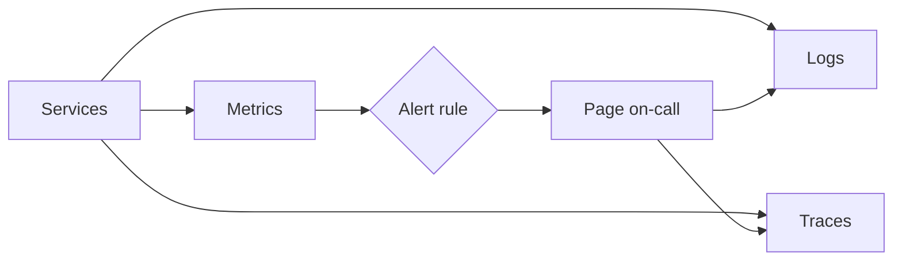

# b12: Monitoring and Logging — Measure what users feel, spend an error budget on it, and page only when the budget burns fast

Building blocks · b11 → **b12** → p01

> *"You cannot fix what you cannot see, and you cannot see everything, so alert on what users feel"*
>
> **Concern**: availability · cost

## The Problem

At 3 AM the site is slow. You have no dashboards and logs on twelve machines. Someone logs into each one, greps, guesses, and restarts things. Four hours later it turns out one database query was slow. With a 99.9% target, the whole month allows 43.2 minutes of downtime, and this one night used 240 minutes: 556% of the budget.

## The Idea

Monitoring is a car dashboard plus a flight recorder. The dashboard says something is wrong now; the recorder says why. Three kinds of data do this, the **three pillars**:

- **Metrics**: numbers over time (requests a second, errors, latency). Cheap, good for alerts.
- **Logs**: what happened, event by event. Good for detail.
- **Traces**: one request followed across services. Good for finding which hop is slow.

Two checklists say what to measure. **RED** for services: rate, errors, duration. **USE** for resources: utilization, saturation, errors.



## How It Works

1. **Collect** metrics, logs and traces from every service.
2. **Alert on a metric.** In the sim an alert takes 5 minutes to notice.
3. **Diagnose with logs and traces.** They cut finding the cause to 10 minutes:

```js
// sim.mjs
  const observedMin = detectMin + diagnoseMin;
  const observed = outcome(incidents * observedMin, budgetMin, 0);
```

   The incident is 15 minutes instead of 240, and the month uses 35% of its budget.
4. **Define targets.** An **SLI** is what you measure (request latency). An **SLO** is the target (P99 under 200 ms). An **SLA** is the contract with penalties ("99.9% under 200 ms or a credit").
5. **Track the error budget**, 100% minus the SLO. At 99.9% over 30 days it is 43,200 × 0.001 = 43.2 minutes:

```js
// sim.mjs
  const budgetMin = MINUTES_PER_MONTH * (1 - sloPct / 100);
```

   After 30 minutes used, 13.2 remain, so a team slows its releases.

## When It Breaks

Alerts on the wrong thing. A CPU threshold fires on harmless spikes (20 pages a week in the sim), so on-call learns to ignore it. It also misses incidents where errors rise but CPU is normal (30% here). Those wait for customers to complain, 30 minutes, and the month uses 52% of the budget instead of 35%.

Monitoring can also go down with what it watches. The Datadog 2023 outage in the vault was the monitoring vendor itself failing.

## The Trade-off

**Burn-rate alerts** page when the error budget is being used faster than planned, so they follow user impact rather than machine load. In the sim that is about one page a week and no incident waiting for a customer, back to 35% of the budget.

The price is up front. You must pick SLOs, measure the right SLI, and agree a policy for what happens as the budget runs out. Collecting logs and traces also costs storage and money, so teams sample traces and set retention.

*Note: the 15 minute detect-plus-diagnose time, the 30% CPU miss rate, 20 false pages a week and one burn-rate page a week are the sim's assumptions. The vault note gives the pillars, RED and USE, the SLI/SLO/SLA example and the 43.2-minute budget.*

## In The Wild

The vault note names Google SRE's error budgets, Netflix, Uber's M3 metrics system and Slack as real practice. The `datadog_2023` outage replay shows the vendor failing.

## Try It

```sh
node course/3_building_blocks/b12_monitoring/sim.mjs
```

You should see `downtimeMin=240  budgetUsedPct=556` first, then `downtimeMin=15  budgetUsedPct=35`, then `downtimeMin=22.5  budgetUsedPct=52  falsePagesPerWeek=20` for CPU alerts. Try `--sloPct=99.99`: the budget shrinks to 4.3 minutes, and even the 15 minute incident uses 347% of it.

## Say It In The Interview

1. Name the three pillars: metrics, logs, traces.
2. Give RED for services and USE for resources.
3. Define SLI, SLO and SLA, and say error budget = 100% minus SLO.
4. Alert on user-facing symptoms and burn rate, not on CPU.

## Boundary

This chapter covers watching a system. Handling the incident itself is outside this course, and the logging pipeline as a whole system is the drill case `logging-pipeline`.

## What's Next

You have the building blocks: entry, storage, caching, queues, search, discovery and monitoring. Each solves a problem but has failure modes of its own. How do you fix those? With patterns, starting with indexing: p01.

## Source notes

- [Monitoring and logging](../../../vault/system_design/02_building_blocks/monitoring_and_logging.md)
