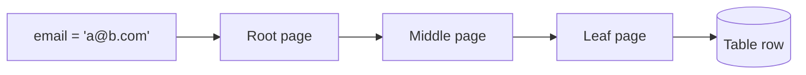

# p01: Database Indexing — One index turns a 3-second scan into 3 milliseconds, and every extra index taxes each write

Patterns · b12 → **p01** → p02

> *"Index what you look up, and only what you look up"*
>
> **Concern**: latency · cost

## The Problem

Your users table has 10 million rows. `SELECT * FROM users WHERE email = 'user@example.com'` takes 3 seconds, because the database reads every row to find one. One `CREATE INDEX` on the email column brings it to 3 milliseconds. That is a thousand times faster from a single statement. But indexes are not free, and the wrong ones make things worse.

## The Idea

A textbook has an index at the back. To find "mitochondria" you look it up and go straight to page 237, instead of reading 500 pages. A database index is the same: a sorted structure that points from a value to the rows holding it.

The default is a **B-tree**, a balanced tree with many keys per page, so it stays shallow. Its cost is that it must be kept in step with the table.



## How It Works

1. **The tree is shallow.** With 500 keys per page, 10 million rows need only 3 levels, so a lookup is 3 page reads:

```js
// sim.mjs
  const depth = Math.max(1, Math.ceil(Math.log(rows) / Math.log(fanout)));
  const matched = rows * (matchPct / 100);
```

2. **A lookup walks the tree**, then fetches the row. In the sim that is 3 ms against 3,000 ms for the scan.
3. **Composite indexes** cover several columns. The **leftmost prefix** rule applies: an index on (a, b) helps queries on a, or on a and b, but not b alone.
4. **A covering index** holds every column the query needs, so the database answers from the index without touching the table (an index-only scan).
5. **A partial index** covers only some rows, such as the rare status values, and stays small.

## When It Breaks

An index only helps when the query picks out a small part of the table. If a query returns 30% of the rows, the index sends the database to fetch 3 million rows one by one, which in the sim takes 6,003 ms, twice as long as the 3,000 ms scan. The vault's rule of thumb: above about 20% of rows, a scan wins. Low-selectivity columns, such as a yes/no flag, are poor index choices on their own, and tables under about 1,000 rows need none.

## The Trade-off

Every index is another structure to update. One write to the table becomes one write to the table plus one per index. In the sim, six indexes turn 1,000 row writes a second into 7,000 disk writes a second, and reads stay at 3 ms. This is **write amplification**, and it is why write-heavy tables (over about half writes) should keep only the essential indexes. Indexes also use space and can bloat.

The vault's habits: drop an index that has not been scanned for 30 days, and build on a live table with `CREATE INDEX CONCURRENTLY` so it does not block writes.

*Note: the sim's speeds (0.0003 ms a scanned row, 1 ms a level, 0.002 ms a random fetch) are assumptions chosen to reproduce the note's 3 s versus 3 ms; real numbers depend on hardware and caching.*

## In The Wild

The vault note walks through Instagram feeds, Twitter timelines, Uber's geospatial matching and GitHub code search, each with a different index type: composite B-trees for ordered feeds, GiST for geography, GIN (an inverted index) for text.

## Try It

```sh
node course/4_patterns/p01_indexing/sim.mjs
```

You should see `queryMs=3000` with no index, `queryMs=3` with one, `queryMs=6003` for the 30% query and `writeAmplification=7  diskWritesRps=7000` with six indexes. Try `--matchPct=5` to see the index win again: 500,000 rows take 1,003 ms.

## Say It In The Interview

1. Say an index turns a full scan into a tree walk: O(n) to O(log n).
2. Name the cost: slower writes, more space.
3. Say what to index: columns in WHERE, JOIN and ORDER BY, with the leftmost prefix rule for composites.
4. Mention EXPLAIN to check the plan actually uses the index.

## Boundary

This chapter covers indexes inside one database. Splitting data across machines is sharding (p03), and text search is b10.

## What's Next

One database still has one copy of the data. If that machine dies, everything is lost. How do you keep a second copy? With replication: p02.

## Source notes

- [Database indexing](../../../vault/system_design/03_design_patterns/database_indexing.md)
