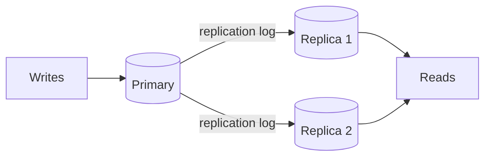

# p02: Replication — Copies keep data alive and reads fast, but the speed of keeping them in step decides what a crash loses

Patterns · p01 → **p02** → p03

> *"Keep more than one copy, and know how far behind each one is"*
>
> **Concern**: availability · consistency

## The Problem

Your single database server crashes at 2 AM. The last backup is 12 hours old, so at 1,000 writes a second that is 43,200,000 writes gone. Even when it is running, at peak hour all reads and writes compete for one machine.

## The Idea

Replication is photocopying an important document and keeping the copies in different offices. If one office burns down, the others still hold it, and several people can read copies at once.

One node is the **primary** (leader) and takes the writes. It sends a **replication log** of every change to **replicas** (followers), which usually serve read-only queries. If the primary fails, a replica is promoted: a **failover**. The delay between a write on the primary and its appearance on a replica is the **replication lag**.



## How It Works

1. **Writes go to the primary**, which records them in its log.
2. **Replicas apply the log.** In the sim a replica 20 ms away needs the round trip plus 10 ms to apply, so it trails by 30 ms.
3. **Reads spread over the replicas.** Two replicas take read capacity from 5,000 to 15,000 a second.
4. **The primary decides when to answer**, and that is the choice that matters:

```js
// sim.mjs
  const asyncRep = outcome({ writeMs: WRITE_MS, writesLost: (writesPerSec * lagMs) / 1000, nodes: 1 + replicas, lagMs });
```

   **Asynchronous**: answer at once. A write takes 2 ms; a crash loses what was in flight (30 writes here).
   **Synchronous**: wait for the replicas to confirm. A write takes 32 ms, and nothing is lost.
   **Semi-synchronous**: wait for one replica. MySQL semi-sync and PostgreSQL `synchronous_commit` offer this middle path.

## When It Breaks

Lag is the hidden problem. The vault's rule of thumb: 50 ms is acceptable, 200 ms is noticeable, 5,000 ms is not. A user who posts a photo and reads from a lagging replica does not see it. If lag reaches 5,000 ms and the primary fails, promoting a replica loses 5,000 acknowledged writes: the sim's failure frame.

A failover can also go wrong the other way. If two nodes both believe they are the primary, that is **split brain**, and they accept conflicting writes. The GitHub 2018 outage replay in the vault is a database failover that went badly.

## The Trade-off

Synchronous replication buys durability and pays in latency: 32 ms instead of 2 ms, and a single slow or dead replica stalls every write. Asynchronous replication is fast and cheap but can lose recent writes, and its replicas serve stale reads. Choose by what a lost write costs: a payment ledger wants synchronous or semi-sync; a like counter does not.

*Note: the sim's 2 ms write, 10 ms apply time, 5,000 reads a second per node and 20 ms round trip are assumptions. The 5,000 ms spike and the lag bands are from the vault note.*

## In The Wild

The vault note covers the primary-replica topology as the most common, with MySQL semi-sync and PostgreSQL synchronous commit as production forms. The `github_db_2018` replay is the failover story.

## Try It

```sh
node course/4_patterns/p02_replication/sim.mjs
```

You should see `writesLost=43200000` for one node, `writesLost=30  replicaLagMs=30` for async, `writesLost=5000` for the spike and `writeLatencyMs=32  writesLost=0` for sync. Try `--replicaRttMs=80` for replicas in another region: synchronous writes take 92 ms.

## Say It In The Interview

1. Say replication gives availability, durability and read scaling.
2. Name primary-replica, and the sync, async and semi-sync choice.
3. Mention replication lag and read-your-writes problems.
4. Mention failover and split brain.

## Boundary

This chapter copies the same data to more nodes. Splitting different data across nodes is sharding (p03), and the theory of what to give up during a partition is f06.

## What's Next

Replicas hold the whole data set, so writes still hit one primary. What if the data no longer fits on one machine? Split it: sharding, p03.

## Source notes

- [Replication](../../../vault/system_design/03_design_patterns/replication.md)
