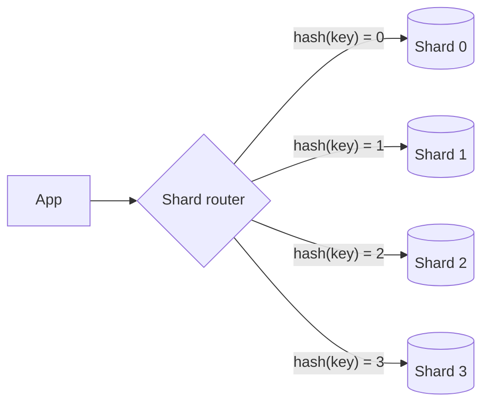

# p03: Sharding — Splitting data across machines scales writes, until one hot key lands on one shard

Patterns · p02 → **p03** → p04

> *"Split the data, then watch for the piece everyone wants"*
>
> **Concern**: scalability · latency

## The Problem

Replicas (p02) copy all the data, so every write still lands on one primary. Your traffic is 40,000 requests a second and one machine handles 12,000: it runs at 333% of capacity. A bigger machine buys a little time. The data and the traffic both have to be divided.

## The Idea

Sharding is splitting one big filing cabinet into several, each holding part of the records. A **shard key** decides which cabinet a record goes in. Each shard is an independent database, so writes, storage and load all divide by the number of shards.

Two common rules pick the cabinet. **Hash sharding** hashes the key and takes a remainder. **Range sharding** gives each shard a block of consecutive keys.



## How It Works

1. **Choose a shard key** that appears in most queries.
2. **Route** each request by the key. Hashing scrambles keys across shards:

```js
// sim.mjs
const hashShard = (key, shards) => {
  let h = Math.imul(key ^ (key >>> 15), 2246822519) >>> 0;
  h = Math.imul(h ^ (h >>> 13), 3266489917) >>> 0;
  return (h >>> 8) % shards;
};
```

3. **Range sharding** keeps neighbours together:

```js
// sim.mjs
const rangeShard = (key, shards) => Math.min(shards - 1, Math.floor(((key - 1) * shards) / KEYS));
```

4. With keys that are equally popular and 4 shards, hashing puts the busiest shard at 91% of its capacity against an average of 83%. Every shard can now cope.

## When It Breaks

Real keys are not equally popular. The sim gives the traffic to key i a weight of 1 / i^skew, so a few keys are hot. Hashing spreads different keys, but it cannot split one key: at skew 1 the busiest of four shards takes 32% of all traffic and runs at 106% while the average is 83%. At skew 2 with 16 shards, one shard still takes 63%.

A **hot shard** is the usual way sharding fails. A celebrity account, a viral post, or an id sequence that always writes to the newest range all concentrate load.

Sharding also makes cross-shard work harder: joins, transactions across shards and range scans all touch several databases.

## The Trade-off

Range sharding makes range queries cheap. A scan of 100 consecutive keys touches 1 shard instead of 4. But popular keys are often neighbours, so in the sim the hot shard runs at 272% against 106% with hashing.

So there is no free choice. Hash for even load and point lookups. Range for scans and ordered access, and accept hot spots (or split ranges as they heat up). Adding a shard with plain hash-modulo reshuffles most keys, which is the problem p04 solves.

*Note: the 1,000 keys, the 1/i^skew popularity model and the 100-key scan are the sim's assumptions. The vault note gives the schemes and their trade-offs, not these numbers.*

## In The Wild

The `discord_db_2024` replay in the vault involves hot partitions in a sharded store. The vault note covers hash, range and directory-based sharding and how real systems rebalance.

## Try It

```sh
node course/4_patterns/p03_sharding/sim.mjs
```

You should see `hottestShardLoadPct=333` for one machine, `hottestShardLoadPct=91` for even hashing, `106` when skewed and `272` for range sharding, with `rangeQueryShards=4` for hash and `1` for range. Try `--shards=16 --skew=2`: hashing still leaves one shard at 209%.

## Say It In The Interview

1. Say sharding divides writes and storage, where replication only divides reads.
2. Pick the shard key by the access pattern, and name hash versus range.
3. Raise hot keys and cross-shard queries yourself.
4. Mention resharding, and consistent hashing (p04) as the way to add shards without moving everything.

## Boundary

This chapter covers how to split. Adding and removing shards cheaply is consistent hashing (p04), and copying each shard for safety is replication (p02).

## What's Next

With hash-modulo, adding a fifth shard remaps most keys. How do you add a node and move only a few of them? Consistent hashing: p04.

## Source notes

- [Sharding](../../../vault/system_design/03_design_patterns/sharding.md)
