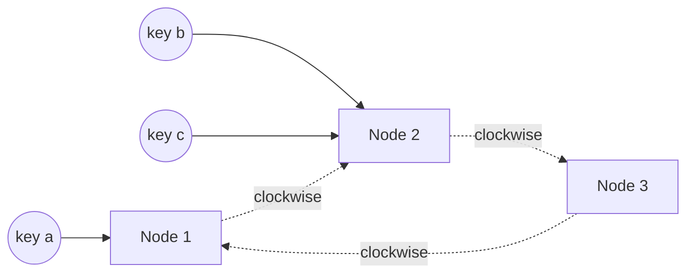

# p04: Consistent Hashing — A hash ring moves a few keys when a node joins, and virtual nodes even out who holds them

Patterns · p03 → **p04** → p05

> *"Change the cluster, not the map"*
>
> **Concern**: scalability · availability

## The Problem

Ten cache nodes hold your data, and each key lives on `hash(key) mod 10`. You add an eleventh node for the holiday. Now every key maps with `mod 11`, and in the sim 91% of the keys land on a different node than before. A cache loses almost everything at once, and every request falls through to the database.

## The Idea

Put the nodes on a circle, like the numbers on a clock. Hash each key onto the same circle and give it to the first node you meet going clockwise. When a node joins, it lands somewhere on the circle and takes over only the keys between it and its neighbour. Everyone else keeps theirs. Removing a node hands its keys to the next one.



## How It Works

1. **Hash nodes and keys** into the same 32-bit space.
2. **Sort the node points** into a ring.
3. **Find a key's owner** with a binary search for the first point at or after its hash:

```js
// sim.mjs
function ringOwner(ring, h) {
  let lo = 0;
  let hi = ring.length;
  while (lo < hi) {
    const mid = (lo + hi) >> 1;
    if (ring[mid].at < h) lo = mid + 1;
    else hi = mid;
  }
  return ring[lo % ring.length].node;
}
```

4. **Add a node** and only the keys in its arc move. With modulo, 91% of 20,000 keys moved. On the ring, 2% did.

## When It Breaks

The 2% looks great, but it is luck: the new node's arc happened to be short. With one random point per machine, arcs have very different lengths. In the sim the busiest of the eleven nodes holds 244% of an even share, so one machine runs hot while others idle. (With 2 nodes and 1 point each it is 208%.) A node failing hands its whole arc to a single neighbour, which can then overload.

## The Trade-off

Give each machine many **virtual nodes**, small arcs scattered around the ring. Arc lengths average out. With 100 virtual nodes each, 9% of keys move (close to the even share of 1 in 11), and the busiest node holds 116% of an even share. A failed machine's load also spreads over many neighbours instead of one.

The price is state: the router keeps 1,100 ring entries sorted and consistent across all clients, and more virtual nodes mean more memory, slower updates and more coordination.

*Note: the 20,000 keys and the fixed integer hash are the sim's assumptions. The numbers depend on the hash: another hash would give different luck for the one-point ring, but the modulo result and the virtual-node improvement hold.*

## In The Wild

The vault note discusses Cassandra, DynamoDB and Memcached. It is how a cache cluster grows without a stampede on the database (b04), and how sharded stores (p03) add nodes.

## Try It

```sh
node course/4_patterns/p04_consistent_hashing/sim.mjs
```

You should see `keysMovedPct=91` for modulo, `keysMovedPct=2  busiestNodeVsEvenPct=244` for one point per node and `keysMovedPct=9  busiestNodeVsEvenPct=116  ringEntries=1100` with 100 virtual nodes. Try `--nodes=50 --vnodes=500`: only 2% move and the busiest node is at 118%, with 25,500 ring entries.

## Say It In The Interview

1. Say modulo hashing remaps almost everything when the node count changes.
2. Describe the ring: a key goes to the next node clockwise, and only a neighbour's keys move.
3. Raise uneven arcs and fix them with virtual nodes.
4. Name where it is used: caches, sharded databases, load balancing.

## Boundary

This chapter covers placement of keys. Choosing the shard key is p03, and keeping copies of each key's data is replication (p02).

## What's Next

A node crashes in the middle of a write. What is left on disk, and how does the database recover it? With a write-ahead log: p05.

## Source notes

- [Consistent hashing](../../../vault/system_design/03_design_patterns/consistent_hashing.md)
