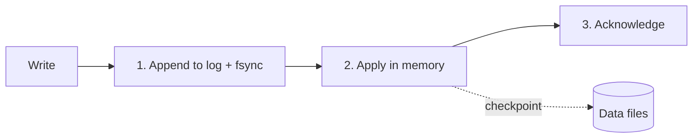

# p05: Write-Ahead Log — Log the change to disk before you apply it, and choose how often to force that log to disk

Patterns · p04 → **p05** → p06

> *"Write it down first, then do it"*
>
> **Concern**: availability · latency

## The Problem

A database receives a write and updates its in-memory data. Power goes out before the data is flushed to disk, and the write is gone forever, even though the client was told it succeeded. With a log, the write goes to disk first as a fast sequential append, and only then is it applied. After a restart, the database replays the log.

## The Idea

Before changing a painting, an artist writes down every planned brushstroke in a notebook. If the power fails mid-stroke, the notebook says exactly where to resume. The notebook is the source of truth until the painting catches up.

The **write-ahead log** (WAL) is that notebook: an append-only file of changes, written before the data files. Appending is sequential, so it is fast. The **checkpoint** periodically writes the in-memory state to the data files, so the log before that point can be discarded.



## How It Works

1. **Append the record to the log** and force it to disk with `fsync`. Until fsync returns, the data may only be in an operating-system buffer.
2. **Apply the change** in memory, then acknowledge the client.
3. **Checkpoint** now and then, so recovery does not replay the whole history.
4. **Recover** by replaying the log after the last checkpoint. With a checkpoint every 60 s at 1,000 writes a second, that is about 0.3 s of replay:

```js
// sim.mjs
  const replaySec = (writesPerSec * checkpointSec * RECORD_KB) / 1024 / REPLAY_MB_PER_SEC;
```

Without a log, the worst case is everything since the last flush. With a 30 s flush, that is 30,000 acknowledged writes.

## When It Breaks

The log is only as durable as its fsync. If the database acknowledges the write before the log reaches disk (for speed), a crash still loses whatever was in the buffer: in the sim, up to a second of writes, 1,000 of them, that clients were told were safe.

The opposite setting has its own problem. An fsync on every commit makes each commit wait, and the disk can force only so many logs a second. At 2 ms per fsync the disk does 500 a second, so 1,000 writes a second asks it to be 200% busy, which it cannot be. Throughput hits a wall.

## The Trade-off

**Group commit** lets writes that arrive within a few milliseconds share one fsync. With a 5 ms window, the disk is 40% busy instead of 200%, nothing is lost, and a commit waits 4.5 ms on average instead of 2 ms. You pay a little latency to make durability affordable.

The other dial is the checkpoint interval: frequent checkpoints shorten recovery but write more data during normal operation, and rare ones do the opposite.

*Note: the 2 ms fsync, 0.5 KB record, 100 MB/s replay rate and the intervals are the sim's assumptions. The worst-case "lost" counts assume constant write rate. The vault note gives the pattern, not these numbers.*

## In The Wild

The vault note covers PostgreSQL's WAL, MySQL InnoDB's redo log, and Kafka as a distributed log. It also describes GitLab's use of WAL archiving for point-in-time recovery and Stripe's use of a log for idempotent payment processing.

## Try It

```sh
node course/4_patterns/p05_wal/sim.mjs
```

You should see `writesLost=30000` with no log, `commitLatencyMs=2  fsyncBusyPct=200  recoverySec=0.3` for a per-commit fsync, `writesLost=1000` for the lazy log and `commitLatencyMs=4.5  fsyncBusyPct=40` with group commit. Try `--fsyncMs=0.1`: on a fast disk, the per-commit fsync is only 10% busy.

## Say It In The Interview

1. Say the log is written and fsynced before the change is applied or acknowledged.
2. Explain recovery: replay the log after the last checkpoint.
3. Mention the fsync trade-off and group commit.
4. Note where the idea reappears: replication streams, Kafka, event sourcing (p18).

## Boundary

This chapter covers durability on one node. Copying the log to other nodes is replication (p02), and storing the log itself as the source of truth is event sourcing (p18).

## What's Next

You can now store and recover data reliably, but you spend a disk read on every lookup, even for keys that do not exist. How do you skip those reads cheaply? A Bloom filter: p06.

## Source notes

- [Write-ahead log](../../../vault/system_design/03_design_patterns/write_ahead_log.md)
