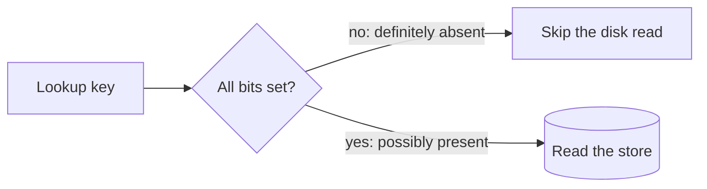

# p06: Bloom Filters — A few bits per key answer "definitely not here" cheaply, if you size them for the keys you will really store

Patterns · p05 → **p06** → p07

> *"Be sure about no, and only guess about yes"*
>
> **Concern**: latency · cost

## The Problem

Your store holds 100,000 keys, and clients keep asking for keys that are not there: a URL the crawler has not seen, a username that is free, a row that was never written. Each such miss costs a disk read to prove there is nothing to find. Keeping all the keys in a memory set would answer instantly, but at about 20 bytes a key that is 2 MB here and gigabytes at real scale.

## The Idea

A Bloom filter is a bouncer with a rough guest list. It cannot say "yes, this person is on the list", but it can say "definitely not on the list", and it does that using a few bits per key instead of the key itself.

It is a row of bits, all zero. To add a key, hash it several ways and set those bits. To check a key, hash it the same ways: if any bit is zero, the key was never added. If all are one, the key is **possibly** present, and you go and check the real store. So it can give false positives, but never false negatives.



## How It Works

1. **Size it.** Pick bits per key, and hash count. The sim uses 10 bits a key and 7 hashes.
2. **Add a key** by setting `hashes` bits. The sim derives them from one hash by double hashing:

```js
// sim.mjs
function bitAt(key, i, bits) {
  const h1 = fmix(key + 1);
  const h2 = fmix(h1 ^ 0x9e3779b9) | 1;
  return ((h1 + Math.imul(i, h2)) >>> 0) % bits;
}
```

3. **Check a key** by computing the same positions. Any zero means absent.
4. **Result.** With 10 bits a key, the filter takes 0.13 MB against 2 MB for an exact set. Measured on 50,000 keys that were never added, 0.87% are wrongly reported present (the formula (1 − e^(−kn/m))^k predicts 0.82%). So 99% of misses skip the disk.

## When It Breaks

A Bloom filter cannot grow. If you plan for 100,000 keys and add 300,000, the bit array fills: in the sim the false-positive rate climbs to 40.23% (theory 40.08%), and most of the benefit is gone. It also cannot delete a key, because clearing a bit could break other keys that share it. And it cannot list what it holds.

## The Trade-off

More bits lower the false-positive rate. Doubling to 20 bits a key (and 14 hashes) takes it to about 0.01% (theory) for 0.25 MB. Fewer bits save memory: at 5 bits a key the rate is 14.07%.

So you tune it against the cost of a false positive. If a false positive is one wasted disk read, a rate of about 1% at 10 bits a key is usually a good deal. If the filter must be exact, do not use one.

*Note: the 20 bytes a key for an exact set and the fixed integer hash are the sim's assumptions; the false-positive rates are measured from the sim's own runs.*

## In The Wild

Filters like this sit in front of storage engines and caches so absent keys never reach the disk, and in crawlers to skip URLs already seen (the `web-crawler` drill case).

## Try It

```sh
node course/4_patterns/p06_bloom_filters/sim.mjs
```

You should see `falsePositivePct=0.87  theoryFalsePositivePct=0.82` for the planned size, `falsePositivePct=40.23` when over-filled, and `filterMemoryMb=0.25  falsePositivePct=0  theoryFalsePositivePct=0.01` with double the bits. Try `--bitsPerKey=5`: the filter halves to 0.06 MB and the rate jumps to 14.07%.

## Say It In The Interview

1. Say a Bloom filter answers "definitely not" or "possibly yes", never a false negative.
2. Give the sizing rule of thumb: about 10 bits a key and 7 hashes gives around 1% false positives.
3. Say it cannot delete or resize, and name a counting or scalable variant as the fix.
4. Say where it goes: in front of a slow lookup, such as a disk read or a remote call.

## Boundary

This chapter covers set membership with a probabilistic structure. Caching results is b04, and indexing a table for exact lookups is p01.

## What's Next

You now have partitioned, replicated and durable data. When the machine holding the leader dies, who takes over, and how do the others agree? Leader election: p07.

## Source notes

- [Bloom filters](../../../vault/system_design/03_design_patterns/bloom_filters.md)
