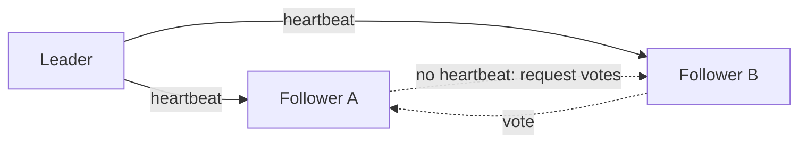

# p07: Leader Election — Pick a new leader in a fraction of a second, and require a majority so two never rule at once

Patterns · p06 → **p07** → p08

> *"Exactly one leader, and only while a majority agrees"*
>
> **Concern**: availability · consistency

## The Problem

You have replicas (p02) and one leader takes the writes. The leader crashes. Both followers notice, and both declare themselves the new leader. Two leaders accept writes independently, the data diverges, and clients see different data depending on which "leader" they reach. That is **split brain**.

The reverse failure is quieter: nobody takes over, and writes fail until a person logs in and promotes a node. In the sim, 15 minutes of that rejects 900,000 writes at 1,000 a second.

## The Idea

A group project needs a coordinator: someone who submits the final document and schedules meetings. If the coordinator disappears, the group must quickly pick a new one, and only one person can hold the role, or you submit two different documents.

In **leader election**, followers watch the leader's heartbeat. If it goes quiet for an **election timeout**, a follower asks the others to vote for it. It becomes leader only if it collects a **majority**. Raft and ZooKeeper's protocol (ZAB) work this way, and the vault covers both.



## How It Works

1. **The leader sends heartbeats.**
2. **A follower times out** after 300 ms without one and starts an election, and a vote round takes 50 ms. The sim's failover is 0.35 s and rejects 350 writes, against 900,000 for a manual fix.
3. **A candidate needs a majority.** With 5 nodes that is 3:

```js
// sim.mjs
  const quorum = Math.floor(nodes / 2) + 1;
```

4. **A leader that cannot reach a majority steps down.**
5. **A fencing token**, a number that grows with each new leader, lets storage reject writes from an old leader that has not noticed it was replaced (p08 shows this in detail).

## When It Breaks

Without the majority rule, a network partition makes split brain. In the sim a 10 s partition cuts the old leader off with 30% of clients. The other side elects a new leader, but the old one still accepts writes, so two leaders coexist for 10 s and 3,000 writes conflict. Nobody can say which is right.

The GitHub 2018 outage replay in the vault is a database failover gone wrong of this kind.

## The Trade-off

The majority rule fixes it: the cut-off leader cannot get 3 of 5 votes, so it steps down and conflicts fall to 0. The price is availability. That 30% of clients get errors for the 10 s, 3,350 writes are rejected in all, and if more than 2 of the 5 nodes are lost, the group cannot elect anyone at all. It picks consistency over availability, the CP side of f06.

The election timeout is a second dial. Short means fast failover, and long means fewer false elections on a slow network: at 1,000 ms, failover takes 1.05 s and rejects 1,050 writes.

*Note: the sim's 300 ms timeout, 50 ms vote round, 15-minute manual fix and 30% minority are assumptions. The vault gives the scenario, Raft, ZAB and fencing tokens.*

## In The Wild

The vault note covers Raft, ZooKeeper's ephemeral nodes (a node that disappears with its session, so a leader's claim expires when it dies), and fencing tokens. Systems such as ZooKeeper and etcd exist mostly so that other services do not have to implement election themselves.

## Try It

```sh
node course/4_patterns/p07_leader_election/sim.mjs
```

You should see `failoverSec=900  writesRejected=900000` for the manual fix, `failoverSec=0.35  writesRejected=350` with election, `doubleLeaderSec=10  conflictingWrites=3000` in the partition, and `writesRejected=3350  conflictingWrites=0` with a quorum. Try `--electionTimeoutMs=1000` to see failover slow to 1.05 s.

## Say It In The Interview

1. Say why you need a single leader, and what split brain is.
2. Describe heartbeats, an election timeout, and voting.
3. Say a majority quorum prevents two leaders, and that it makes the minority side unavailable.
4. Mention fencing tokens, and that you would use ZooKeeper, etcd or Raft rather than build it.

## Boundary

This chapter covers choosing a leader. Making sure a stale leader cannot still do harm is locking and fencing (p08), and copying data to followers is p02.

## What's Next

A leader that lost its lease can be paused by a garbage collection and wake up still thinking it holds it. How do you stop it writing? A lock with a fencing token: p08.

## Source notes

- [Leader election](../../../vault/system_design/03_design_patterns/leader_election.md)
