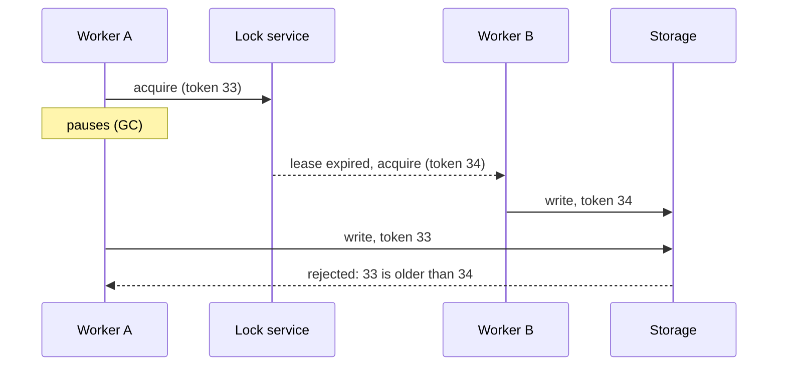

# p08: Distributed Locking — A lease lock stops double work, and a fencing token stops the holder that paused too long

Patterns · p07 → **p08** → p09

> *"A lock you cannot check at write time is only a hint"*
>
> **Concern**: consistency · availability

## The Problem

A flash sale. Two servers process the same order at once. Both check the inventory (one item left), both deduct, both confirm. The customer is charged twice and the inventory goes to −1. You needed a lock on that inventory check, and it has to work across servers, so an in-process mutex is no use.

## The Idea

A distributed lock is a single key to a shared room, kept by a third party that everyone trusts (Redis, ZooKeeper or etcd). Only the holder may enter. Because a holder can crash while holding the key, the key is a **lease**: it expires after a time-to-live (TTL) unless the holder renews it.

That expiry is what makes it tricky. The lock service and the holder do not share a clock or a fate, and the lock service cannot stop a holder that has lost the lock but does not know it.



## How It Works

1. **Acquire** the lock with a TTL. Only one worker can hold it.
2. **Renew** while working. The sim uses a 10 s lease renewed every third of it, 18 calls a minute.
3. **Release** when done, or let it expire if the holder dies. Another worker takes over after at most one lease: 10 s.
4. **Attach a fencing token** to each grant, a number that only goes up, and have the storage reject any write with an older token:

```js
// sim.mjs
  const fenced = outcome({ overlapSec: staleSec, accepted: 0, failoverSec: ttlSec, ttlSec });
```

## When It Breaks

The lease expires while its holder is not running. In the sim the holder pauses for 15 s, longer than the 10 s lease. Another worker takes the lock and starts writing. The first wakes up believing it still holds the lock and writes for about 3.3 s more, until its next renewal fails. At 100 writes a second that is 333 stale writes accepted. A pause can be a garbage collection, a slow disk, or a virtual machine freeze, and the holder cannot detect it: it checked the lock just before it paused.

Checking "do I still hold the lock?" before each write does not help, because the pause can happen between the check and the write.

## The Trade-off

**Fencing tokens** close the window: the storage remembers the highest token and rejects older ones, so 0 stale writes are accepted even though the old holder still writes for 3.3 s. The cost is that the storage must support token checks, and a lock service alone is not enough.

The lease length is a second trade. A shorter lease means faster failover after a real crash, but more renewals and more chances for a slow-but-alive holder to lose the lock: halving 10 s to 5 s doubles renewals to 36 a minute.

Use a lock only when you need mutual exclusion. If the operation can be made idempotent (p11), that is often simpler and safer.

*Note: the sim's 10 s lease, renewal at a third of the lease and 100 writes a second are assumptions. The vault note covers Redis, Redlock, ZooKeeper and etcd locks and the failure scenario above.*

## In The Wild

The vault note compares Redis-based locks (including the Redlock algorithm), and ZooKeeper and etcd locks, and discusses Kleppmann's fencing argument. The `checkout-double-charge` scenario in the practice gym is the double-processing failure, and `ticketmaster` is a drill where the same seat must not be sold twice.

## Try It

```sh
node course/4_patterns/p08_distributed_locking/sim.mjs
```

You should see `staleWritesAccepted=6000` with no lock, `0` with a lease, `doubleWriterSec=3.3  staleWritesAccepted=333` after the pause, and `staleWritesAccepted=0` with fencing. Try `--pauseSec=5`: the pause is shorter than the lease and nothing goes wrong.

## Say It In The Interview

1. Say you need a distributed lock only when two servers must not act on the same thing at once.
2. Say a lock needs a TTL, so a dead holder does not block everyone.
3. Raise the paused-holder problem yourself, and give fencing tokens as the fix.
4. Say where you would keep it (Redis, ZooKeeper, etcd), and prefer idempotency when possible.

## Boundary

This chapter covers mutual exclusion across machines. Choosing one leader for a whole group is p07, and making a repeated request harmless is idempotency (p11).

## What's Next

Servers now find each other, agree on a leader and take locks. How does a cluster spread news, like which nodes are alive, without anyone coordinating? Gossip: p09.

## Source notes

- [Distributed locking](../../../vault/system_design/03_design_patterns/distributed_locking.md)
