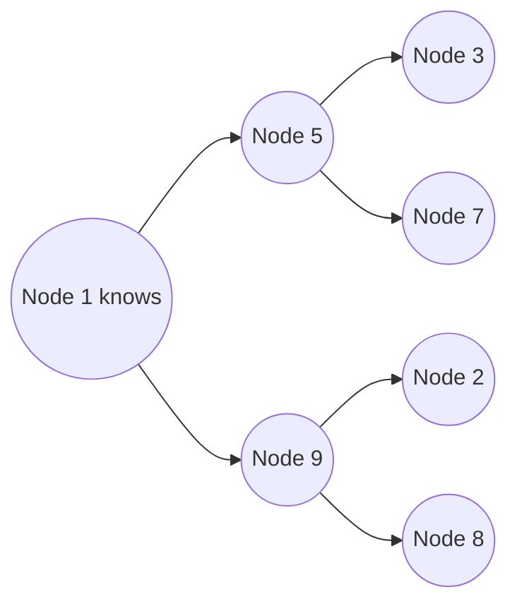

# p09: Gossip Protocol — News spreads through random whispers in about log N rounds, with no coordinator to lose

Patterns · p08 → **p09** → p10

> *"Tell a few, and let them tell a few"*
>
> **Concern**: scalability · availability

## The Problem

You have a cluster of 1,000 nodes, and one central monitor tracks every node's health. The monitor crashes. Now nobody knows which nodes are alive, requests route to dead nodes, timeouts cascade, and the whole cluster degrades. Even while it works, one machine must message all 1,000 nodes for every change: 999 messages, 10 seconds at a modest 100 a second.

## The Idea

A rumor in a school cafeteria. One student tells two or three friends, each of them tells two or three others, and within minutes everyone knows, though nobody made an announcement. There is no coordinator, only peer-to-peer whispers.

In a **gossip protocol**, each node periodically picks a few random peers and shares what it knows. The number of nodes that know a piece of news grows by a factor each round, so it reaches N nodes in about log N rounds. The vault calls this O(log N) and names SWIM, used for failure detection, as a common protocol.



## How It Works

1. **Every round, each node that knows the news picks a few random peers.** The sim uses 3.
2. **It tells them,** and any peer that did not know now does:

```js
// sim.mjs
        let peer = Math.floor(random() * (nodes - 1));
        if (peer >= n) peer++;
        if (random() * 100 >= lossPct && !knows[peer]) {
          knows[peer] = 1;
          known++;
        }
```

3. **Repeat** until everyone knows. With 1,000 nodes and fanout 3, that takes 8 rounds, and the busiest node sent only 24 messages, against 999 for the central monitor.
4. **Failure detection works the same way:** nodes gossip who they have heard from, and a node that nobody has heard from is marked dead. No single monitor decides.

## When It Breaks

Gossip is **eventually consistent**: for a few rounds, nodes hold different views of the cluster. And it is chatty. Even without loss, the sim's gossip sends 8,535 messages against 999 for the central broadcast, because most whispers reach someone who already knows.

Weak settings hurt. With a fanout of 1 and 20% of messages lost, spreading needs 22 rounds instead of 8. On a poor network, a node can be slow to hear about a failure, and a healthy node may be wrongly suspected.

## The Trade-off

A bigger fanout spreads faster but costs more: fanout 6 with 20% loss finishes in 6 rounds and sends 11,748 messages. Fanout 1 sends fewer per round but takes far longer.

So the win is not fewer messages. It is that the load spreads evenly, no node is special, and losing any node changes nothing. Use gossip when you have many nodes and can accept brief disagreement. For strong consistency, use a consensus system (p07).

*Note: the 100 messages a second monitor, the 1-second round and the random-peer model are the sim's assumptions. The vault gives the scenario, the O(log N) claim and the protocols.*

## In The Wild

The vault note names Cassandra, which uses gossip for cluster membership, and Consul, Serf and SWIM-based tools. It also covers anti-entropy, where nodes compare data and repair differences.

## Try It

```sh
node course/4_patterns/p09_gossip/sim.mjs
```

You should see `rounds=10  messages=999  busiestNodeSends=999` for the central monitor, `rounds=8  messages=8535  busiestNodeSends=24` for gossip, `rounds=22` for fanout 1 with loss, and `rounds=6  messages=11748` for the wider fanout. Try `--nodes=5000`: the central monitor needs 50 s while gossip needs only a few more rounds.

## Say It In The Interview

1. Say each node tells a few random peers periodically, so news spreads in O(log N) rounds.
2. Say there is no single point of failure, and load is even.
3. Say it is eventually consistent and chatty.
4. Name the uses: membership and failure detection (Cassandra, Consul), and anti-entropy repair.

## Boundary

This chapter covers spreading information without a coordinator. Agreeing on one value or one leader needs consensus (p07), and discovering services is b11.

## What's Next

Messages can be lost, and a caller that retries them can flood a recovering service. How should retries behave? Retry with backoff and jitter: p10.

## Source notes

- [Gossip protocol](../../../vault/system_design/03_design_patterns/gossip_protocol.md)
