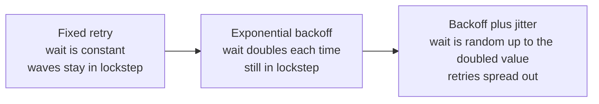

# p10: Retry with Backoff and Jitter — Retries help until every client retries at the same moment

Patterns · p09 → **p10** → p11

> *"Spread the retries, or the retries become the outage"*
>
> **Concern**: availability · scalability

## The Problem

A payment API has a bad minute and starts returning 503 to 1,000 clients. Every client's retry logic says the same thing: wait one second and try again. One second later all 1,000 arrive together. The server can only serve a slice of them, rejects the rest, and they all retry one second later.

Each wave is the same spike that caused the trouble in the first place. With a server that handles 300 requests a second, only 21% of clients get through after six retries each. A one-minute overload turns into an outage that never ends.

## The Idea

You call a busy restaurant and get a busy signal. You do not call back immediately. You wait a minute, then two, then five. And if a hundred people got the same busy signal, you would all want to avoid calling at the same second, so you add a random offset. That offset is **jitter**.

There are three levels, and each one fixes what the last one left broken:



## How It Works

1. **A failed request waits before retrying.** The wait gives the server time to recover.
2. **The wait grows.** Each failure doubles the wait (1 s, 2 s, 4 s, and so on) up to a cap of 30 seconds, so a struggling server sees fewer and fewer retries.
3. **The wait is randomized.** *Full jitter* picks a random time between zero and the doubled wait. Clients that failed together no longer retry together, so the load spreads across time.
4. **There is a limit.** After a fixed number of retries the client gives up and reports the failure.

```js
// sim.mjs
const POLICIES = {
  fixed: (base) => base,
  backoff: (base, attempt) => Math.min(CAP_MS, base * 2 ** (attempt - 1)),
  jitter: (base, attempt, rng) => rng() * Math.min(CAP_MS, base * 2 ** (attempt - 1)),
};
```

Two rules keep retries safe. Only retry errors that can succeed later (429, 5xx and timeouts), never a 400 or 404. And only retry operations that are safe to repeat, which is what p11 covers.

## When It Breaks

Backoff alone is not enough. All 1,000 clients fail at the same moment, so they all wait exactly 1 s, then exactly 2 s, then exactly 4 s. The waves are further apart, but each is still a full-size spike: only 21% succeed, and it takes 61 seconds to finish.

Other ways retries go wrong:

- **No retry limit.** Infinite retries waste resources and keep the server pinned.
- **Retrying non-idempotent calls.** A retried `POST /payments` after a lost response means a double charge.
- **Retrying a 4xx error.** A bad request will never succeed.
- **Retrying outside a circuit breaker.** When the service is truly down, retries only add load. Retry inside the breaker so it can open and fail fast (see p12).

## The Trade-off

Retries are extra load. In the sim, full jitter takes 3 attempts per client to get everyone through. Cap retries at 2 and it takes 2.6 attempts per client, but 24% of clients give up.

Production systems use a **retry budget**: a system-wide limit on how much of the traffic may be retries, typically 10%, so retries can never become the bulk of the load. The vault note suggests tighter budgets on critical paths (payments, about 5 to 10%) and looser ones for background work (20 to 30%).

## In The Wild

AWS SDKs ship with exponential backoff and full jitter built in. Stripe pairs retries with idempotency keys so a retried payment returns the original result instead of charging twice. The OpenAI 2024 outage was a thundering herd of a different kind: DNS caches expired at the same moment and everything asked again at once, which is the same shape of failure.

## Try It

```sh
node course/4_patterns/p10_retry_backoff/sim.mjs
```

You should see four frames. The first reports `successPct=21  gaveUpPct=79  attemptsPerClient=6.4  settledSec=6` for fixed retry, and the second reports `successPct=100  attemptsPerClient=3` with jitter. Try `--capacityRps=100` to squeeze the server: fixed retry falls to 7% while jitter still gets 99.9% through, in 34 seconds.

## Say It In The Interview

1. Name jitter: backoff alone still retries in lockstep, so add randomness. The formula is `sleep = random(0, min(cap, base * 2^attempt))`.
2. Retries need idempotency: an idempotency key makes a retried request safe.
3. Put a circuit breaker around the retries: retries handle brief failures, the breaker handles sustained ones.
4. Mention a retry budget of about 10% so retries cannot double the load.

## Boundary

This chapter covers when and how long to wait between attempts. Making the repeated request safe is p11, Idempotency, and stopping retries entirely when a dependency is down is p12, Circuit Breaker.

## What's Next

Retrying a payment is only safe if repeating it cannot charge twice. How do you make a request safe to repeat? That is p11, Idempotency.

## Source notes

- [Retry with exponential backoff and jitter](../../../vault/system_design/03_design_patterns/retry_with_backoff.md)
