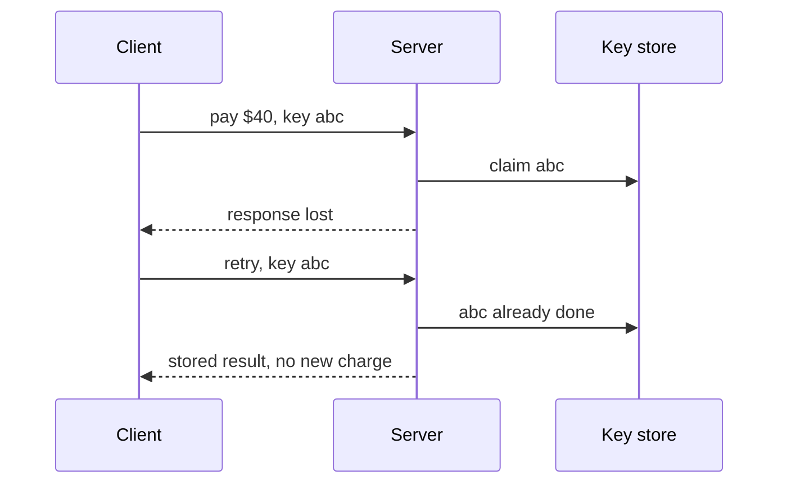

# p11: Idempotency — Give each request a key so a retry returns the first result instead of charging twice

Patterns · p10 → **p11** → p12

> *"Do it once, no matter how many times you are asked"*
>
> **Concern**: consistency · availability

## The Problem

A customer taps Pay. The server charges the card, but the response is lost on its way back. The client sees a timeout and retries, as retry logic (p10) tells it to. The server sees a new request and charges again. With 1,000,000 payments a day and 2% of responses lost, the sim ends the day with 20,408 duplicate charges, $816,320 taken twice.

## The Idea

An elevator button. Pressing it five times still calls one elevator: the operation is **idempotent**, meaning repeating it has the same effect as doing it once. Reading a page is idempotent, and so are PUT and DELETE in HTTP. A POST that creates or charges is not, so we make it so.

The client generates a unique **idempotency key** for each logical operation and sends it on every attempt (Stripe uses an `Idempotency-Key` header). The server remembers each key with its result. If a key comes back, it returns the stored result and does nothing new.



## How It Works

1. **The client makes a key** for the operation, once, and reuses it on every retry.
2. **The server claims the key** before doing the work.
3. **It stores the result** against the key when done.
4. **A repeated key** gets the stored result. In the sim that cuts duplicates from 20,408 to 0, for 2 ms a request and 100 MB of keys held for 24 hours:

```js
// sim.mjs
  let retried = 0;
  for (let i = 1; i <= retries; i++) retried += paymentsPerDay * p ** i;
  const keys = (paymentsPerDay * retentionHours) / 24;
```

## When It Breaks

The claim must be atomic. If the server reads the key ("not seen") and then writes it in a second step, two attempts that overlap both see "not seen" and both charge. In the sim, when 5% of retries overlap the first attempt, 1,020 duplicates ($40,816) still get through.

Keys also expire. If a retry arrives after the key is gone, it looks new. And a key must be tied to the request it came with: the same key with a different amount should be rejected, not treated as a repeat.

## The Trade-off

Claiming the key with one atomic step, a database unique constraint or Redis `SET NX`, removes the race: 0 duplicates. You pay for it. Every request does one extra check (2 ms here), the store holds one entry per key for as long as clients might retry (the vault's Stripe example keeps them for 24 hours), and that store is now on your critical path.

Use it wherever a repeated request would do harm: payments, orders, emails. Where an operation is naturally idempotent, do not add a key.

*Note: the sim's 2% loss, 3 retries, 2 ms check, 100 bytes a key and 5% overlap are assumptions. The vault note covers the Idempotency-Key header, Stripe's approach, Redis and database unique constraints, and queue consumers.*

## In The Wild

The vault note walks through Stripe's implementation and also covers idempotent consumers of message queues (b05), where a message may be delivered more than once. The `knight_capital_2012` replay is a runaway flood of orders, the kind of damage that repeated or unintended operations can do at speed. The gym's `checkout-double-charge` scenario is this chapter's failure.

## Try It

```sh
node course/4_patterns/p11_idempotency/sim.mjs
```

You should see `duplicateCharges=20408  duplicateUsd=816320` first, then `duplicateCharges=0  extraLatencyMs=2  keyStorageMb=100`, then `duplicateCharges=1020  duplicateUsd=40816` with the race, and `duplicateCharges=0` with an atomic claim. Try `--lossPct=5`: naive retries duplicate 52,625 payments.

## Say It In The Interview

1. Say retries need idempotency, or a lost response becomes a double charge.
2. Describe the key: the client generates it, the server stores key and result.
3. Say the claim must be atomic (unique constraint or `SET NX`), and keys need a retention window.
4. Mention which HTTP methods are already idempotent, and that queue consumers need the same care.

## Boundary

This chapter covers making one request safe to repeat. How retries are spaced is p10, and coordinating several steps that can each fail is the saga (p19).

## What's Next

A dependency is slow and retries are safe, but callers still pile up waiting on it. How do you stop calling something that is failing? A circuit breaker: p12.

## Source notes

- [Idempotency](../../../vault/system_design/03_design_patterns/idempotency.md)
