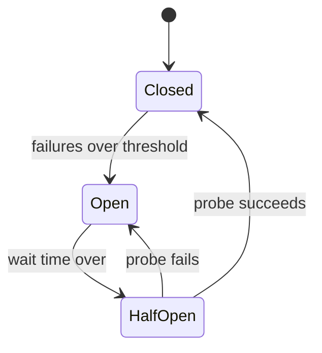

# p12: Circuit Breaker — Stop calling a failing dependency, so its slowness does not eat every thread you have

Patterns · p11 → **p12** → p13

> *"Fail fast beats waiting to fail"*
>
> **Concern**: availability · latency

## The Problem

Service A calls Service B. B's database goes down, and every call takes 30 seconds to time out. A has 100 threads, all now waiting on B, so A stops answering. Service C calls A, and gets stuck too. One database outage cascades through the whole system.

The sim uses gentler numbers: 500 requests a second, 200 threads, a dependency that slows to 5 seconds, and only half the requests need it. The demand for threads is rate times time held, so those slow calls need about 1,263 threads and the pool has 200. It is 100% used, and 84% of all requests fail, including the 50% that never touch the slow dependency.

## The Idea

A circuit breaker in a house cuts the power when a circuit draws too much, so the wiring does not burn. In software, the breaker wraps the call to a dependency and counts failures. Past a threshold it **opens**: calls fail at once, without trying. After a while it lets one probe through to see whether the dependency has recovered.

The states are **closed** (calls go through), **open** (calls fail fast) and **half-open** (one probe is allowed). Netflix's Hystrix and Resilience4j are well-known libraries.



## How It Works

1. **Closed.** Calls go through and failures and timeouts are counted.
2. **Open.** Past the threshold, calls to the dependency fail in about 1 ms instead of waiting 5 s. Threads free up: the pool drops to 6% used.
3. **Fallback.** A failed call can return cached or default data instead of an error. With 60% of dependency requests answered from a fallback, 20% of all requests fail, not 84%:

```js
// sim.mjs
  const breaker = outcome({
    demandThreads: otherThreads,
    poolSize,
    failedShare: share * (1 - fallback),
```

4. **Half-open.** After a wait, one probe goes through. If it succeeds, the breaker closes; if not, it opens again.

## When It Breaks

The open time is a guess. Suppose the dependency is slow for only 5 s, but the breaker stays open 30 s. For the 25 s after it recovered, 20% of requests still fail while the dependency is fine. A breaker that trips too easily on a small blip can hurt more than it helps.

A fallback can also be wrong: stale prices or a default recommendation is better than an error for some features and dangerous for others (a balance, an inventory count).

## The Trade-off

A shorter open time with a probe recovers quickly: in the sim, a 5 s wait wastes 0 s after a 5 s blip, and the probe costs 0.2 calls a second. If the dependency is still down, each probe waits the full 5,000 ms and holds one thread, which is cheap.

The rest is a policy choice per dependency: what counts as failure (errors, timeouts, slow calls), how big the window is, what the fallback returns, and who is alerted when it opens. Pair it with timeouts and with a bulkhead (p13), which limits how many threads one dependency may hold, and with backoff on the retries (p10).

*Note: the 50 ms healthy call, 1 ms fast failure, the 50% share, and the proportional sharing of an exhausted pool are the sim's assumptions. The vault note gives the scenario, the three states, fallbacks and the libraries.*

## In The Wild

The vault note covers Netflix Hystrix and Resilience4j. The `aws_us_east_2021` replay in the vault is a large-scale cascade, the kind of failure a breaker limits.

## Try It

```sh
node course/4_patterns/p12_circuit_breaker/sim.mjs
```

You should see `poolUsedPct=100  failedRequestsPct=84` without a breaker, `poolUsedPct=6  failedRequestsPct=20` with one, `unneededOpenSec=25` when it stays open too long, and `unneededOpenSec=0  dependencyCallsRps=0.2` with a shorter open time. Try `--fallbackPct=0`: the breaker still frees the pool, but half of all requests fail, and fast.

## Say It In The Interview

1. Say a slow dependency is worse than a dead one: it holds threads and cascades.
2. Name the three states: closed, open, half-open.
3. Give the fallback, and what it must not be used for.
4. Mention timeouts and bulkheads alongside it.

## Boundary

This chapter covers stopping calls to a failing dependency. Limiting how many threads one dependency can take is the bulkhead (p13), and slowing the retries is p10.

## What's Next

The breaker opens only after a pool is already full. Can you make sure one dependency can never use the whole pool in the first place? A bulkhead: p13.

## Source notes

- [Circuit breaker](../../../vault/system_design/03_design_patterns/circuit_breaker.md)
