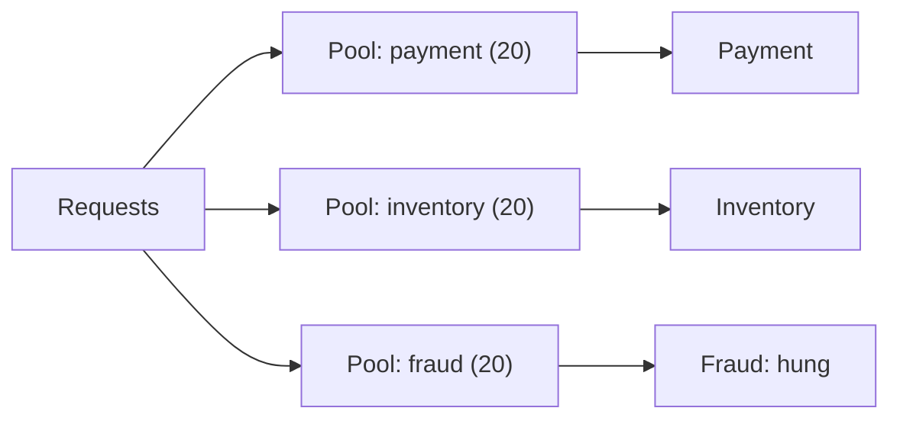

# p13: Bulkhead Pattern — Give each dependency its own compartment so one hung call cannot sink the whole service

Patterns · p12 → **p13** → p14

> *"Let one compartment flood, and keep the ship afloat"*
>
> **Concern**: availability · cost

## The Problem

Your Order service calls 10 downstream services (payment, inventory, shipping, recommendations, reviews, analytics, pricing, tax, fraud, notifications) from one shared pool of 200 threads. The fraud service ships a bad release and starts answering in 25 seconds instead of 50 ms.

At 400 requests a second, its calls need about 1,000 threads, and the pool has 200. Every thread ends up waiting on fraud. In the sim, 80% of all requests fail, and so do 80% of the requests to the nine healthy dependencies, which had done nothing wrong.

## The Idea

A ship's hull is divided into watertight compartments. A hole floods one compartment, not the ship. In software, a **bulkhead** gives each dependency (or client, or feature) its own limited pool of threads, connections or memory. When one is exhausted, the others are untouched.

The circuit breaker (p12) reacts after failures; the bulkhead limits the damage beforehand, and the two work together. The vault covers both thread-pool and semaphore bulkheads, and libraries such as Resilience4j and Hystrix.



## How It Works

1. **Split the pool by dependency.** 200 threads across 10 dependencies is 20 each.
2. **A slow dependency fills only its own pool.** The hung fraud service can hold 20 threads, not 200.
3. **Excess calls to it are rejected at once**, without waiting. In the sim 10% of requests fail (fraud's own), and the healthy dependencies lose 0%:

```js
// sim.mjs
  const failed = rate.map((r, i) => r * (1 - served[i]));
  const from = hung ? 1 : 0;
```

4. **Other resources can be bulkheaded too:** connection pools, per-tenant limits, or separate deployments for critical and non-critical traffic. A **semaphore** bulkhead is a cheap counter with no separate threads.

## When It Breaks

Isolation wastes flexibility. In the sim, a healthy dependency spikes to 15 times its normal traffic. It needs about 30 threads and its compartment holds 20, so 21% of requests are rejected even though the other nine compartments are almost idle. A shared pool would have absorbed this. Capacity in one compartment cannot help another.

Compartments must also be sized, and re-sized as traffic changes. Too tight causes the rejections above, and too many small pools cost memory and switching.

## The Trade-off

Bigger compartments help: doubling each pool to 40 threads takes the spike's rejections to 0%. But the service now reserves 400 threads instead of 200, and a hung dependency can now hold twice as many.

Choose the boundary by blast radius. Give critical dependencies (payments) their own pools, and let low-value ones share. Combine with timeouts, so a compartment turns over even when a dependency hangs.

*Note: the 50 ms healthy call, the even spread of requests and the proportional-rejection rule are the sim's assumptions. The vault gives the 10-dependency scenario, thread-pool versus semaphore bulkheads and the libraries.*

## In The Wild

The vault note covers Hystrix, Resilience4j and Kubernetes resource isolation. The `aws_us_east_2021` outage replay in the vault is a case where trouble in one part of a shared system spread to others.

## Try It

```sh
node course/4_patterns/p13_bulkhead/sim.mjs
```

You should see `failedRequestsPct=80  healthyDepsFailedPct=80  threadsHeldByHung=200` with a shared pool, `failedRequestsPct=10  healthyDepsFailedPct=0  threadsHeldByHung=20` with bulkheads, `failedRequestsPct=21` for the spike, and `failedRequestsPct=0  totalThreads=400` with bigger compartments. Try `--deps=20`: each compartment shrinks to 10 threads.

## Say It In The Interview

1. Say a shared pool lets one slow dependency starve every other.
2. Say a bulkhead gives each dependency its own limited pool, so the damage stays local.
3. Name the cost: idle capacity in one pool cannot be used by another, and sizing matters.
4. Pair it with a circuit breaker and timeouts.

## Boundary

This chapter covers isolating resources. Stopping calls to a failing dependency is the circuit breaker (p12), and isolating a whole slice of users from a bad deploy is the cell (p15).

## What's Next

Bulkheads reject work when a compartment is full. How should a system slow down or shed load when producers outrun consumers? Back pressure: p14.

## Source notes

- [Bulkhead pattern](../../../vault/system_design/03_design_patterns/bulkhead_pattern.md)
