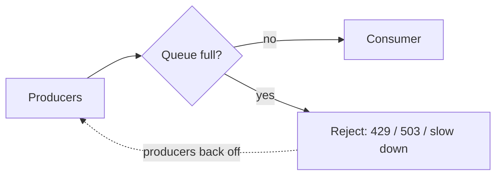

# p14: Back Pressure — Refuse work you cannot finish in time, so a surge becomes rejected requests instead of a crash

Patterns · p13 → **p14** → p15

> *"Say no early, or fail late"*
>
> **Concern**: availability · latency

## The Problem

Your ingestion pipeline handles 10,000 events a second. A spike pushes 100,000 a second. The queue fills, the workers cannot keep up, memory runs out, and the whole pipeline crashes, losing all 100,000 events. If it had refused or slowed the excess, most of the work would have survived.

The sim scales it down: a consumer that does 1,000 requests a second faces 1,500 for 30 seconds, and clients give up after 3 seconds. An unbounded queue swallows it all, and grows to a 16 s wait and 31.3 MB, and 83% of the work is for clients who already left.

## The Idea

A kitchen with a line of order tickets. If tickets arrive faster than the cooks can work, you can keep taking them (the wait becomes hours), or the host can stop taking orders. **Back pressure** is the second option: a full system pushes back on the source instead of buffering without limit.

The signals are simple: a bounded queue that rejects when full, an HTTP 429 or 503, TCP's own flow control, or consumers that tell producers how much they can accept (Reactive Streams). Rejecting on purpose is called **load shedding**.



## How It Works

1. **Bound the queue.** A limit of 2,000 items keeps memory at 3.9 MB and the wait at 2 s.
2. **Reject when full**, at once, so the caller learns immediately. In the sim 31% of the surge is rejected.
3. **Producers respond**: they slow down, retry with backoff (p10), or drop low-value events.
4. **Size the limit by the timeout.** The rule is capacity times timeout, so everything queued can be served before the client gives up:

```js
// sim.mjs
    const take = Math.min(arrivalRps, Math.max(0, limit - queue));
    wasted += Math.max(0, Math.min(take, queue + take - Math.max(queue, budget)));
    accepted += take;
```

## When It Breaks

A limit that is too generous is nearly as bad as none. At 8,000 items the wait reaches 8 s, longer than the 3 s clients allow. The queue stays full of requests nobody is waiting for, and 80% of the work is wasted, while only 18% of the surge is rejected. The system looks busy and delivers little.

Back pressure also has to be honoured. A producer that retries a rejected request immediately turns a rejection into more load, which is why p10 matters.

## The Trade-off

Sizing the queue to the timeout (1,000 requests a second × 3 s = 3,000 items) wastes nothing and waits 3 s, at the cost of shedding 29% of the surge. You trade completeness for timeliness: some requests get a fast "no" so that the rest get a useful "yes".

Which requests to shed is a policy choice: newest first (simple), lowest priority first, or by client (this is close to rate limiting, b09). Where you cannot afford to lose events, push back all the way to a durable log such as Kafka, and let the log buffer.

*Note: the sim's rates, 3 s timeout and 2 KB per item are assumptions, and it treats the surge as constant. The vault gives the 10K to 100K events scenario and the mechanisms.*

## In The Wild

The vault note covers HTTP 429 and 503 responses, Kafka consumers and Reactive Streams, along with TCP flow control and load shedding. The gym's `iot-ingest-overload` scenario is a device fleet flooding an ingestion service.

## Try It

```sh
node course/4_patterns/p14_back_pressure/sim.mjs
```

You should see `droppedPct=0  wastedWorkPct=83  peakWaitSec=16  peakMemoryMb=31.3` for the unbounded queue, `droppedPct=31  wastedWorkPct=0  peakWaitSec=2` for a queue of 2,000, `droppedPct=18  wastedWorkPct=80  peakWaitSec=8` for 8,000, and `droppedPct=29  wastedWorkPct=0  peakWaitSec=3` sized to the timeout. Try `--surgeSec=120`: the unbounded queue's wait grows to 60 s.

## Say It In The Interview

1. Say an unbounded queue only hides overload until memory runs out.
2. Name the tools: a bounded queue, 429 or 503 rejection, load shedding, consumer-driven flow control.
3. Say queue size should follow the client timeout, or you serve requests nobody waits for.
4. Say producers must back off when rejected.

## Boundary

This chapter covers what a consumer does when it is overloaded. Limiting each client's rate at the edge is b09, and isolating the damage inside a service is the bulkhead (p13).

## What's Next

Back pressure keeps one system alive under load. Can you also limit how many users one bad deploy or one failing part can reach? With cells: p15.

## Source notes

- [Back pressure](../../../vault/system_design/03_design_patterns/back_pressure.md)
