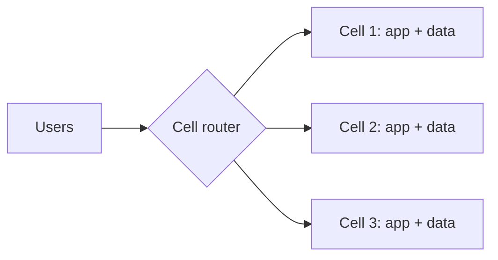

# p15: Cell-Based Architecture — Split users across self-contained copies of the service so one bad deploy reaches only a slice of them

Patterns · p14 → **p15** → p16

> *"Make the blast radius a design choice"*
>
> **Concern**: availability · cost

## The Problem

Your team pushes a bad deploy that corrupts data in the shared database. Every user is affected: 100% blast radius. The whole platform is down while you roll back and repair data. With cells, that same deploy goes to cell 3 first, and only the 2% of users in cell 3 are hurt. The other 98% never notice.

## The Idea

A submarine has watertight compartments. If one floods, you seal it and keep sailing. A **cell** is a self-contained copy of the whole service, with its own data, serving a fixed slice of users. A **cell router** at the front maps each user to their cell. A failure in one cell cannot spread to another because they share nothing that can fail together.

The **blast radius** is the share of users a single failure can reach. Cells make it a design parameter: 1 divided by the number of cells.



## How It Works

1. **Build a full stack per cell**: services, database, queues.
2. **Assign each user to one cell** and route by user id.
3. **Roll out one cell at a time.** Deploy, watch, and continue only if healthy.
4. **Blast radius is 1 over N.** With 50 cells, a failure that starts in one cell reaches 2% of users:

```js
// sim.mjs
  const shared = outcome({ affectedShare: 1, cells: 1, cellOverheadPct, rolloutMin: ALL_AT_ONCE_MIN });
  const oneCell = outcome({ affectedShare: 1 / cells, cells, cellOverheadPct, rolloutMin: ALL_AT_ONCE_MIN });
```

5. **Shuffle sharding**, mentioned in the vault, is a refinement: each customer maps to a small random group of cells, so two customers rarely share the same set.

## When It Breaks

Cells only contain failures that start inside one cell. If a deploy goes to all 50 at once, 100% of users are affected, exactly as before, and you paid a 25% higher infrastructure bill for nothing.

Shared parts break the isolation as well. A global database, a shared queue or the router itself is a place where one failure spans every cell. The router must therefore be very simple and highly available.

## The Trade-off

Staged rollout makes cells pay off. Deploy to one cell and wait. With a 10 minute detection time, a bad build reaches 2% of users, and a rollback affects one cell's data. The cost is speed: with a 30 minute wait between cells, a full rollout takes 1,475 minutes, about a day, instead of 5.

Cells also cost money. Each has fixed overhead and spare capacity, so 50 cells at 0.5% each is a cost index of 125. They complicate anything that crosses cells (reports, moving a user, a very large customer that does not fit in one), so choose the cell count from the blast radius you need, not the largest number you can run.

*Note: the sim's 50 cells, 0.5% overhead a cell, 10 min detection, 30 min wait and 5 min all-at-once deploy are assumptions. The vault note gives the 2% scenario, the router and shuffle sharding.*

## In The Wild

The vault note mentions AWS and Slack among its examples. The `aws_s3_2017` and `aws_us_east_2021` outage replays are large failures where a wider blast radius meant more customers down.

## Try It

```sh
node course/4_patterns/p15_cells/sim.mjs
```

You should see `usersAffectedPct=100  infraCostIndex=100` for one shared stack, `usersAffectedPct=2  infraCostIndex=125` with cells, `usersAffectedPct=100  infraCostIndex=125` for an all-at-once deploy, and `usersAffectedPct=2  rolloutMinutes=1475` staged. Try `--cells=10`: the blast radius is 10% and the cost index 105.

## Say It In The Interview

1. Say the goal is to limit the blast radius: one failure reaches only one cell's users.
2. Describe a cell as a full independent copy with its own data, behind a cell router.
3. Say deploys go one cell at a time.
4. Mention the costs: infrastructure, a slower rollout, and cross-cell operations.

## Boundary

This chapter covers isolating slices of users. Isolating dependencies inside one service is the bulkhead (p13), and splitting the data itself is sharding (p03).

## What's Next

Cells talk to each other and to the outside through messages. How do you send one event to many independent consumers? Publish and subscribe: p16.

## Source notes

- [Cell-based architecture](../../../vault/system_design/03_design_patterns/cell_based_architecture.md)
