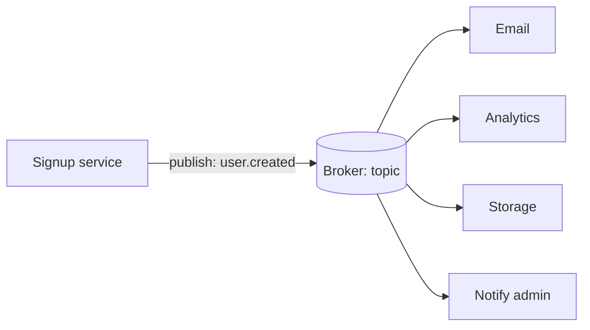

# p16: Publish and Subscribe — Publish an event once and let any number of subscribers pick it up, as long as they can keep up

Patterns · p15 → **p16** → p17

> *"Announce it once, and let whoever cares listen"*
>
> **Concern**: scalability · availability

## The Problem

When a user signs up, you must send a welcome email, record an analytics event, provision storage and notify an admin. Your signup service calls four other services directly. If the email service is slow, signup is slow. If analytics is down, signup fails. Every new interested party means changing the signup service.

The sim scales it up: 10 subscribers at 30 ms a call means the publisher waits 300 ms for every event, and the last subscriber hears about it 300 ms after the first.

## The Idea

A radio station broadcasts once and anyone tuned in hears it. The station does not know who is listening, and does not change when a listener joins. In publish and subscribe, a publisher sends an **event** to a **topic** on a **broker**, and each subscriber to that topic receives it. Kafka, RabbitMQ, Google Pub/Sub and AWS SNS with SQS are the usual brokers.



## How It Works

1. **The publisher sends one message** to a topic and moves on. In the sim it waits 35 ms instead of 300 ms.
2. **The broker stores it** and delivers a copy to each subscriber, in parallel, 65 ms end to end:

```js
// sim.mjs
  const direct = outcome({ waitMs: subscribers * callMs, endToEndMs: subscribers * callMs, deliveries });
  const broker = outcome({ waitMs: callMs + BROKER_MS, endToEndMs: callMs + BROKER_MS + callMs, deliveries });
```

3. **Subscribers are independent.** Adding one needs no change to the publisher, and one that is down catches up from the stored events when it returns.
4. **Consumer groups** let several copies of one subscriber share the work, so each event is handled by one of them.

## When It Breaks

The publisher no longer sees its subscribers, so a slow one goes unnoticed. In the sim one subscriber handles 40 events a second while 100 arrive. It falls 60 events a second behind, and after 10 minutes its backlog is 36,000 events, each waiting longer than the last. The publisher is fine and does not know.

Delivery is usually **at least once**: the broker retries until acknowledged, so a subscriber can see the same event twice. Ordering across partitions is limited too, and the broker itself is now infrastructure that must stay up.

## The Trade-off

Three consumers in a group can handle 120 events a second, and the backlog is 0. In return, retries mean 2% of deliveries repeat, 1,200 duplicates a minute across the 10 subscribers, so every subscriber must be idempotent (p11).

Pub/sub gains decoupling and fan-out at the cost of immediacy and visibility. Use it when many parties react to an event and the publisher does not need their result. Use a direct call when the caller needs an answer now.

*Note: the sim's 30 ms call, 5 ms broker time and 2% redelivery are assumptions. The vault note gives the signup scenario, the brokers, consumer groups and at-least-once delivery.*

## In The Wild

The vault note compares Kafka, RabbitMQ, Google Pub/Sub, SNS with SQS and Redis Pub/Sub, and explains consumer groups. The gym's `notification-firehose` scenario and `notification-service` drill are both fan-out problems.

## Try It

```sh
node course/4_patterns/p16_pub_sub/sim.mjs
```

You should see `publisherWaitMs=300  endToEndMs=300` for direct calls, `publisherWaitMs=35  endToEndMs=65` with a broker, `slowSubscriberBacklog=36000` for the slow subscriber, and `slowSubscriberBacklog=0  duplicatesPerMin=1200` with a consumer group. Try `--subscribers=50`: direct calls now make the publisher wait 1,500 ms.

## Say It In The Interview

1. Say pub/sub decouples publishers from subscribers and fans one event out to many.
2. Name the broker (Kafka, SNS/SQS, RabbitMQ) and the topic and consumer group ideas.
3. Say delivery is at least once, so consumers must be idempotent.
4. Watch for lag: a slow consumer builds a backlog the publisher never sees.

## Boundary

This chapter covers one-to-many events. A single queue with one consumer for buffering work is b05, and making duplicates harmless is p11.

## What's Next

Events flow to many readers, and readers want their own shape of the data. Why not separate the write model from the read model? CQRS: p17.

## Source notes

- [Pub/sub](../../../vault/system_design/03_design_patterns/pub_sub.md)
