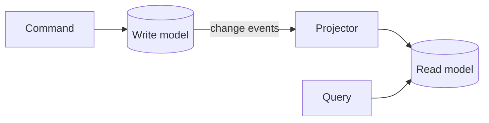

# p17: CQRS — Give reads their own denormalised model, and accept that it trails the writes

Patterns · p16 → **p17** → p18

> *"Reads and writes want different shapes, so give each its own"*
>
> **Concern**: latency · consistency

## The Problem

Your product page needs details, reviews, ratings, recommendations and the inventory count. One SQL query with five joins takes 800 ms. Meanwhile, orders and reviews are written to the same tables, causing lock contention. Reads and writes have different needs, but they share one model and one database.

In the sim, 500 reads and 100 writes a second put a 16-core database at 131%, and reads slow to 1,048 ms.

## The Idea

A restaurant has an order pad for the waiter and a menu board for the guests. The pad records exactly what was ordered; the board shows it in the way that is easiest to read. **CQRS**, command query responsibility segregation, does this for data. **Commands** (writes) go to a write model that is normalised and enforces the rules. **Queries** (reads) go to a read model shaped like the screens that need it. A **projector** copies each change from one to the other.

The vault lists Elasticsearch, Redis and MongoDB as read stores, and Kafka for carrying the changes.



## How It Works

1. **Commands change the write model**, which can stay small and strict.
2. **Each change becomes an event**, which the projector applies to one or more read models.
3. **A query is one lookup** on a document already shaped like the page:

```js
// sim.mjs
  const split = {
    readLatencyMs: LOOKUP_LATENCY_MS,
    writeSideUtilPct: utilPct(writesPerSec * WRITE_CPU_MS, cores),
    readSideUtilPct: utilPct(readsPerSec * LOOKUP_CPU_MS, cores),
    readModelLagMs: projectionLagMs,
  };
```

4. **The result:** reads take 5 ms and 2% of the read store, the write side is at 6%, and the read model trails by about 500 ms.
5. **Scale each side alone.** Reads can have many replicas or a cache, and writes keep a small strict database.

## When It Breaks

The read model is eventually consistent. If writes arrive faster than the projector can copy them, the lag grows. In the sim a 10 s burst of 2,000 writes a second against a projector that manages 500 leaves 15,000 events waiting: the read model is 30.5 s behind, and a customer who just changed something reads the old value. The write side is also over capacity during the burst (125%).

You also have more parts: two models, a projector, and a way to rebuild a read model when its shape changes.

## The Trade-off

To hide the lag from the person who caused it, route a few reads, such as a user viewing their own change, to the write model. In the sim 2% of reads cost the write side 9% instead of 6%. Everyone else still sees data up to 500 ms old.

CQRS pays when reads and writes really differ: heavy read joins, very different volumes, several shapes of the same data. For a simple create-read-update app it is extra machinery. A single model with an index (p01) or a cache (b04) is often enough.

*Note: the 40 ms join, 10 ms write, 0.5 ms lookup, 16 cores and the projector speed are the sim's assumptions. The vault gives the 800 ms scenario, the read stores and projection.*

## In The Wild

The vault note walks through read models in Elasticsearch, Redis and MongoDB and event streams on Kafka, and pairs CQRS with event sourcing (p18).

## Try It

```sh
node course/4_patterns/p17_cqrs/sim.mjs
```

You should see `readLatencyMs=1048  writeSideUtilPct=131` for one model, `readLatencyMs=5  writeSideUtilPct=6  readSideUtilPct=2  readModelLagMs=500` split, `readModelLagMs=30500` after the burst, and `writeSideUtilPct=9` with reads of your own writes. Try `--projectorRps=2000`: the burst no longer builds a backlog and the lag stays at 500 ms.

## Say It In The Interview

1. Say CQRS separates the write model from the read model so each is shaped for its job.
2. Name the projector and the read stores.
3. Say the read side is eventually consistent, and what you do about read-your-writes.
4. Say when not to use it: simple CRUD.

## Boundary

This chapter covers splitting reads from writes. Storing the writes as a log of events is event sourcing (p18), and broadcasting events is p16.

## What's Next

The write side keeps only the current state, so the history of how it got there is lost. What if you stored the changes instead? Event sourcing: p18.

## Source notes

- [CQRS](../../../vault/system_design/03_design_patterns/cqrs.md)
