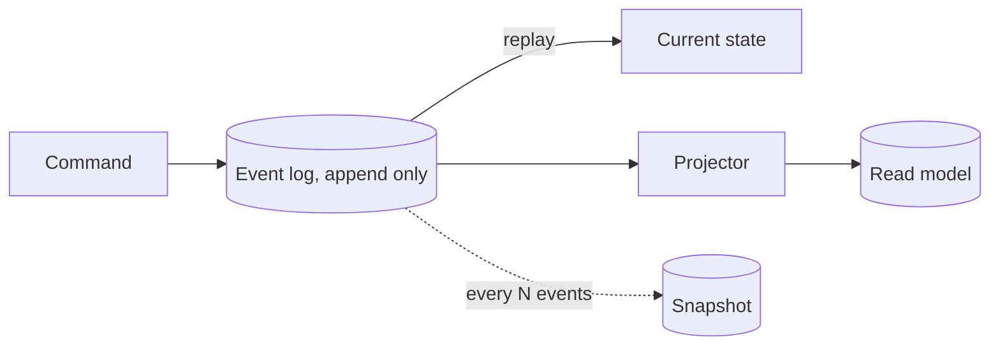

# p18: Event Sourcing — Keep every change as an event and derive the state, and use snapshots so replays stay short

Patterns · p17 → **p18** → p19

> *"Store what happened, and work out what is true"*
>
> **Concern**: consistency · cost

## The Problem

Your e-commerce system updates an order's status in place: pending, paid, shipped, delivered. A customer disputes: "I never received it, but it says delivered." You have no record of who changed the status or when. The database holds only the latest value.

## The Idea

A bank statement lists every deposit and withdrawal, and the balance is what you get by adding them up. **Event sourcing** keeps the statement, not just the balance. Every state change is stored as an immutable **event** ("OrderPaid", "OrderShipped") appended to a log. The current state is computed by replaying an entity's events, its **aggregate**.

You get a full audit trail, and you can rebuild any view of the data by replaying the log, including views you did not think of when you wrote the events. It pairs well with CQRS (p17), where projectors build read models from the same events, and it uses the log idea of p05.



## How It Works

1. **Commands become events**, appended and never edited.
2. **State is a replay.** To load an account, read its events and apply them in order. With 200 events at 50,000 replayed a second, that is 4 ms:

```js
// sim.mjs
  const replayMs = (events) => (events / replayEventsPerSec) * 1000;
```

3. **The history is free.** In the sim, 100,000 accounts hold 20 million events: the answer to "who changed this and when" is in the log.
4. **Snapshots** save the computed state every N events, so a load starts from the latest snapshot and replays only what follows.
5. **Correcting a mistake means a new event** ("PaymentReversed"), not an edit, so the history stays true.

## When It Breaks

Replay time grows with the length of the history. A very active account with 200,000 events takes 4,000 ms to load, a second longer for every 50,000 events, without limit.

There is also the size: 20 million events at 1 KB take 19,531 MB, about a hundred times the 195 MB the state rows need. Events cannot be edited either, so a wrong event schema, or a legal need to erase personal data, needs careful handling.

## The Trade-off

A snapshot every 1,000 events caps a load at 1,000 replayed events plus the snapshot read: 22 ms, instead of 4,000. It adds 100,000 snapshots (about 490 MB) and a policy for when to write them. The snapshot is a cache: if it is wrong or the event schema changes, you delete it and replay.

Use event sourcing when the history is the point: money, orders, compliance, or when you need to derive new views from the past. For ordinary CRUD, it is a lot of machinery for a benefit you will not use.

*Note: the 100,000 accounts, 200 events each, 1 KB an event, 50,000 events a second replay and 5 KB snapshots are the sim's assumptions. The vault note gives the order-status scenario, snapshots, and examples such as banking.*

## In The Wild

The vault note covers event stores such as EventStore and Kafka-based logs, snapshotting, audit trails, and banking as the classic use. The `payment-system` drill is a domain where the history of every change matters.

## Try It

```sh
node course/4_patterns/p18_event_sourcing/sim.mjs
```

You should see `loadStateMs=2  storageMb=195  historyEvents=0` for state in place, `loadStateMs=4  storageMb=19531  historyEvents=20000000` for events, `loadStateMs=4000` for the busy account, and `loadStateMs=22  snapshotsStored=100000` with snapshots. Try `--longLivedEvents=1000000`: replaying it takes 20,000 ms.

## Say It In The Interview

1. Say you store immutable events and derive state by replay.
2. Give the benefits: audit, time travel, rebuilding read models.
3. Give the costs: storage, replay time (fixed with snapshots), and schema changes.
4. Say it pairs with CQRS, and that you would not use it for plain CRUD.

## Boundary

This chapter covers storing changes as events. Separating read models is CQRS (p17), and the write-ahead log that a database uses internally for recovery is p05.

## What's Next

A purchase now spans payment, stock and shipping in three services, each with its own log. If the last step fails, how do you undo the first two? With a saga: p19.

## Source notes

- [Event sourcing](../../../vault/system_design/03_design_patterns/event_sourcing.md)
