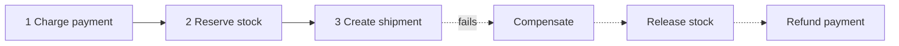

# p19: Saga Pattern — Replace one big transaction with local steps and an undo for each, and make the undos safe to retry

Patterns · p18 → **p19** → t01

> *"If you cannot roll back, roll forward with an apology"*
>
> **Concern**: consistency · availability

## The Problem

An e-commerce checkout deducts payment, reduces inventory and creates a shipment. Those are three microservices with three databases, so one database transaction cannot cover them. Payment succeeds, the inventory deduction succeeds, and the shipment fails. Now you have taken money and reserved stock for an order that cannot ship.

In the sim, a five-step checkout fails at step 4, and 2% of 100,000 daily checkouts do this: 2,000 a day. Each is left with three committed steps until someone repairs it by hand.

## The Idea

Booking a holiday: flight, hotel, car. If the car is unavailable, you cancel the hotel, then the flight. Each booking is complete on its own, and each has a cancel. A **saga** is a sequence of local transactions, each with a **compensating action** that undoes it. If a step fails, the saga runs the compensations of the completed steps in reverse.

Two styles run a saga. **Orchestration**: a coordinator tells each service what to do and hears back. **Choreography**: each service reacts to the previous one's event (p16), with no coordinator.



## How It Works

1. **Run the steps in order**, each a local transaction.
2. **When step k fails, compensate the earlier steps**, latest first: refund, then release stock.
3. **In the orchestrated sim, 14 messages:** a command and reply for each of the 4 forward steps (8) and for each of the 3 undo steps (6):

```js
// sim.mjs
  const orchestratedMessages = 2 * k + 2 * done;
  const windowSec = ((k + done) * stepMs) / 1000;
```

4. **Nothing is left behind** after 1.4 s, instead of 30 minutes waiting for a person.
5. **A choreographed saga** does the same with 8 events: one per forward step, one failure event, and one per undo. There is no coordinator, but no service knows how far a saga has got.

## When It Breaks

A compensation is a network call and can fail. With 5% failing and no retry, about 285 of the 2,000 failed sagas a day are stuck half-done. A saga is also not isolated: while it runs, other users can see the in-between state (payment taken, stock not yet reserved), unlike a real transaction.

Some steps cannot be undone at all: an email sent, a package shipped. Order the steps so those come last, or make the compensation a new action (an apology, a return).

## The Trade-off

Make every compensation **idempotent** (p11) and retry it. With 3 retries the sim's stuck sagas fall to about 0 a day. The orchestrator can also record each saga's state, so a stuck one is found, which makes orchestration easier to operate.

Choreography needs fewer messages (8 against 14 here) and no central component, but its flow is spread across services. It gets hard to follow as it grows and it invites cyclic dependencies. Prefer orchestration for a long or critical flow like checkout. Use a saga only when a transaction spanning services is unavoidable; a single database transaction (f07) is simpler, when it fits.

*Note: the 200 ms a step, 5% compensation failure, 2% failure rate and 30 minute manual repair are the sim's assumptions. The vault note gives the checkout scenario, orchestration, choreography and compensation.*

## In The Wild

The vault note compares orchestration and choreography and covers compensations. The gym's `checkout-double-charge` scenario and the `payment-system` drill are the checkout problems this pattern serves.

## Try It

```sh
node course/4_patterns/p19_saga/sim.mjs
```

You should see `leftBehindSteps=3  stuckSagasPerDay=2000` with no saga, `messages=14  inconsistentSec=1.4  stuckSagasPerDay=0` with a saga, `stuckSagasPerDay=285` when compensations fail, and `stuckSagasPerDay=0` with retries. Try `--failAtStep=5`: the saga sends 18 messages and takes 1.8 s.

## Say It In The Interview

1. Say a saga replaces a distributed transaction with local transactions and compensations.
2. Name orchestration and choreography and give one trade-off of each.
3. Say compensations must be idempotent and retried, and some steps cannot be undone.
4. Say sagas are eventually consistent and not isolated.

## Boundary

This chapter covers multi-service consistency by undoing. Making a single request safe to repeat is p11, and the ACID guarantees of one database are f07.

## What's Next

That completes the patterns. Every pattern gave something up: speed, consistency, cost or simplicity. How do you choose between them? With the trade-off chapters, starting with consistency versus availability: t01.

## Source notes

- [Saga pattern](../../../vault/system_design/03_design_patterns/saga_pattern.md)
