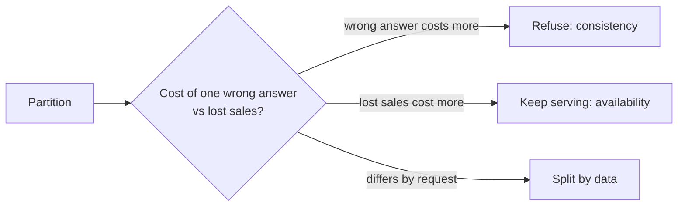

# t01: Consistency vs Availability — During a partition, price a wrong answer against no answer, and split the choice by data

Trade-offs · **t01** → t02

> *"Ask what a wrong answer costs before you decide a slow one is worse"*
>
> **Concern**: consistency · availability

## The Problem

Your e-commerce site goes viral during a flash sale. Network trouble cuts your database replicas off from the primary. If you choose consistency, the site goes down for 5 minutes, users cannot browse or buy, and you lose $500K in sales. If you choose availability, the site stays up, two users buy the last item, and you have an angry customer and a refund. The wrong choice for your business is expensive either way.

## The Idea

f06 proved you cannot have both during a partition, and f08 listed the consistency models. This chapter is about choosing. The library analogy in the vault: consistency is one master ledger every desk must check before lending (accurate but slower); availability is each desk keeping its own ledger and syncing later (fast but it might double-book).

The choice is not philosophical. It is a price: **what does one wrong answer cost, against what does refusing every request cost?** The calculator turns the sliders into those two dollar amounts.



## How It Works

1. **Set the scene.** A 5 minute partition, 2,000 orders a minute at $50: 10,000 orders and $500,000, matching the vault's figure. 2% of orders hit an almost sold-out item.
2. **Price consistency.** Refuse everything: the site is down 5 minutes and the loss is the whole $500,000.
3. **Price availability.** Sell everything: only the at-risk orders go wrong. 200 oversold orders at $60 each (refund, apology, support) is $12,000.
4. **Find the break-even.** The two costs meet when one oversold order costs the basket divided by the at-risk share:

```js
// sim.mjs
  const breakEven = basketUsd / (lowStockPct / 100);
```

   That is $50 / 0.02 = $2,500. At $60 an oversold order, availability is 40 times cheaper. At $5,000, as with a wrongly moved balance, consistency wins.

## When It Breaks

Choosing the wrong side at the wrong time is the failure. An availability-first payments system that lets two withdrawals both succeed pays far more than $2,500 per error. A consistency-first product catalogue that goes dark because one price cache is stale loses sales to protect a number nobody would miss.

The calculator's own weakness: it needs a number for "cost of a wrong answer" that is often a guess. Treat the break-even as a question to ask, not an answer to trust.

## The Trade-off

You rarely need one answer for the whole system. Refuse only the requests that could go wrong: in the sim, orders on almost sold-out items. That loses $10,000 (the 2% of orders refused), oversells nothing and keeps the site up. Browsing and normal orders stay available, and the last-item purchase gets the strong answer.

The cost is complexity: a way to tell which requests need the strong answer, and users who sometimes see a "try again". Most real systems are hybrids like this.

*Note: the 2,000 orders a minute, $50 basket, 2% at-risk share and $60 cost per oversold order are the sim's assumptions, chosen to reproduce the vault's $500K. The vault gives the scenario and the CAP framing, not these figures.*

## In The Wild

The vault note walks through where each side is chosen: money and inventory on the consistency side, feeds and catalogues on the availability side. The `github_db_2018` replay is a database whose consistency and failover went wrong. The `ticketmaster` drill is the same last-seat problem.

## Try It

```sh
node course/5_trade_offs/t01_consistency_availability/sim.mjs
```

You should see `totalLossUsd=500000  unavailableMin=5` for consistency, `totalLossUsd=12000  inconsistentOrders=200` for availability, and `totalLossUsd=10000  unavailableMin=0  inconsistentOrders=0` for the split. Try `--inconsistencyCostUsd=5000`: an oversold order now costs $5,000 and consistency is the cheaper choice.

## Say It In The Interview

1. Say you cannot have both during a partition, so name which one this feature needs.
2. Give the cost logic: what does a wrong answer cost against a refused request?
3. Say the choice is per feature: browse is available, payment is consistent.
4. Name the mechanisms: quorum or a single leader for the strong side, and eventual consistency for the other.

## Boundary

The theorem is f06 and the consistency models are f08. This chapter is only the decision. How replicas are copied is p02, and the case for SQL or NoSQL follows in t03.

## What's Next

You chose how correct to be. The next choice is how fast: do you optimise for each user's wait, or for how many users you serve? Latency versus throughput: t02.

## Source notes

- [Consistency vs availability](../../../vault/system_design/06_trade_offs/consistency_vs_availability.md)
