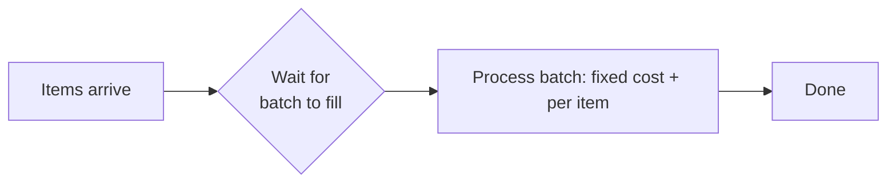

# t02: Latency vs Throughput — Batching buys capacity with waiting, so pick the smallest batch that keeps up

Trade-offs · t01 → **t02** → t03

> *"Batch until you keep up, and not one item further"*
>
> **Concern**: latency · cost

## The Problem

A startup builds an image API that processes one image at a time, 50 ms each. The user experience is great. Then a customer wants to process 1 million images. At 50 ms each, one after another, that is 50,000 seconds: 13.9 hours. The design optimised the wrong number for this customer.

The opposite mistake is as easy: batch everything to maximise work per second, and every single user waits for a batch to fill.

## The Idea

A restaurant can cook each order the moment it arrives (low latency, one order at a time), or collect ten orders and cook them together (high throughput, each customer waits longer). f04 defined latency and throughput. This chapter chooses between them for a workload.

The lever is **batching**. Every batch pays a **fixed cost** (a network round trip, a disk sync), then a cost per item. Big batches share the fixed cost across many items, which raises capacity. But an item now waits for its batch to fill, which raises latency.



## How It Works

1. **State the load.** 500 items a second, a 100 ms latency target, 10 ms fixed per batch, 1 ms per item, and 20% spare capacity: the worker needs at least 600 items a second.
2. **Compute the capacity and latency of a batch of B:**

```js
// sim.mjs
  const batchMs = overheadMs + batch * perItemMs;
  const capacityRps = (batch / batchMs) * 1000;
  const latencyMs = ((batch - 1) / 2 / arrivalRps) * 1000 + batchMs;
```

3. **One at a time (B = 1):** 11 ms per item, but capacity is only 91 items a second against 500 arriving: 550% utilised. The queue grows without bound.
4. **A batch of 500:** capacity 980 a second, but latency is 1,009 ms, ten times the target.
5. **Search for the smallest batch that meets the capacity you need:** 15 items gives 600 a second at 39 ms.

## When It Breaks

Both extremes fail, in different ways. Small batches fail on capacity: fixed costs dominate and the system falls behind. Large batches fail on latency and memory: 500 items in flight, and one slow item delays the whole batch. In the sim a batch of 500 keeps 504.5 items in flight (Little's law: 500 a second × 1.009 s).

Also watch the tail. A batch is only as fast as its slowest item, and a batch that fails may fail all its items together.

## The Trade-off

The answer is not "batch" or "do not batch". It is the smallest batch that meets your capacity: it gives up the least latency for the throughput you need. At 15 items the sim delivers 600 a second at 39 ms, inside the 100 ms target. Raise the arrival rate and the right batch grows; cut the fixed cost and it shrinks.

Where you can, reduce the fixed cost instead of batching around it: keep connections open, or use group commit (p05). That improves both numbers.

*Note: the 10 ms fixed cost, 1 ms per item, arrival pattern and 20% headroom are the sim's assumptions. The vault gives the image scenario, the batching decision matrix and Little's law.*

## In The Wild

The vault note discusses batching in message producers and databases, and the p99 latency that batching worsens. The `logging-pipeline` drill is a throughput-first design where batching is the main tool.

## Try It

```sh
node course/5_trade_offs/t02_latency_throughput/sim.mjs
```

You should see `batchSize=1  latencyMs=11  capacityRps=91  utilizationPct=550`, then `batchSize=500  latencyMs=1009  capacityRps=980`, then `batchSize=15  latencyMs=39  capacityRps=600  utilizationPct=83`. Try `--arrivalRps=700`: the smallest batch that keeps up grows to 53 items at 100 ms, right on the target. Try `--overheadMs=2`: cut the fixed cost and it shrinks to 3 items at 7 ms.

## Say It In The Interview

1. Say latency and throughput pull in opposite directions, and batching is the usual lever.
2. Say small batches raise per-item fixed cost, and large ones add waiting.
3. Say you pick by a latency target and a capacity requirement, not by taste.
4. Mention Little's law: items in flight = rate × latency.

## Boundary

f04 defined the two measures. This chapter is only the decision. Consistency against availability is t01, and paying for performance is t06.

## What's Next

You have chosen speed against volume. But when your data model is the question, which database fits? SQL or NoSQL: t03.

## Source notes

- [Latency vs throughput](../../../vault/system_design/06_trade_offs/latency_vs_throughput.md)
