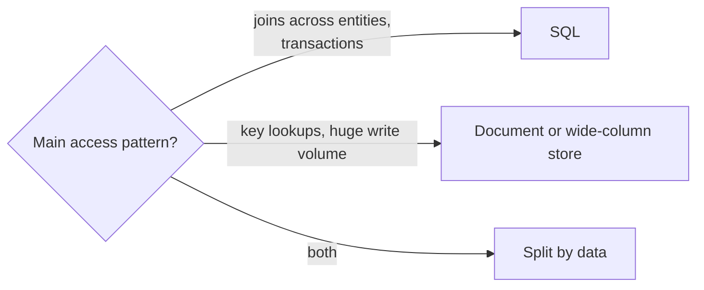

# t03: SQL vs NoSQL — Choose by access pattern: relationships want joins, and a write surge wants horizontal scale

Trade-offs · t02 → **t03** → t04

> *"Pick the database for the questions you will ask, not the one you like"*
>
> **Concern**: scalability · consistency

## The Problem

Two stories from the vault, opposite in their lesson.

A social app stores posts in MongoDB. Deploys are fast, schema changes are easy. Then it needs "show posts from the people this user follows." In SQL that is one JOIN. In MongoDB the app fetches the user, fetches the follow list, makes 500 separate queries for posts, and sorts in code. The page takes 8 seconds. It chose flexibility over relationships, and a social network is all relationships.

An analytics app keeps billions of events in PostgreSQL. Then traffic grows tenfold overnight. PostgreSQL scales writes by buying a bigger machine, and the events cannot be sharded easily because the queries JOIN across user and event tables. The $50,000 server is maxed out.

## The Idea

b02 and b03 covered how each kind of database works. The decision is by **access pattern**. Relational databases store data in tables and answer questions across them with joins and transactions. Document and wide-column stores organise data around a key, so they scale writes by adding nodes, but they answer questions across keys poorly.

The calculator runs one workload through both and prints the cost of each.



## How It Works

1. **Set the workload.** Users follow 500 people, and writes are 4,000 a second, growing 10× to 40,000.
2. **SQL feed:** one JOIN, 80 ms, one query. One primary handles 10,000 writes a second, so today it is at 40%.
3. **Document-store feed:** 502 queries at 16 ms each is 8,032 ms, the vault's 8 seconds:

```js
// sim.mjs
  const docQueries = follows + 2;
  const nodes = Math.ceil(grown / (nosqlNodeWriteCapRps * 0.7));
```

4. **Grow the writes tenfold.** One SQL primary would be at 400%. The document store handles 40,000 a second on 4 nodes.

## When It Breaks

Each side has a wall. The document store's wall is relationships: every join moves into your application code, and grows with the number of followers. SQL's wall is single-primary writes: past its capacity you must shard (p03), and a schema built around JOINs shards badly.

Also weigh consistency. SQL gives ACID transactions (f07); many document stores give eventual consistency and single-document atomicity. Moving a balance between two documents is the situation that needs the former.

## The Trade-off

Split by access pattern. Keep the relational data (users, follows, the feed's joins) in SQL, where it stays at 80 ms. Put the write-heavy, key-accessed data (events, timelines) in a document store on 4 nodes at 67% load. The price is two systems to run, back up and keep in step, and no JOIN between them.

Start with SQL unless a specific need says otherwise: it is well understood, flexible for questions you have not thought of, and fine to a large scale. Move data out when a measured wall appears, not before.

*Note: the 20 ms plus 0.12 ms per follow join, the 16 ms document query, the 10,000 and 15,000 writes a second capacities and the 70% target load are the sim's assumptions, chosen to reproduce the vault's 8 seconds. Real numbers vary by hardware and design.*

## In The Wild

The vault note's two scenarios above are its examples. The `discord_db_2024` replay in the vault involves a wide-column store's hot partitions, which is the other price of the key-based model.

## Try It

```sh
node course/5_trade_offs/t03_sql_nosql/sim.mjs
```

You should see `feedPageMs=80  queriesPerPage=1  writeLoadPct=40` for SQL, `feedPageMs=8032  queriesPerPage=502` for the document store, and `feedPageMs=80  writeCapacityRps=60000  writeLoadPct=67` for the split. Try `--growthX=1`: without the surge, one SQL primary stays at 40% load and the split has no reason to exist.

## Say It In The Interview

1. Say you start with the access patterns: joins and transactions, or key lookups at high volume.
2. Say SQL scales reads with replicas and writes only up to one primary, then sharding.
3. Say NoSQL gives horizontal writes but weaker joins and often weaker consistency.
4. Say many systems use both, each for what it fits (polyglot persistence).

## Boundary

How each database works is b02 and b03, and how to shard is p03. This chapter is the decision only. The wider question of doing less is t04.

## What's Next

Every choice so far added parts. When is that too much? Simplicity against scalability: t04.

## Source notes

- [SQL vs NoSQL](../../../vault/system_design/06_trade_offs/sql_vs_nosql.md)
