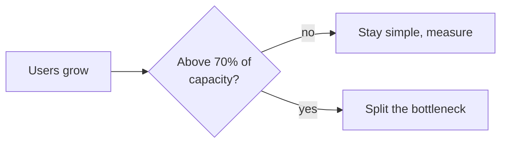

# t04: Simplicity vs Scalability — Build for the load you can measure, and know the number at which you will split

Trade-offs · t03 → **t04** → t05

> *"Complexity you build today is paid for with time you do not have"*
>
> **Concern**: cost · scalability

## The Problem

A startup builds microservices on day one. Three engineers spend 8 months building an authentication service, a user service, a payment service, a notification service and an API gateway. By launch there are 15 repositories, 8 databases and a deployment pipeline that takes 2 hours. They have 47 users. The whole system could run on one $5 a month server.

The cost: $400K of funding and 8 months. Competitors with simple monoliths shipped in 6 weeks and took the market. The complexity killed the company before scalability mattered.

## The Idea

Scalability is insurance against a load you do not have yet. Simplicity is speed, fewer bugs, and a team that can understand its own system. Insurance has a premium, and for an early product the premium is the runway.

The chapter's tool is a calculator. It prices the two paths in months and dollars, and prints how many months of growth remain before a simple design hits its limit. That number turns "we might need to scale" into a date you can plan around. e04 covers how to split a monolith later.



## How It Works

1. **State the team and the growth.** 3 engineers at $16,700 a month each (the vault's $400K over 8 months), 47 users growing 15% a month.
2. **Price the monolith.** 1.5 months (6 weeks) to launch, $75,150, capacity for about 100,000 users, 10 minute deploys.
3. **Price microservices.** 8 months, $400,800, capacity for 1,000,000, 120 minute deploys.
4. **Ask when you would need the capacity.** Take usage growing at 15% a month and find when it reaches 70% of capacity:

```js
// sim.mjs
    monthsUntilWall: users >= need ? 0 : round1(Math.log(need / users) / Math.log(1 + growthPct / 100)),
```

   The monolith's wall is 52.3 months away. The microservices' is 68.8, so the extra 16.5 months of headroom cost $325,650 and 6.5 months of delay.

## When It Breaks

Simplicity breaks when the load is real. A monolith that serves 100,000 users cannot serve 5 million, and squeezing a large team into one codebase and one deploy queue slows everyone. Run the calculator with `--users=80000`: the monolith is already past its 70% mark, and starting simple is no longer the answer.

The failure on the other side is the one in the story: paying for scale that never comes. Most products never reach the load microservices are built for.

## The Trade-off

Start simple, keep modules separate inside the codebase, and pick a trigger. The trigger is a measurement, such as 70% of capacity on the current bottleneck, not a feeling. With 52.3 months of runway in the sim, you have time to learn where the real bottleneck is before splitting it.

Splitting later has a cost: a migration of live data and traffic. But you pay it with real users, real revenue and real knowledge of where to cut. The vault's lesson is the same: the complexity killed them before scalability mattered.

*Note: the 15% monthly growth, 1.5 and 8 month build times, 100,000 and 1,000,000 user capacities, and 70% trigger are assumptions; only the 3 engineers, 8 months, 6 weeks, $400K and 2 hour pipeline come from the vault.*

## In The Wild

The vault's startup story above is its example. The gym's `premature-microservices` scenario is the same mistake to spot in a design.

## Try It

```sh
node course/5_trade_offs/t04_simplicity_scalability/sim.mjs
```

You should see `monthsToLaunch=1.5  buildCostUsd=75150  capacityUsers=100000  monthsUntilWall=52.3` for the monolith and `monthsToLaunch=8  buildCostUsd=400800  deployMinutes=120  monthsUntilWall=68.8` for microservices. Try `--users=80000`: the monolith's wall is already here (`monthsUntilWall=0`).

## Say It In The Interview

1. Say you start with the simplest design that meets today's requirements plus a margin.
2. Give the numbers for your scale, and say when you would split and what you would split first.
3. Say microservices trade development speed and operational cost for independent scaling and deployment.
4. Say you would keep a monolith modular so the split stays possible.

## Boundary

How the migration from monolith to microservices goes is e04. This chapter is only whether and when. Trading reads against writes is t05.

## What's Next

You decided how much machinery to build. Inside a system, is the data shaped for reading or for writing? Read versus write optimisation: t05.

## Source notes

- [Simplicity vs scalability](../../../vault/system_design/06_trade_offs/simplicity_vs_scalability.md)
