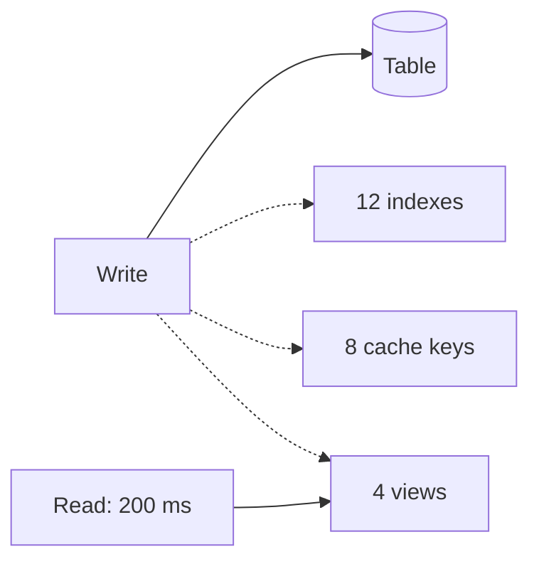

# t05: Read vs Write Optimization — Every read shortcut is paid for on each write, so keep the write path lean and rebuild reads from it

Trade-offs · t04 → **t05** → t06

> *"Speed up reads without taxing every write"*
>
> **Concern**: latency · cost

## The Problem

Your analytics dashboard takes 5 seconds to load and users complain. You denormalise tables, add caching and build materialized views. The dashboard now loads in 200 ms. Success.

Six months later the event ingestion pipeline starts failing. Write throughput has fallen from 50,000 events a second to 5,000. Every write now updates 12 indexes, invalidates 8 cache keys and refreshes 4 materialized views. The read optimisation quietly killed write performance.

## The Idea

Most systems read far more than they write (90% or more), so reads get optimised by default. But every read shortcut is extra work that someone has to do in advance, and that someone is the writer. An index is a second copy that a write must update (p01). A cache key must be invalidated (b04). A materialized view must be refreshed (p17).

So this is a budget question: how much write speed will you spend to buy read speed, and can you spend it somewhere else, at a time when it does not matter?



## How It Works

1. **Baseline.** Bare tables write 50,000 a second and the dashboard takes 5,000 ms.
2. **Add read shortcuts.** In the sim, a write costs a base 0.02 ms plus 0.005 ms per index, 0.005 ms per invalidation and 0.02 ms per view:

```js
// sim.mjs
  const fullWriteMs = BASE_MS + indexes * INDEX_MS + cacheKeys * INVALIDATE_MS + views * VIEW_MS;
```

3. **Result at today's 3,000 events a second:** the dashboard is 200 ms, write capacity is 5,000 a second, and the load is 60%. Everyone is happy.
4. **Watch the budget.** The design can absorb 5,000 events a second and no more.

## When It Breaks

Ingestion grows 7×, to 21,000 events a second. The same design can write only 5,000, so it is 420% used and the pipeline falls behind. Nothing was wrong on the day you made reads fast; the cost arrived later as write load grew.

The trap is that read work is visible (a dashboard someone complains about) and write cost is invisible until it fails.

## The Trade-off

Move the work off the write path. Keep only the indexes the writes need (3 here), and rebuild the views and cache in batches every 30 seconds. The write path costs 0.035 ms, so capacity is 28,571 a second, the load at 21,000 is 74%, and the dashboard still answers in 200 ms. The price is staleness: dashboard data is up to 30 seconds old.

That is the same idea as CQRS (p17): give reads their own model, updated behind the writes. Choose the refresh interval from what the reader can tolerate. A dashboard can be 30 seconds behind; an account balance cannot.

*Note: the per-write costs are chosen to reproduce the vault's numbers (50,000 down to 5,000 a second, 5 s down to 200 ms). The 3,000 and 21,000 events a second, the 3 essential indexes and the 30 second refresh are assumptions.*

## In The Wild

The vault note tells the dashboard story above and covers denormalisation, indexing, caching and materialized views as read optimisations, with their write costs.

## Try It

```sh
node course/5_trade_offs/t05_read_write/sim.mjs
```

You should see `dashboardMs=5000  writeCapacityRps=50000` on raw tables, `dashboardMs=200  writeCapacityRps=5000  writeLoadPct=60` when read-optimised, `writeLoadPct=420` after growth, and `writeCapacityRps=28571  writeLoadPct=74  stalenessSec=30` when decoupled. Try `--ingestGrowthX=3`: the read-optimised design is at 180% and the decoupled one at 32%.

## Say It In The Interview

1. Say read optimisations (indexes, caches, denormalisation) are paid for by each write.
2. Give a number: how many writes per second the design can take.
3. Say you can move the cost off the write path with async refresh and accept a delay.
4. Say the ratio of reads to writes decides how much to spend where.

## Boundary

Indexes are p01, the read-model split is CQRS (p17), and caching is b04. This chapter is the decision. The cost of running all of it is t06.

## What's Next

Faster reads and writes both cost money. What is the performance you can afford? Cost versus performance: t06.

## Source notes

- [Read vs write optimisation](../../../vault/system_design/06_trade_offs/read_vs_write_optimization.md)
