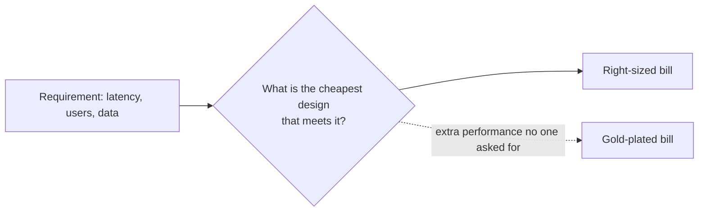

# t06: Cost vs Performance — Buy the performance your requirement names, and scale the bill with the load

Trade-offs · t05 → **t06** → t07

> *"Performance is expensive, so buy what you need and not what sounds impressive"*
>
> **Concern**: cost · latency

## The Problem

A startup launches using "best practices" from a big-company blog: three regions, over-provisioned instances (m5.8xlarge), real-time replication everywhere and hot storage for all data. Traffic: 50 users a day. The monthly bill: $45,000. They burn through their seed funding in 4 months.

What they actually needed: one region, which serves all users in under 100 ms, small instances at 5% CPU, eventual consistency, and cheap storage, since 95% of data is never read after 30 days. Right-sized cost: $800 a month.

## The Idea

Every performance feature is a purchase: more regions, bigger machines, faster storage, tighter consistency. Each buys something real, and each has a price. The failure is buying it without a requirement that names it.

The calculator prices both designs for the same product. It also reports the cost per user, since a fixed cost spread over 50 users is $900 each.



## How It Works

1. **Start from the requirement.** 50 users a day, and a target of 100 ms.
2. **Size for it.** Two small instances (the minimum for availability), a managed database, and tiered storage:

```js
// sim.mjs
  const hotTb = dataTb * (1 - coldPct / 100);
  const tieredStorage = hotTb * HOT_TB_USD + (dataTb - hotTb) * COLD_TB_USD;
```

   With 30 TB and 95% cold, storage is $435 and the total is $795 a month. CPU is 5%, and one region answers in 80 ms.
3. **Price the impressive design.** Three regions of 10 large instances, all data on hot storage in every region, plus cross-region replication: $45,000. CPU is under 0.1%, latency is 30 ms.
4. **Compare.** The gold-plated bill is 57 times as large, and it buys 50 ms that 50 users cannot notice.

## When It Breaks

Under-buying fails too. If the right-sized design misses the target, or one instance is the only copy of something important, the saving is a false economy. With `--latencyTargetMs=50` the single region's 80 ms is outside the target, and a second region is justified.

The cost side changes as you grow. Data that was cold becomes warm, and traffic from far away makes the extra region worth its price. Right-sizing is repeated, not done once.

## The Trade-off

Scale the bill with the load. At 5,000 users a day the right-sized design needs 15 small instances at 66.7% CPU: $1,185 a month, or $0.2 a user, against $15.9 a user at 50 users. The gold-plated design would still cost $45,000.

Buy more performance when a measured limit or a missed target demands it. Use cheaper storage tiers for data that cools (b07), a CDN before a new region (b06), and revisit the numbers each quarter.

*Note: the instance, database and storage prices, the 500 and 4,000 users per instance and the 80 and 30 ms latencies are assumptions, chosen to reproduce the vault's $45,000 and $800.*

## In The Wild

The vault note's $45,000 story is its example, and it goes on to cover reserved capacity, spot instances and storage tiers. The gym's `photo-gallery-overload` scenario is a design that paid for the wrong resource.

## Try It

```sh
node course/5_trade_offs/t06_cost_performance/sim.mjs
```

You should see `monthlyCostUsd=795  cpuUtilizationPct=5  p95LatencyMs=80  costPerUserUsd=15.9` for the right-sized design, `monthlyCostUsd=45000  cpuUtilizationPct=0  p95LatencyMs=30  costPerUserUsd=900` for the gold-plated one, and `monthlyCostUsd=1185  cpuUtilizationPct=66.7  costPerUserUsd=0.2` at 5,000 users. Try `--latencyTargetMs=50`: the single region now misses the target.

## Say It In The Interview

1. Say you start from the requirement (users, latency, availability) and pick the cheapest design that meets it.
2. Say what you would add at 10 times the load, and what would trigger it.
3. Name the cost levers: instance size, regions, storage tiers, reserved and spot capacity.
4. Say performance beyond the requirement is waste.

## Boundary

Whether to build for scale early is t04, and the read and write cost of performance features is t05. This chapter is only the bill.

## What's Next

One last choice concerns who starts the conversation: does the system push updates to clients, or do clients pull them? Push versus pull: t07.

## Source notes

- [Cost vs performance](../../../vault/system_design/06_trade_offs/cost_vs_performance.md)
