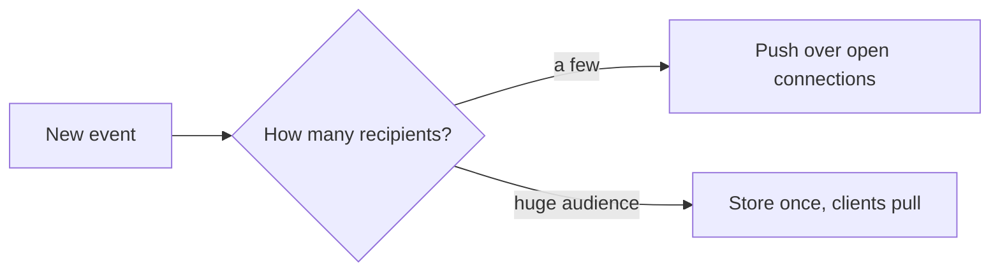

# t07: Push vs Pull — Polling wastes requests on empty answers, pushing melts on the celebrity post, and the answer is both

Trade-offs · t06 → **t07** → m01

> *"Push what is small and personal, and let clients pull what is huge and shared"*
>
> **Concern**: scalability · latency

## The Problem

Your team builds notifications for a social app. At first, clients poll every 10 seconds (pull). With 10 users that is 1 request a second, which is fine. Six months later there are 100,000 active users and 10,000 requests a second, and 99% of them return "no new data". Servers burn money checking empty mailboxes, and users wait up to 10 seconds for a notification.

You switch to WebSockets (push). Notifications are instant. But now there are 100,000 open connections, and a celebrity posts, and 50,000 fans need it at once. The server falls over trying to fan out to 50,000 connections together. Neither pure push nor pure pull scales.

## The Idea

A newspaper delivery and a newsstand. **Push** is delivery: the server sends data the moment it exists, over a connection it keeps open (WebSocket, server-sent events, or a mobile push service such as FCM or APNs). **Pull** is the newsstand: the client asks when it wants to know. Long polling sits between them.

Push gives low latency and pays with connections and fan-out work. Pull is simple and stateless and pays with empty requests and delay.



## How It Works

1. **Count the events.** 100,000 users at 3.6 events an hour each is 100 events a second.
2. **Price pull.** Polling every 10 s is 10,000 requests a second to find 100 events: 99% empty, a 5 second average wait, and 83% of a 12,000 a second fleet.
3. **Price push.** 100 messages a second and a 0.05 s delay, but 100,000 open connections, and a fan-out problem.
4. **Meet the celebrity.** One post to 50,000 fans asks the fleet for 50,000 sends at once:

```js
// sim.mjs
  const push = outcome({ rps: events, emptyPct: 0, regularDelay: PUSH_DELAY_SEC, celebrityDelay: fans / fleetCapRps, connections: users, peakLoad: fans / fleetCapRps });
```

   That is 417% of capacity and 4.2 seconds to deliver, if it survives.

## When It Breaks

Each pure choice has its failure. Pull fails on cost: the request count grows with users, not with events, so most of the work is empty. Push fails on the wide fan-out: work is done at write time for every recipient, so one post multiplies into 50,000 sends. Open connections also cost memory, and a server restart drops all of its clients at once, who then reconnect together.

Neither handles a mismatch well: a quiet user costs pull a request every 10 seconds, and a celebrity costs push an instant spike.

## The Trade-off

Use both, by audience size. Push normal notifications to individuals, which are small and personal. For content with an enormous audience (a celebrity post), do not fan out at write time. Store it once and let clients fetch it when they open the feed. This is the vault's fan-out on write versus fan-out on read.

In the sim, regular notifications arrive in 0.05 s, celebrity posts are seen after 5 s on average, and the load is 1,100 requests a second, 9% of the fleet, against 10,000 for pull. You now run two paths: a connection tier and a pull path, and you need a rule for who counts as a celebrity.

*Note: the 3.6 events an hour (chosen to give the vault's 99% empty polls), the 12,000 a second fleet, the 0.05 s push delay and the 10% of users with the app open are the sim's assumptions. The vault gives the 100,000 users, 10,000 requests a second, 99% empty and 50,000 fans.*

## In The Wild

The vault note covers WebSockets, server-sent events, long polling, FCM and APNs, and compares fan-out on write with fan-out on read for celebrities. The `notification-firehose` scenario and `notification-service` drill in the gym are this problem.

## Try It

```sh
node course/5_trade_offs/t07_push_pull/sim.mjs
```

You should see `serverRequestsRps=10000  emptyResponsesPct=99  regularDelaySec=5` for pull, `openConnections=100000  celebrityDelaySec=4.2  peakLoadPct=417` for push, and `serverRequestsRps=1100  regularDelaySec=0.05  celebrityDelaySec=5  peakLoadPct=9` for the hybrid. Try `--fans=200000`: a celebrity post now takes 16.7 s to push and asks for 1,667% of capacity.

## Say It In The Interview

1. Say pull is simple but wasteful and delayed, and push is instant but needs connections.
2. Name the mechanisms: polling, long polling, WebSockets, server-sent events, mobile push.
3. Raise the celebrity problem, and give fan-out on write for most users and on read for celebrities.
4. Say you would pick by audience size and how fresh the data must be.

## Boundary

How chat systems scale connections is e03, and the broker behind fan-out is pub/sub (p16). This chapter is the decision only.

## What's Next

That completes the trade-offs. Deciding well needs a method: start from requirements, do the arithmetic, and make each choice explicit. Thinking like an architect: m01.

## Source notes

- [Push vs pull](../../../vault/system_design/06_trade_offs/push_vs_pull.md)
