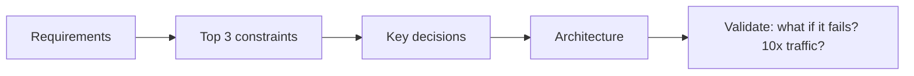

# m01: HLD Thinking — Constraints first: a component earns its place by answering a force

Method · t07 → **m01** → m02

> *"Don't start with components. Start with forces."*
>
> **Concern**: scalability · cost

## The Problem

A junior engineer is asked "Design Instagram". They draw a load balancer, an app server, a database and a cache in under a minute. It looks reasonable. The interviewer asks: "Why these components? Why not event-driven? Why SQL over NoSQL?" Silence. They drew a template, not a design, and they cannot defend a single choice.

The sim shows the same failure in numbers. With 1,200 writes and 24,000 reads a second, a global audience and a strong-consistency requirement, the habit-drawn four boxes have one box no force justifies (the cache) and miss three that are needed (read replicas, a queue, a CDN). Only 75% of what is drawn has a reason, and half of what is needed is absent.

## The Idea

You do not pick furniture before you know how many people live in the house. Architects work in a loop: **requirements, then constraints, then key decisions, then architecture, then validation**. The diagram comes last. The constraints (scale, latency, consistency, availability, durability, cost, team) tell you what to build.

Two rules make the loop concrete:

- Every component must answer "which constraint asked for you?". A box with no answer is unjustified.
- Every important constraint must have a component or an explicit decision behind it. A constraint with no answer is a gap.



## How It Works

1. **Write the forces down.** Reads per write, writes a second, how global the users are, how strict consistency must be, how big the team is.
2. **Map each force to an implication.** The vault's table: read-heavy means caching, replicas, a CDN; write-heavy means a queue and async work; strong consistency means an ACID database and no cache for critical data; a small team means a monolith.
3. **Check each candidate component against the rules:**

```js
// sim.mjs
    "load balancer": readRps + writeRps > 500,
    "app server": true,
    "database": true,
    "cache": readRps / Math.max(writeRps, 1) >= 20 && !strictConsistency,
    "read replicas": readRps > 10000,
    "queue": writeRps >= 1000,
```

4. **Compare against the template.** The forces above justify 6 components: load balancer, app server, database, read replicas, queue, CDN and multi-region. The template has 4 boxes, 3 of them justified, so precision is 75% and 3 needs are missing.

## When It Breaks

Two ways, opposite in direction. **Template first** fails as above: unexplained boxes and missed needs. **Everything first** fails the other way: drawing all 9 components covers every need, but 3 of the 9 have no force behind them, so precision falls to 67%. Each extra box is a service to run, monitor and pay for. The vault names it as "Designing for Google scale on day 1".

It also breaks when the constraints are guessed wrong. The method does not remove the guess; it makes the guess visible so someone can challenge it. Change one constraint (say, drop strong consistency) and the answer changes, which is the point.

## The Trade-off

Constraint-first thinking costs time up front: you spend the first minutes on forces before drawing anything. In return every box comes with a reason, which is exactly what the interviewer is testing.

The remaining judgement is where to stop. The sim draws the justified components and nothing else, then leaves the path to the rest ("if writes pass 5,000 a second, we shard"). That is how you avoid both failures: start with what the forces justify, and say what would add the next box.

*Note: the thresholds (500 req/s per load balancer trigger, a 20:1 read ratio for a cache, 10,000 reads for replicas, 1,000 writes for a queue, 5,000 for sharding, 50% global users, a team of 20 for microservices) are the sim's round numbers. The vault gives the constraint-to-implication table, the pipeline, the common mistakes and the core-challenge idea, not these cut-offs.*

## In The Wild

The vault's core-challenge table shows the method at work: Twitter's is fan-out, Uber's is real-time geospatial matching, WhatsApp's is persistent connections at massive scale, Stripe's is distributed transaction consistency. Naming the one hard problem in the first two minutes tells you which constraint will dominate the design.

## Try It

```sh
node course/6_method/m01_hld_thinking/sim.mjs
```

You should see `needed=6  drawn=6  unjustified=0  missing=0  precisionPct=100`, then the template `needed=6  drawn=4  unjustified=1  missing=3  precisionPct=75`, then the over-build `needed=6  drawn=9  unjustified=3  missing=0  precisionPct=67`. Try `--strictConsistency=0`: the cache becomes justified, so the template has 0 unjustified boxes and still misses 3 (precision 100%). Try `--writeRps=6000 --teamSize=25`: 8 components are justified (adding sharded writes and microservices) and the template misses 5.

## Say It In The Interview

1. Say you will start from constraints, and state the top three: "The key forces here are X, Y and Z."
2. Name the core challenge in the first two minutes.
3. Justify every component in one sentence tied to a constraint.
4. Narrate your thinking out loud (the architect's playback); the diagram follows the reasoning.
5. Finish with "what if it fails" and "what if traffic grows 10x".

## Boundary

This chapter is the thinking loop. The interview's time structure is m02, the arithmetic for the numbers is m03, and the pre-presentation checks are m06. Each individual component (caches, queues) is covered in its own building-block chapter.

## What's Next

Knowing how to think, you need to fit it into 45 minutes. The four-step interview framework is m02.

## Source notes

- [HLD thinking system](../../../vault/system_design/10_hld/hld_thinking_system.md)
