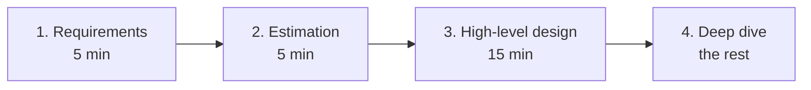

# m02: The Four-Step Framework — Requirements, numbers, design, deep dive: spend the time where the signal is

Method · m01 → **m02** → m03

> *"Never jump to a solution, and never run out of time before the deep dive"*
>
> **Concern**: latency · cost

## The Problem

A candidate gets 45 minutes to design a system. They spend 12 minutes on requirements, because more questions feel safer, and 8 on estimation. The high-level design takes 15. With 2 minutes for a wrap-up, the deep dive gets 8 minutes, 18% of the interview, against 18 minutes in the plan. The interviewer's follow-ups on failure, trade-offs and scaling are the part that separates candidates, and they get cut short.

The reverse is just as bad: jump straight to a solution ("for Twitter I'd use Kafka and Cassandra and...") and you never show that you can break the problem down.

## The Idea

Use the same four steps for every question, from a URL shortener to Netflix, and give each a time box:

1. **Requirements** (about 5 min): functional and non-functional. What does it do, how well, at what scale.
2. **Estimation** (about 5 min): QPS, storage, bandwidth, servers. Show you think in numbers (m03).
3. **High-level design** (about 15 min): key APIs, boxes and arrows, walk the main use cases, name the data model.
4. **Deep dive** (the rest): the interviewer picks one or two components; discuss trade-offs and failure modes.

The structure is the point. It prevents most of the common red flags, such as jumping to a solution, having no numbers, and not finishing.



## How It Works

1. **Fix the total.** 45 minutes, and 2 of them reserved for wrap-up: "here is what I would add with more time".
2. **Spend the plan on the first three steps.** 5 + 5 + 15 = 25 minutes, so the deep dive gets 18 minutes, 40% of the interview.
3. **Compute what your own split leaves:**

```js
// sim.mjs
  const deepFor = (r, e, h) => Math.max(0, totalMin - r - e - h - WRAP_MIN);
  const pctOf = (deep) => Math.round((deep / totalMin) * 100);
```

4. **Compare.** A 12 / 8 / 15 split leaves 8 minutes for the deep dive (18%), 10 fewer than the plan.
5. **Fix it the way the vault suggests.** Keep questions to 3 or 4 minutes, state your assumptions ("I'll assume X, tell me if that's off"), and move on. Capped at 4 and 5 minutes, the deep dive gets 19 minutes (42%).

## When It Breaks

The failure is time you cannot get back. Spending too long early does not just shrink the deep dive; it can remove it. On a 30-minute interview with a 30-minute design step, the sim leaves 0 minutes for the deep dive.

The framework also breaks when followed like a script. The interviewer may pull you into the deep dive early or ask about the write path during step 3. Follow their lead: hints are the interview steering you.

## The Trade-off

Capping requirements and estimation buys deep-dive time, and the price is committing to assumptions the interviewer may not share. It is cheap to say them aloud and cheap for the interviewer to correct them; it is expensive to spend 12 minutes asking questions whose answers you could have assumed.

Estimation is the easiest step to over-spend. Aim for the numbers that change the design (is it thousands or millions of requests a second?), not exact ones.

*Note: the vault is not fully consistent on the split. Its step headings give 5, 5, 15 and 10 minutes (35 in total) while its timeline puts requirements and estimation together in minutes 0 to 5, and the deep dive in minutes 20 to 35. This sim uses the step headings, a 2-minute wrap-up from the timeline, and gives the deep dive whatever is left, so a 45-minute interview gets 18. The 4- and 5-minute caps are the sim's reading of "keep questions to 3 or 4 minutes".*

## In The Wild

The vault lists what interviewers evaluate: breaking down an ambiguous problem, reasonable trade-offs, clear communication, thinking about scale and failure, and responding to hints. It also lists what they do not: a single "correct" design, memorised technologies, or code. The Practice interview mode (the `url-shortener` drill case) runs this structure against a timer.

## Try It

```sh
node course/6_method/m02_four_step_framework/sim.mjs
```

You should see the plan `reqMin=5  estMin=5  hldMin=15  deepMin=18  deepPct=40`, then your split `reqMin=12  estMin=8  hldMin=15  deepMin=8  deepPct=18`, then the capped version `reqMin=4  estMin=5  hldMin=15  deepMin=19  deepPct=42`. Try `--totalMin=35`: the same split leaves `deepMin=0` (and the plan itself leaves 8). Try `--totalMin=30 --hldMin=30`: your split leaves `deepMin=0` while the plan still leaves 3.

## Say It In The Interview

1. Say up front how you will use the time: "A few minutes on requirements and numbers, then a high-level design, then I'll go deep where you would like."
2. State assumptions instead of interrogating: "I'll assume X. Let me know if that's off."
3. Check in during the design ("does this direction make sense?") rather than monologuing.
4. Follow the interviewer's hints into the deep dive.
5. Leave two minutes to say what you would add with more time.

## Boundary

This chapter is the interview's clock and structure. The thinking that fills step 1 and step 3 is m01, the arithmetic for step 2 is m03, and the checks to run before you say "I'm done" are m06.

## What's Next

Step 2 needs numbers you can produce in your head. Back-of-envelope estimation and capacity planning is m03.

## Source notes

- [The four-step framework](../../../vault/system_design/07_interview_framework/the_four_step_framework.md)
- [Requirements gathering](../../../vault/system_design/07_interview_framework/requirements_gathering.md)
