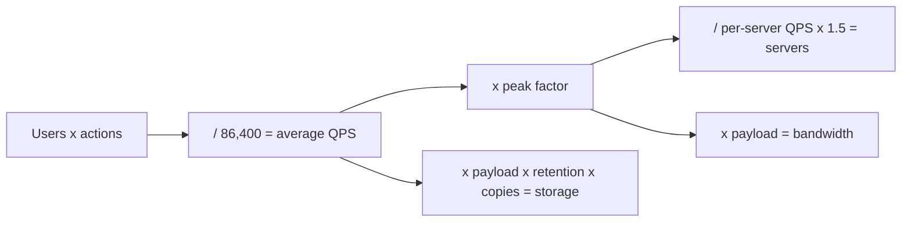

# m03: Estimation and Capacity — From users to QPS to servers: get the order of magnitude, then add peak and headroom

Method · m02 → **m03** → m04

> *"Size for the peak, not the average, and be right to within 2x"*
>
> **Concern**: scalability · cost

## The Problem

A team sizes a service for 100 million daily users doing 10 actions each. The average load works out to about 11,574 requests a second, and 24 app servers of 500 requests a second each cover it. They ship. At the evening peak, traffic is three times the average, 34,722 requests a second. Those 24 servers face 289% of what they can handle, and the service falls over exactly when the most people are using it.

The opposite habit wastes the interview: computing to three significant figures while the design step waits.

## The Idea

Estimation turns a vague requirement ("100 million users") into numbers that pick an architecture. It is a chain of simple multiplications, each with a rule of thumb: a day is about 100,000 seconds, so 1 million requests a day is about 12 a second. Peak is a multiple of the average. Servers are peak divided by what one server handles, with a safety factor on top.

You do not need accuracy, only the right order of magnitude. Thousands of requests a second and millions of them lead to different systems; 11,574 and 12,000 do not.



## How It Works

1. **Average QPS.** 100M users x 10 actions = 1 billion actions a day, divided by 86,400 = about 11,574 a second.
2. **Peak.** Multiply by 3 for consumer traffic: 34,722 a second.
3. **Servers.** Peak / per-server QPS x a 1.5 safety factor, rounded up:

```js
// sim.mjs
  const serversFull = Math.ceil((peakRps / qpsPerServer) * SAFETY);
  const serversAvg = Math.max(1, Math.ceil(avgRps / qpsPerServer));
  const load = (servers) => round((peakRps / (servers * qpsPerServer)) * 100);
```

That is 105 servers at 66% of capacity at peak.
4. **Storage and bandwidth.** With 10% of actions writing 5 KB and 3 copies kept for 5 years, storage is about 2,738 TB. Reads at peak with a 5 KB payload need about 1,250 Mbps of egress.
5. **Cost.** At about $250 a server and $23 a TB of object storage: roughly $89,213 a month.
6. **Grade your guess.** The napkin check scores a guess within 2x of the truth as spot-on, within 10x as close, and beyond that as off.

## When It Breaks

Sizing for the average fails: 24 servers at peak run at 289% of capacity. Skipping the safety factor is the smaller version of the same mistake; the vault's own example divides 35,000 peak by 500 to get 70 servers, and the 1.5 factor turns that into 105.

Estimates also fail through assumptions nobody said out loud. The write share, the payload size and the retention drive storage far more than server count does. Halve the peak factor to 1.5 and the servers drop to 53 while storage stays at 2,738 TB.

## The Trade-off

More precision costs interview minutes and buys almost nothing: a guess within 2x picks the same architecture. A guess of 10x off still gets the order of magnitude, but it may put you on the wrong side of a threshold (one database or many).

Headroom is the real trade-off. The 1.5 factor is 105 servers instead of 70, about 50% more spend, in return for running at 66% at peak instead of 100%. The vault's capacity-planning note also suggests headroom of 2 to 3x for peaks.

*Note: the write share (10%), the 5 KB payload, three-way replication, "storage is the write volume kept for the whole retention", and reads carrying the payload at peak are the sim's assumptions. The vault gives the 86,400-second day, the x3 peak, the 500 QPS app server, the 1.5 safety factor, the $250 server and $23 per TB prices, and the napkin grading rule comes from the app's `napkinCheck.js`. The sim's cost ignores the database, cache and CDN lines in the vault's cost example.*

## In The Wild

The vault's practice problems are the same chain: a URL shortener at 100M URLs a month for 5 years is 6 billion URLs, about 3 TB; a Twitter-like service with 200M daily users and 2 tweets each is about 4,600 writes a second; a chat service with 50M users sending 40 messages each is about 23,000 messages a second. The `url-shortener` drill case and the Practice napkin quiz drill exactly this.

## Try It

```sh
node course/6_method/m03_estimation_capacity/sim.mjs
```

You should see `avgRps=11574`, then `peakRps=34722  servers=105  peakLoadPct=66  storageTB=2738  egressMbps=1250  monthlyCostUsd=89213`, then the average-sized `servers=24  peakLoadPct=289`, then `guessRatio=1.5  gradeScore=2` (spot-on). Try `--guessFactor=10`: ratio 10, `gradeScore=1` (close). Try `--peakMult=1.5`: 53 servers at 66%, and the average-sized fleet runs at 145%. Try `--dauM=10`: peak drops to 3,472 a second and 11 servers are enough.

## Say It In The Interview

1. Say the chain out loud: users x actions / 86,400, then x3 for peak.
2. Round aggressively (a day is 10^5 seconds) and state that you are rounding.
3. Convert to infrastructure: "about 100 servers, a few thousand terabytes over five years".
4. Note what dominates, storage or bandwidth or compute, because that decides the design.
5. Leave headroom and say so: "I would run at about two thirds at peak."

## Boundary

This chapter is the arithmetic. When to spend interview time on it is m02, what the numbers imply for components is m01, and the paying-for-performance trade-off is t06. Latency numbers themselves are f04.

## What's Next

Numbers tell you how much traffic; next, how the components talk. Sync chains, async events and broadcast: m04.

## Source notes

- [Estimation cheat sheet](../../../vault/system_design/07_interview_framework/estimation_cheat_sheet.md)
- [Capacity planning](../../../vault/system_design/10_hld/capacity_planning.md)
