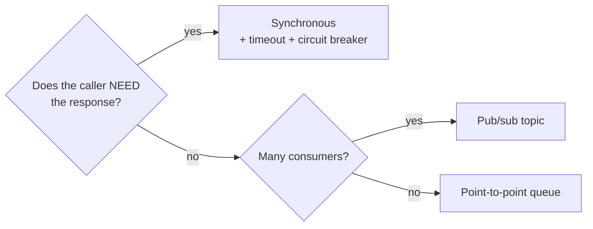

# m04: Interaction Patterns — In a synchronous chain, latency adds and availability multiplies, so keep only the calls you must wait for

Method · m03 → **m04** → m05

> *"Wait only for what you cannot continue without"*
>
> **Concern**: availability · latency

## The Problem

Five services call each other in a row: client to A to B to C to D to E. Each takes 50 ms and is 99.9% available, which sounds healthy. Together the chain takes at least 250 ms, and its availability is 99.9% multiplied five times: 99.5%, about 216 minutes of downtime a month, where each service alone would allow 43. Then service C slows to 500 ms. The request takes 700 ms, and the caller is blocked for all of it. If C is down, everything is down.

The vault calls this the synchronous chain of death: latency accumulates and any failure kills the chain.

## The Idea

Services talk in three ways. A **phone call** (synchronous request-response): the caller waits, so it is simple but tightly coupled. A **text message** (asynchronous): the caller publishes an event and moves on. A **group email** (broadcast, pub/sub): one event, many independent subscribers.

The rule is one question: does the caller need the response to continue? If yes, call synchronously, and put a circuit breaker and a timeout on it. If no, use a queue. Sync is for the critical path; everything else can wait.



## How It Works

1. **Draw the interaction matrix.** For each source and target, record the protocol, sync or async, and why. Order to payment is sync (you must confirm payment), order to notifications is async (they can be late).
2. **Compute a synchronous chain.** Latency is the sum, availability the product:

```js
// sim.mjs
  const a = hopAvailPct / 100;
  const need = Math.min(syncHops, hops);
  const availPct = (n) => a ** n * 100;
```

3. **Five sync hops:** 250 ms and 99.5%.
4. **Keep only the hops the caller needs.** With 2 sync hops and the other 3 behind a queue (a 5 ms publish): 105 ms at 99.79% availability, about 91 minutes of downtime a month instead of 216.
5. **Accept the lag.** The 3 skipped hops still run, about 150 ms later.

## When It Breaks

The chain breaks on its slowest link: one hop at 500 ms makes the request 700 ms, and the other four healthy services do not help. It also breaks at length: with 10 hops at 99.9% each, availability falls to 99%. At 99% per hop and 5 hops it is 95.1%, about 2,117 minutes down a month.

The async fix has its own failures. Work is now eventually consistent, so a subscriber may be behind. Messages can be delivered twice, so consumers must be idempotent. Failed messages need a dead-letter queue. And with no immediate response, debugging is harder. Two other anti-patterns from the vault: the chatty service (50 calls to the same service per request, fixed with a batch API or a cache) and the distributed monolith (every service calls every other synchronously).

## The Trade-off

Async buys latency and availability by giving up immediacy and simplicity. In the sim, moving 3 of 5 hops behind a queue cuts the request from 250 ms to 105 ms and lifts availability from 99.5% to 99.79%, while those 3 hops complete about 150 ms later. That is right for notifications and analytics. It is wrong for a payment check the caller must act on.

If a hop must stay synchronous, protect it: a timeout and a circuit breaker (p12) so a slow dependency fails fast instead of holding the caller.

*Note: the 5 ms publish, the 99.99% queue availability, independent failures, and the 43,200-minute month are the sim's assumptions. The vault gives the three styles, the interaction matrix, the 50 ms chain example, the anti-patterns and the decision tree; it does not give an availability formula, so the product of hops is the standard series-reliability rule.*

## In The Wild

The vault's interaction matrix is the real-world pattern: client to gateway and gateway to auth are synchronous, order to payment is synchronous, order to notification and order to analytics go over Kafka. Its ADR example shows the payoff: a like that called the notification service synchronously took 200 ms longer, and moving it behind a queue brought the target under 50 ms. The `notification-service` drill case is the same decision.

## Try It

```sh
node course/6_method/m04_interaction_patterns/sim.mjs
```

You should see `latencyMs=250  availabilityPct=99.5  downtimeMinPerMonth=215.57`, then the slow hop `latencyMs=700`, then `latencyMs=105  availabilityPct=99.79  downtimeMinPerMonth=90.67  syncHops=2  asyncLagMs=150`. Try `--hops=10`: `latencyMs=500  availabilityPct=99`, and a slow hop makes it 950 ms. Try `--hopAvailPct=99`: the 5-hop chain drops to `availabilityPct=95.1`, and the two-sync design still reaches 98.

## Say It In The Interview

1. Say the question you ask of every call: does the caller need the response to continue?
2. Say latency adds and availability multiplies along a synchronous chain.
3. Put non-critical work (notifications, analytics) behind a queue and name the cost: eventual consistency and idempotent consumers.
4. Protect the synchronous calls that remain with timeouts and circuit breakers.
5. Offer the interaction matrix as a check on your own diagram: too many sync arrows means fragility.

## Boundary

This chapter chooses how components talk. The breaker itself is p12, queue mechanics are b05, pub/sub is p16, and coordinating a multi-step async flow is the saga, p19. The trade of latency against throughput is t02.

## What's Next

You have made a set of decisions. To make them last past the interview, write them down: architecture decision records, m05.

## Source notes

- [Component interaction patterns](../../../vault/system_design/10_hld/component_interaction_patterns.md)
