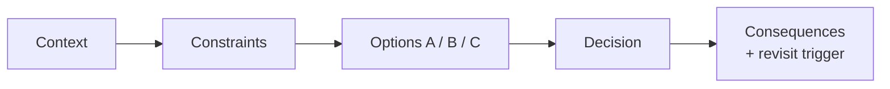

# m05: Architecture Decision Records — A decision without its options and reasons cannot be defended or revisited

Method · m04 → **m05** → m06

> *"Record the why, not just the what"*
>
> **Concern**: cost · scalability

## The Problem

A new engineer asks: "Why are we using Kafka here?" The answer: "I don't know, it was here when I joined." The reasoning left with the person who made the call. Now nobody can say whether the reason still holds, so nobody dares change it, or someone rips it out and breaks the analytics pipeline that needed message replay.

The sim scores a typical hurried record: status and context written, one constraint, one option, one consequence, no revisit trigger. It passes 3 of 7 checks, 43% complete. With one option listed it is an announcement, not a decision: nobody can see what was rejected.

## The Idea

A court records every ruling with its reasoning, not just the verdict. An **Architecture Decision Record** (ADR) does the same for one architectural choice, in a short fixed template:

- **Status**: proposed, accepted, deprecated or superseded.
- **Context**: the problem that needs a decision.
- **Constraints**: the forces (scale, latency, team, cost).
- **Options considered**: each with how it works, pros and cons.
- **Decision**: which one and why, referencing the constraints.
- **Consequences**: what improves, what gets harder, what new problems appear, and when to revisit.



## How It Works

1. **Write it when the choice is made**, while the reasons are fresh. One page.
2. **List at least two options.** A record with one option cannot show what was given up.
3. **Tie the decision to constraints.** "PostgreSQL, because 500 writes a second is well inside its capacity and the data has relationships."
4. **State the cost and the trigger to revisit.** "If we hit 100K writes a second, reconsider."
5. **Check completeness.** The sim applies seven checks:

```js
// sim.mjs
  ["status", (a) => a.statusSet === 1],
  ["context", (a) => a.contextStated === 1],
  ["constraints (2+)", (a) => a.constraintsCited >= 2],
  ["options (2+)", (a) => a.optionsListed >= 2],
  ["decision ties to a constraint", (a) => a.constraintsCited >= 1],
```

A record with 3 options, 3 constraints, 3 consequences and a revisit trigger passes 7 of 7.

## When It Breaks

Records fail by omission. The default sim inputs miss constraints, options, consequences and the revisit trigger: 4 of 7 checks fail. A record with nothing filled in beyond a title fails all 7, and a verbal version fails 3 of 4 of its checks.

They also fail by staleness. A decision made for 10K reads a second may be wrong at 100K. Without a revisit trigger, the record outlives the forces that justified it. Marking an old ADR "superseded by" a new one keeps the history honest instead of deleting it.

## The Trade-off

Writing an ADR costs time and adds documents to maintain. Reserve them for decisions that are hard to reverse or that people will ask about: database choice, sync versus async, where the consistency boundary sits. Do not write one for every library.

In an interview the same thinking is delivered aloud in about 15 seconds: the options considered, the decision, the reasoning and the trade-off. With the default inputs that covers 3 of its 4 elements (75%): it lacks a second option. What it omits are status and a revisit trigger, which matter to a team and not to a whiteboard.

*Note: the seven checks, the "2 or more" thresholds and the completeness percentages are the sim's model of the vault's template; the vault does not define a scoring rule. The vault provides the template, two example ADRs (a database choice and sync versus async notifications) and the verbal ADR idea.*

## In The Wild

The vault's examples show the shape. ADR-001 picks PostgreSQL over MongoDB and DynamoDB for 50M users at 10K reads and 500 writes a second, noting that at 100K writes a second the choice should be revisited. ADR-002 moves like-notifications behind Kafka to bring the response under 50 ms, accepting a 1 to 2 second notification delay and the need for a dead-letter queue. The Practice Proposal tool is the place to practise writing one.

## Try It

```sh
node course/6_method/m05_adrs/sim.mjs
```

You should see the full record `checksPassed=7  checksTotal=7  completenessPct=100`, then the default record `checksPassed=3  checksTotal=7  completenessPct=43  missingCount=4`, then the verbal version `checksPassed=3  checksTotal=4  completenessPct=75`. Try `--optionsListed=3 --constraintsCited=3 --consequencesListed=2 --revisitTrigger=1`: both the written and verbal records reach 100%. Try `--statusSet=0 --contextStated=0 --constraintsCited=0 --optionsListed=0 --consequencesListed=0`: the record passes 0 of 7 and the verbal ADR 1 of 4.

## Say It In The Interview

1. Name the options: "I considered PostgreSQL for ACID and MongoDB for a flexible schema."
2. Give the decision and tie it to a number: "PostgreSQL, because we need transactions and 500 writes a second is well within it."
3. Acknowledge the cost: "Scaling writes will be harder."
4. Say when you would revisit: "If writes reach 100K a second, I would look at sharding."

## Boundary

This chapter is how to record and voice a decision. The thinking that produces the constraints is m01, and the trade-offs themselves live in the t chapters (for example SQL versus NoSQL, t03). The linter-style pre-presentation checks are m06.

## What's Next

Before you present a design, review it. The HLD review checklist and the red flags: m06.

## Source notes

- [Architecture decision records](../../../vault/system_design/10_hld/architecture_decision_records.md)
