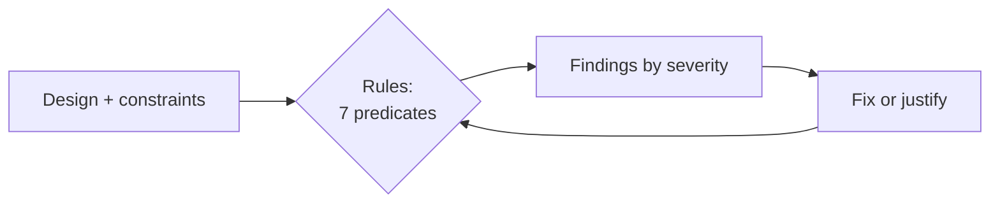

# m06: The Review Checklist — Run your design against a checklist before you present it, and treat each finding as a question

Method · m05 → **m06** → c01

> *"Find the gaps yourself before the interviewer does"*
>
> **Concern**: availability · scalability

## The Problem

A candidate draws a design for 8,000 reads and 6,000 writes a second with an 80 ms p95 target: a database, a few services, and no load balancer, cache, rate limiting or observability. They say "I'm done." Run the checklist and it fires 6 findings, 2 of them high: no load balancer at that traffic, and a latency target of 80 ms with no cache. Risk score 13. The interviewer needs five minutes to find what a two-minute check would have.

## The Idea

The vault's review checklist groups the questions to ask before you say "I'm done" into six areas: completeness, scalability, reliability, consistency, operational readiness, and decision quality. The red-flags list is the same idea from the other side: what tanks an interview (jumping to a solution, a single point of failure, no trade-offs, over-engineering, no numbers, no failure thinking, monologue, buzzwords, ignoring hints, not finishing).

Turn the checklist into small rules and it becomes a linter: each rule is a one-line predicate over the design, and each fired rule is one finding with a severity. Auditable beats clever.



## How It Works

1. **State the design as data.** Constraints (reads, writes, latency, team) and components (load balancer, cache, observability, rate limiting).
2. **Run the rules.** Each rule is a severity and a predicate:

```js
// sim.mjs
  { id: "no-load-balancer-at-scale", severity: "high", when: (d) => d.readRps > 5000 && !d.hasLoadBalancer },
  { id: "low-latency-no-cache", severity: "high", when: (d) => d.latencyP95Ms <= 100 && d.readRps >= 1000 && !d.hasCache },
  { id: "sql-write-bottleneck", severity: "medium", when: (d) => d.writeRps > 5000 },
```

3. **Read the findings by severity.** The sample fires 2 high, 3 medium and 1 low: risk 13 (3 per high, 2 per medium, 1 per low).
4. **Fix the high ones first.** Adding a load balancer and a cache clears both.
5. **Re-run.** The cache patch creates a new finding: a cache with no TTL or invalidation. Total 5 findings, risk 9.

## When It Breaks

A checklist finds gaps, not designs. The patch above shows it: adding a cache to silence a rule swaps one finding for another, because a cache without an invalidation story serves stale data silently. Fixing to the checklist without understanding the constraint is the buzzword-dropping red flag in code.

It is also only as good as its rules. Change the latency target from 80 ms to 300 ms and the cache rule stops firing (5 findings, 1 high), even though a cache might still help. Thresholds are a prompt for a conversation, not a verdict.

## The Trade-off

Running the checklist costs a minute or two of your interview and can surface problems you then have to solve. Skipping it means the interviewer finds them. It fits in the wrap-up of the high-level design, not the middle of it.

The other trade-off is severity: fix what blocks the design (single points of failure, unmeetable targets) first, and mention the rest as known follow-ups. Chasing every low finding is the over-engineering flag.

*Note: the seven rules, their thresholds and the 3/2/1 severity weights are the sim's tiny model, loosely based on the shape of the app's drill linter (rules as predicates that cite notes), not a copy of it. The vault gives the checklist areas and the red-flags list, not these numeric cut-offs.*

## In The Wild

The observability rule echoes real outages: the linter cites the Roblox outage (`roblox_2021`) for the case where a team cannot see what is failing. The Practice Review System and Bug Finder run this kind of rule set over your own drill design; `premature-microservices` is the low-severity rule here (a small team running many services) as a full scenario.

## Try It

```sh
node course/6_method/m06_review_checklist/sim.mjs
```

You should see `findings=6  high=2  medium=3  low=1  riskScore=13`, then the high ones only `findings=2  high=2  riskScore=6`, then after the patch `findings=5  high=0  medium=4  low=1  riskScore=9`. Try `--teamSize=20`: the small-team rule stops firing, `findings=5  riskScore=12`. Try `--latencyP95Ms=300`: `findings=5  high=1  riskScore=10`. Try `--readRps=800 --writeRps=100 --services=1`: only `no-observability` fires, `findings=1  riskScore=2`.

## Say It In The Interview

1. Before you finish, say "let me check this against a review list": single points of failure, read and write paths, caching and invalidation, async work, monitoring.
2. Name the top risk and the fix rather than reciting every item.
3. When you add a component to fix a gap, say what new question it creates (a cache means invalidation).
4. Say what you would add with more time.

## Boundary

This chapter is the final review pass. The thinking that produces the design is m01, the time to leave for it is m02, and each rule's real remedy lives in its own chapter (caching in b04, rate limiting in b09, monitoring in b12). Failure-injection replays are in the outages practice.

## What's Next

You have the whole method: think in constraints, budget the time, estimate, choose how components talk, record decisions, review. Now use it on a full system, starting with the URL shortener: c01.

## Source notes

- [HLD review checklist](../../../vault/system_design/10_hld/hld_review_checklist.md)
- [Common red flags](../../../vault/system_design/07_interview_framework/common_red_flags.md)
