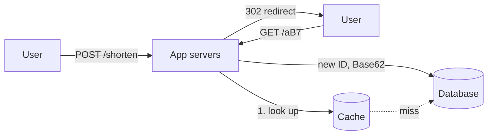

# c01: URL Shortener — Reads outnumber writes ten to one, so a cache carries it until a link goes viral

Case studies · m06 → **c01** → c02

> *"Put the whole loop to work on one small, read-heavy system"*
>
> **Concern**: latency · scalability

## The Problem

Your startup builds a URL shortener and launches on Product Hunt. One link goes viral and 50,000 people click it at once. The single server times out, a race condition gives three short codes different destinations, and one customer's link expires in the middle of an email campaign to 100,000 subscribers.

Nothing here is exotic. It is a lookup table with a redirect on top. The failure comes from never asking, before launch, how many reads per second the table must serve and which part gives out first.

## The Idea

This is the first case study, so run the whole loop once: **constraints** (requirements and capacity numbers), **component** (the v1 design), **failure** (what breaks at 10x) and **trade-off** (what you chose and gave up).

The system is one mapping, short code to long URL. Two flows use it:



## How It Works

**Constraints.** The vault note fixes the requirements: 100 million new URLs a month, 10 reads per write, 5-year retention, under 50 ms at the 99th percentile, 99.9% availability. Turn them into rates:

```js
// sim.mjs
  const writeRps = (newUrlsM * 1e6) / SECONDS_PER_MONTH;
  const peakReads = writeRps * readWriteRatio * peakFactor;
```

That is 38.6 writes a second and, at 3x peak, 1,157 reads a second (the vault rounds writes up to 40 and gets 1,200). Storage is 700 bytes a URL plus 200 bytes for each logged click: about 12.3 TB over five years, the vault's figure. Seven Base62 characters give 62^7, about 3.5 trillion codes, so the code space is never the limit. A counter turned into Base62 gives unique codes with no collisions, which is why the note prefers it to hashing for high volume.

**Component, the v1 design.** App servers behind a load balancer, a cache in front of one database. Every read checks the cache first and only misses go to the database. The sim computes what that does:

```js
// sim.mjs
  const dbReadRps = readRps * (1 - hitPct / 100);
  const avgLatencyMs = (hitPct / 100) * CACHE_MS + (1 - hitPct / 100) * DB_MS;
```

Without a cache, all 1,157 reads a second reach one database node, which the sim treats as 116% of its capacity. With an 80% hit rate the database sees 231 reads a second (23% load) and the average redirect takes 7.6 ms, the vault's number. The bill is about $400 a month: three app servers, a cache and one database node.

## When It Breaks

Now the failure beat: one link goes viral and reads rise 10x, to 11,574 a second. The cache hit rate is still 80%, so the 20% that miss send 2,315 reads a second to a database node that serves about 1,000. That is 231% load. Requests queue, latency climbs past the 50 ms target, and the timeouts pile more retries on top (p10).

Two sharper versions of the same failure. A cold cache after a restart behaves like a hit rate of 0%: every read goes to the database at once, the 116% load of the first frame. And a single hot key can overload one cache node however well the average looks.

## The Trade-off

The chosen fix is **read replicas**. Sized to run at 70% load, the sim needs 4 database nodes in all: load falls to 58% and the bill rises to $550 a month. Reads scale out cheaply because reads are 10 of every 11 operations; writes still go to one primary, which at 39 a second is nowhere near a limit.

The second decision is the redirect code. A **302** sends every click to your servers, so you can count them, but it keeps the read load. A **301** lets the browser cache the redirect, so repeat clicks never reach you, but your analytics lose them. The note lists analytics as a feature, so v1 uses 302 and pays for replicas instead.

There is a cheaper lever than more replicas: raise the hit rate. Going from 80% to 95% cuts database reads by four times, at the cost of more cache memory and stale entries when a link changes or expires.

*Note: the vault does not give a database node's capacity. The sim assumes about 1,000 reads a second per node, 100 concurrent requests per app server, replicas sized to 70% load, and a viral spike that multiplies reads only. Prices are the vault's ($100 per app server, $50 for the cache, $50 per database node). These are rough round numbers, not benchmarks.*

## In The Wild

The vault note describes four stages. A single server with SQLite handles about 1,000 URLs for $5 a month. Two app servers and PostgreSQL reach about 1 million URLs and 100 queries a second. Adding a Redis cache and read replicas reaches about 100 million URLs and 10,000 queries a second for about $500 a month. Past that, bit.ly-style services go multi-region on a database like Cassandra or DynamoDB with eventual consistency, at $10,000 a month or more. Each step is the same loop this chapter ran once: measure, find the bottleneck, add the smallest thing that removes it.

## Try It

```sh
node course/7_case_studies/c01_url_shortener/sim.mjs --cacheHitPct=95 --spike=20
```

You should see four frames. Frame 2 reports `dbReadRps=58  dbLoadPct=6  avgLatencyMs=3.4`: a 95% hit rate leaves the database nearly idle. Frame 3 reports `peakReadRps=23148  dbReadRps=1157  dbLoadPct=116`: even at 95%, a 20x spike overloads one node. Frame 4 reports `dbNodes=2  dbLoadPct=58  monthlyCostUsd=450`. Now run with the defaults: frame 3 shows `dbLoadPct=231` and frame 4 needs `dbNodes=4` and `monthlyCostUsd=550`. Try `--readWriteRatio=100` to see a read-heavier service.

## Say It In The Interview

1. Ask for requirements first: writes per month, read to write ratio, retention, latency and availability targets.
2. Do the numbers out loud: about 40 writes and 400 reads a second on average, 1,200 at peak, about 12 TB over five years.
3. Draw the read path: a cache in front of the database, then read replicas. Name the redirect trade-off, 301 against 302, and pick one for a stated reason.
4. Explain unique codes: a counter in Base62 avoids collisions; a hash needs collision checks.
5. Say what breaks at 10x and how you would see it coming: the cache hit rate and database load on a dashboard.

## Boundary

This chapter is the system design as a whole. The ideas it leans on are taught elsewhere: caching in b04, load balancing in b01, replication in p02. Turning a limit into a ceiling on requests per client is b09 and c02. The full drill is the `url-shortener` case in the Library.

## What's Next

A shortener with an open API invites abuse: one client can send thousands of requests a second. Where is that limit enforced across many servers? A distributed rate limiter: c02.

## Source notes

- [Design a URL shortener](../../../vault/system_design/05_case_studies/design_url_shortener.md)
