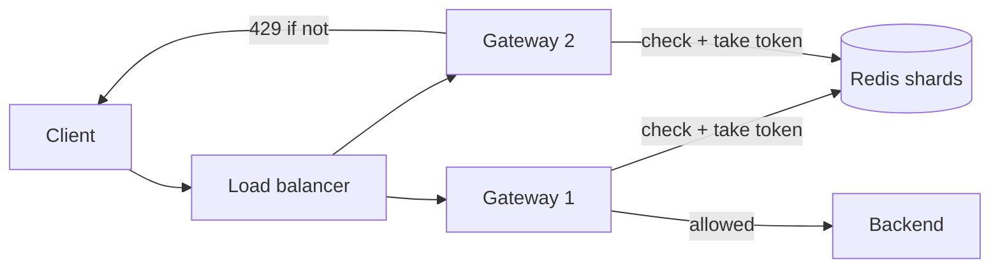

# c02: Rate Limiter — A limit shared by many servers lives in a store, and that store becomes the bottleneck

Case studies · c01 → **c02** → c03

> *"A limit is only as strong as the store that counts it"*
>
> **Concern**: scalability · availability

## The Problem

Your API is public. A developer's script loops and sends 1,000 requests a second. The servers catch fire, the database locks, and every honest user sees a 503. You needed a rate limiter yesterday.

b09 showed how one limiter counts: token bucket, sliding window, and so on. But your API runs on many gateway servers. A request from one client can land on any of them. If each gateway counts on its own, a limit of 100 a minute quietly becomes 100 a minute per gateway. This chapter designs the shared version and asks what it costs to run.

## The Idea

Put the counters in one shared store that every gateway checks before it forwards a request. Redis is the usual choice: fast, in memory, and able to run a small script atomically. The gateway asks "may this client pass?", Redis says yes or no, and a no becomes HTTP 429.



## How It Works

**Constraints.** The vault note sizes the limiter itself: 1 million active users at 100 requests a minute is 100 million a minute, 1.67 million a second on average and 5 million a second at a 3x peak. The limiter sits on every request, so it must add under 5 ms.

Each check is a read and a write, 2 Redis operations. One Redis instance serves about 100,000 operations a second. The sim turns that into load:

```js
// sim.mjs
  const load = opsRps / (shards * REDIS_OPS_PER_INSTANCE);
  const overheadMs = load >= 1 ? TIMEOUT_MS : Math.min(TIMEOUT_MS, BASE_MS / (1 - 0.7 * load));
```

Ten million operations a second on one instance is 10,000% of its capacity. In the sim's first frame 99% of checks would time out.

**Component, the v1 design.** Shard the counters by client key across many Redis masters, each with 2 replicas for failover, behind a fleet of gateways. Sized to run at 70% load, the sim needs 143 shards. Load is 70%, a check adds about 3.9 ms, and the bill is about $267,276 a month.

The check and the increment must be one atomic step. Without that, two gateways both read 99 against a limit of 100, both allow, and the client gets 101. The vault's fix is a small Lua script that checks and increments inside Redis in a single call.

## When It Breaks

At 10x traffic the same 143 shards get 100 million operations a second: 699% load. Checks time out after 10 ms. The vault's advice for a Redis failure is to fail open for most APIs, so the requests go through without being counted. The sim shows 86% of requests never counted. The limiter has stopped shielding the backend at the moment the backend needs it most.

Other things go wrong before then, and the vault lists them: a hot key (one client's counter) lands on a single shard whatever the average looks like; a connection pool that is too small queues checks; and clock skew between gateways makes windows disagree unless the limiter uses Redis's own time.

## The Trade-off

The vault's cheapest lever is to check Redis less often. Each gateway takes a batch of 5 tokens per Redis call and spends them locally, so Redis sees 5 times fewer operations. At 10x the sim needs 286 shards instead of 1,429. The bill is still large, $606,284 a month, but it is a fraction of the alternative.

The price is accuracy. Each gateway may hold up to 4 unspent tokens. A client that reaches 4 gateways can get about 16 extra requests, 16% of a 100-a-minute limit, past the counter. A limit that guards a login page should stay exact and fail closed. A limit that guards a public read API can tolerate the slack and fail open.

So there are two dials, and both give something up. Batch size trades accuracy for load. Failure mode, open or closed, trades availability of the API for protection of the backend.

*Note: the vault contradicts itself here. Its arithmetic says one Redis serves about 100,000 ops a second and 10 million ops a second needs 100 instances, yet its final architecture uses 30 instances at about $26,000 a month. The sim follows the arithmetic, sizes shards to 70% load (assumed), assumes latency rises as 2 ms / (1 - 0.7 x load), a client reaching at most 4 gateways, and a per-client limit of 100 a minute. Its costs are much higher than the vault's total for that reason. Treat the shape as the lesson, not the dollar figure.*

## In The Wild

The vault note describes three limiters. Stripe limits API calls per key and lets safe retries through with idempotency keys. GitHub gives unauthenticated callers a small hourly quota and authenticated OAuth callers a much larger one, and reports the remaining quota in response headers. Cloudflare applies rate rules at its edge against attacks that can reach over 100 million requests a second. All three answer with 429 and a `Retry-After` header, so a well-behaved client knows when to come back.

## Try It

```sh
node course/7_case_studies/c02_rate_limiter/sim.mjs --growth=5 --syncBatch=10
```

You should see four frames. Frame 1 reports `redisLoadPct=10000  uncheckedPct=99`. Frame 2 reports `redisShards=143  redisLoadPct=70  overheadMs=3.9`. Frame 3, at 5x growth, reports `redisLoadPct=350  uncheckedPct=71`. Frame 4 reports `redisShards=72  overshootPct=36  monthlyCostUsd=175700`: batching 10 tokens at a time needs 72 shards instead of 715 and lets 36% of a limit slip past the counter. Run it with the defaults to see 10x growth: 699% load, 86% unchecked, and 286 shards with 16% overshoot.

## Say It In The Interview

1. Ask what to limit (user, IP, API key), how strict (exact or approximate), and what to do on failure (open or closed).
2. Name the algorithm (token bucket for bursts) and where the counter lives: shared Redis, keyed by client.
3. Do the numbers: 5 million requests a second, 2 Redis operations each, 100,000 operations per instance, so it is a sharded cluster.
4. Name the race: check and increment must be one atomic step, a Lua script in Redis.
5. Name the trade-off you would pick: local token batches to cut Redis load, at the cost of accuracy.

## Boundary

b09 is the algorithms: how one limiter counts within a window. This chapter is the distributed design: where the counter lives, how big that store must be, and what happens when it fails. The circuit breaker that decides when to fail open is p12, and consistent placement of keys across shards is p04.

## What's Next

Rate limiting keeps the front door safe. Now the system behind it must send messages to people at scale, through several channels, without losing or duplicating them. A notification system: c03.

## Source notes

- [Design a rate limiter](../../../vault/system_design/05_case_studies/design_rate_limiter.md)
