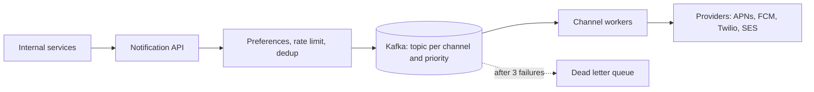

# c03: Notification System — A queue absorbs the load, and priority lanes stop a campaign from burying the one-time codes

Case studies · c02 → **c03** → c04

> *"Deliver the important message first, and the rest when there is room"*
>
> **Concern**: latency · availability

## The Problem

Your app sends push notifications, SMS and email to millions of people. Marketing schedules a campaign for 50 million users, and it goes out at peak time. The login one-time codes sit in the same queue behind it. People cannot sign in for eight minutes while the campaign drains.

Nothing crashed. Every message was accepted and every worker was busy. The system failed a latency promise, under 1 minute for high-priority messages, because it treated a newsletter and a security code as the same kind of work.

## The Idea

A notification system is a pipeline with a queue in the middle. Services send a request to an API. The API checks the user's preferences, rate limits and duplicates, then puts the message on a queue. Channel-specific workers take messages off the queue and hand them to outside providers: APNs and FCM for push, Twilio for SMS, SES for email.



## How It Works

**Constraints.** The vault sets the target: 10 billion notifications a day, at least once, high priority in under a minute. That is about 115,000 a second; the split is 70% push, 10% SMS and 20% email. The sim assumes a peak of twice the average, so 231,481 a second, with 23,148 of them SMS.

The queue decouples arrival from delivery, but the workers behind it must still be big enough. The sim sizes them:

```js
// sim.mjs
const workersFor = (rps) => Math.ceil(rps / (WORKER_RPS * TARGET_LOAD));
```

Sized only for the average, 331 workers cannot keep up with the peak hour: 237.5 million messages pile up and a one-time code waits 1,436 seconds. A queue smooths a short spike; it cannot hide a system that is too small for a sustained one.

**Component, the v1 design.** Sized for the peak, 662 workers carry the load with the backlog at zero, and a message spends about a second in the pipeline. The fleet costs about $99,300 a month.

The vault's pipeline adds four things that keep it correct:

- **Retries.** Wait 1 second, retry, wait 5 seconds, retry, then park the message in a dead letter queue for a human to look at (p10).
- **Idempotent delivery.** Every notification has a unique ID and the worker checks "already sent?" first. At-least-once delivery from the queue plus a dedup check is effectively exactly once (p11).
- **Preferences and rate limits.** Skip opted-out users, delay for quiet hours (10 PM to 8 AM), and cap marketing at 3 pushes an hour per user. Transactional messages such as OTPs and receipts are exempt.
- **Provider failover.** SMS goes Twilio, then Vonage. Email goes SES, then SendGrid. A circuit breaker opens if a provider's error rate stays above 5% for 30 seconds, and half-opens after 60 seconds with 1% of traffic (p12).

## When It Breaks

Now the campaign arrives. Fifty million marketing messages land in a queue that is also carrying one-time codes. At peak the fleet has only about 99,519 a second spare, so the campaign needs 502 seconds to drain. Every code behind it waits about 503 seconds, against a 60-second target. This is the shape of the `notification-firehose` bug scenario: a flood of low-value messages delays the ones that matter.

Retries make it worse. A slow provider makes workers wait, the queue grows, and more messages time out and retry. Back pressure (p14) and a circuit breaker limit the damage; the queue alone does not.

## The Trade-off

The vault's answer is a separate Kafka topic for each channel and priority: `push-high` for codes and security alerts, `push-low` for marketing. High-priority topics get more consumers and faster processing. In the sim, 67 workers (10% of the fleet) are reserved for the 5% of traffic that is high priority. A code now waits about 1 second whatever the campaign does.

That costs two things. The campaign takes 644 seconds instead of 502, so marketing is slower. And 65% of the reserved capacity sits idle in normal traffic: you pay for it to be ready. The reservation is insurance. Raise it and the campaign drains even slower; with `--reservedPct=20` and `--campaignM=100` the campaign needs 2,243 seconds and 83% of the reserved lane idles.

*Note: the vault notes give the 10 billion a day, the 70/10/20 split, the priority topics, the retry and failover rules, and a statement that providers are the usual bottleneck. They do not give a peak factor, a worker's throughput or cost, or the share of high-priority traffic. The sim assumes a 2x peak lasting one hour, 500 messages a second per worker at 70% target load, $150 a worker a month, 5% high priority, and a campaign enqueued all at once. Provider limits are not modelled.*

## In The Wild

The vault names the real providers a design like this depends on: Apple's APNs and Google's FCM for push, which are required and not redundant, Twilio with Vonage as a failover for SMS, and SES with SendGrid as a failover for email. It also notes that the external providers, not Kafka, are usually the bottleneck, so real systems batch where they can and pool connections. The vault gives no company-specific numbers for this case beyond the 10 billion a day target.

## Try It

```sh
node course/7_case_studies/c03_notification_system/sim.mjs --campaignM=100 --reservedPct=20
```

You should see four frames. Frame 1 reports `workers=331  backlogM=237.5  otpDelaySec=1436`. Frame 2 reports `workers=662  backlogM=0  otpDelaySec=1  monthlyCostUsd=99300`. Frame 3 reports `backlogM=100  otpDelaySec=1006  campaignDrainSec=1005`. Frame 4 reports `otpDelaySec=1  campaignDrainSec=2243  idleReservedPct=83`. Run it with the defaults to see the 50M campaign: 503 seconds of code delay, then 644 seconds of drain with priority lanes.

## Say It In The Interview

1. Ask about channels, scale (10 billion a day is about 115,000 a second), delivery guarantee and the latency target for urgent messages.
2. Draw the pipeline: API, validation, priority queues, channel workers, providers, delivery tracker, dead letter queue.
3. Say at-least-once plus an idempotency key gives effectively exactly once.
4. Name the bottleneck: the outside providers. Batch, pool connections, and fail over behind a circuit breaker.
5. Name the failure and the fix: a campaign can starve urgent messages in a shared queue; separate topics per priority, with reserved consumers.

## Boundary

This chapter is the whole pipeline. The queue itself is b05, retries are p10, dedup is p11, the breaker is p12, and per-user limits are b09. The full drill is the `notification-service` case in the Library.

## What's Next

You have shipped messages to people. Now they type to find things. Search that answers on every keystroke needs a very different read path: autocomplete, c04.

## Source notes

- [Design a notification system](../../../vault/system_design/05_case_studies/design_notification_system.md)
- [HLD: notification platform](../../../vault/system_design/10_hld/examples/hld_notification_platform.md)
