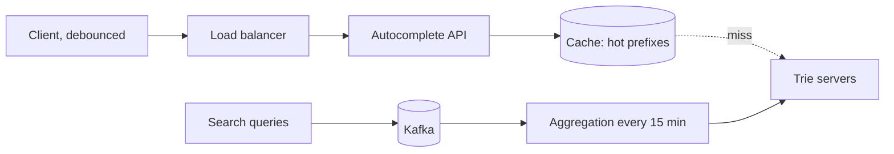

# c04: Search Autocomplete — Pre-compute the answers per prefix, and pay for freshness only where it matters

Case studies · c03 → **c04** → c05

> *"Answer before they finish typing, from an answer you made earlier"*
>
> **Concern**: latency · cost

## The Problem

A search box must show suggestions after every keystroke, in under 100 ms, or it feels broken. Do the arithmetic. Five billion searches a day, about five keystrokes each, is 25 billion suggestion requests a day: roughly 290,000 a second. If each one runs a search over the whole query history, no database survives it.

Then the world changes. Something happens, everyone types the same new phrase, and your suggestions are 15 minutes behind, because that is how often the data refreshes.

## The Idea

Do not search when the user types. Look up an answer prepared in advance. A **trie** is a prefix tree: each step down spells one more letter. Every node stores the top few completions for its prefix, ranked by how often people search them. Typing "tre" walks three nodes and returns a ready-made list such as "tree", "trend", "trek".

The rankings are built offline. Search queries stream into a queue, an aggregation job counts them every 15 minutes, and the trie is rebuilt. Between rebuilds it only reads.



## How It Works

**Constraints.** The vault gives the requirements: show the top 5 to 10 suggestions, under 100 ms, high availability, more than 100,000 queries a second. Its estimate is 5 billion searches a day, 5 keystrokes each, about 290,000 requests a second:

```js
// sim.mjs
  const keystrokeRps = (queriesB * 1e9 * keystrokes) / 86400;
  const debouncedRps = keystrokeRps * (1 - debouncePct / 100);
```

That is 289,352 requests a second. If every one reached a trie server, and one server answers about 20,000 lookups a second (assumed), it would take 21 servers at 70% load.

**Component, the v1 design.** Shrink the load in layers before it reaches the trie:

1. **The client waits.** Debounce sends a request only after the user pauses for 50 to 100 ms, and short prefixes such as one character are not sent at all. The sim assumes this removes 50% of requests, leaving 144,676 a second.
2. **Caches answer the popular prefixes.** The vault lists four levels: browser (1 hour), CDN, Redis for the top 100,000 prefixes, and the trie for the rest. At an 80% hit rate, 28,935 lookups a second reach the trie.
3. **The trie serves the rest.** Three servers run at 48% load. Average latency is 3.6 ms: 80% of requests take 2 ms and 20% take 10 ms.

That is 2 to 3 servers where the raw design needed 21. Everything about the design is about not asking the trie.

## When It Breaks

Failure beat: a trending event multiplies requests by 10. Two things go wrong at once. The queries are new, so they are not in the cache; the sim halves the hit rate to 40% (assumed). They are also not in the trie, which was built up to 15 minutes ago. The 3 servers now get 868,056 lookups a second: 1,447% load. Even if they survive, suggestions for the event are stale or absent, exactly when people care most.

The vault names other risks in passing: rare prefixes miss every cache, and one language or letter range can run hot if the trie is sharded by prefix range (server 1 for a to f, server 2 for g to n).

## The Trade-off

There are two separate purchases. More trie servers buy capacity: 63 of them carry the spike at 69% load. A **trending pipeline** buys freshness. The vault describes it as a separate real-time path that injects fast-rising queries, so they show up in about 2 minutes instead of 15. In the sim the pair costs $16,100 a month against $1,100 for v1.

Most of that bill is a spike you see rarely. Capacity for a 10x spike that lasts an hour is expensive to hold all month; the vault does not say how to size it, so a real design would weigh autoscaling against accepting a degraded answer, for example serving only the cache during the spike. The batch interval is the other dial: refresh every 5 minutes instead of 15 and staleness falls, but the aggregation job runs three times as often.

The vault also suggests never recomputing on every search: that would be too expensive, which is why the trie is batch-built and read-only in between.

*Note: the vault gives the volume, latency target, cache tiers, debounce window and 15-minute batch. It does not give the debounce saving, the hit rate during a spike, a trie server's throughput or any prices. The sim assumes debounce removes 50% of requests, one trie server answers 20,000 lookups a second at 70% load, a Redis read takes 2 ms, the hit rate halves during a spike, and $200, $500 and $3,000 a month for servers, cache and the trending pipeline. The 10 ms trie lookup is the vault's ceiling, used as the average.*

## In The Wild

The vault frames this as the design of Google's search suggestions but gives no Google numbers beyond the question itself. Its building-block note on search gives another way to get the same result: index every prefix of each term as an edge n-gram ("hello" becomes "h", "he", "hel"), or use a completion suggester built on a finite state transducer, for autocomplete under 10 ms inside Elasticsearch. That trades the custom trie for an existing engine, at the cost of less control over ranking and freshness.

## Try It

```sh
node course/7_case_studies/c04_search_autocomplete/sim.mjs --debouncePct=70 --spike=20 --batchMin=5
```

You should see four frames. Frame 2 reports `clientRps=86806  trieRps=17361  trieServers=2  trieLoadPct=43`: more debounce means fewer trie servers. Frame 3 reports `cacheHitPct=40  trieLoadPct=2604  staleMin=5`. Frame 4 reports `trieServers=75  trieLoadPct=69  staleMin=2  monthlyCostUsd=18500`. The defaults give 21, 3 and 63 servers across the three sized frames, and a stale window of 15 minutes falling to 2.

## Say It In The Interview

1. Do the numbers: 5 billion searches, 5 keystrokes, about 290,000 requests a second.
2. Name the data structure: a trie with the top completions pre-computed at each node, so a lookup is a walk, not a search.
3. Layer the caches (browser, CDN, Redis, trie) and debounce on the client. Say that the trie sees a small share of the traffic.
4. Explain freshness: batch aggregation every 15 minutes, plus a fast path for trending queries.
5. Shard the trie by prefix range with read replicas, and mention that letter ranges are uneven.

## Boundary

This chapter is the design of a read path that answers from pre-computed data. Full-text search over documents (an inverted index and ranking such as BM25) is b10. Caching layers are b04, the aggregation queue is b05, and sharding is p03. The full drill is the `search-autocomplete` case in the Library.

## What's Next

Suggestions are pre-computed and read-only between updates, which is why they are easy to scale. Next in the case studies: c05.

## Source notes

- [Design search autocomplete](../../../vault/system_design/05_case_studies/design_search_autocomplete.md)
- [Search systems](../../../vault/system_design/02_building_blocks/search_systems.md)
