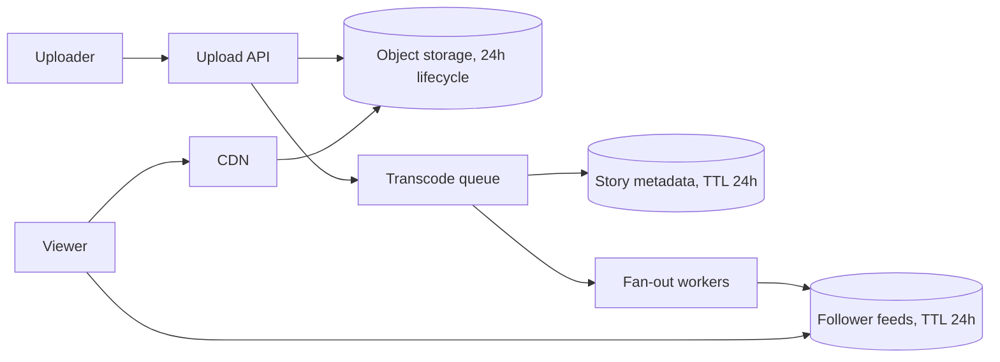

# c05: Instagram Stories — Let everything expire by itself, and do the fan-out work at write time only for ordinary accounts

Case studies · c04 → **c05** → c06

> *"Content that dies in a day should never need a delete job"*
>
> **Concern**: scalability · cost

## The Problem

Your team adds Stories to an app that already has permanent posts, so it reuses the posts design. Stories are stored forever and a cron job deletes the old ones once an hour. Three things go wrong. Stories stay visible up to an hour past their 24-hour deadline. The database has to run deletes for hundreds of millions of rows. And the feed asks every followed account for its recent stories, so opening the tray is slow.

The requirements, from the vault note: 500 million daily users, 60% of them upload at least one story a day, 2.5 stories each, so 750 million stories a day. Playback should start within 200 ms, a story should be processed within 2 seconds of upload, and everything disappears after 24 hours.

## The Idea

An ephemeral system is a bulletin board whose notes erase themselves. The design does not add a deleter. It gives every layer an expiry time: the object store lifecycle rule, the metadata row TTL and the feed entry TTL all drop a story at the same 24-hour mark.

The second idea is how the feed gets built. Each upload is written into the feed of every follower (fan-out on write). Opening the tray then reads one list, and reads far outnumber uploads.



## How It Works

The sim computes the four beats from a handful of inputs. The traffic and storage lines are the heart of it:

```js
// sim.mjs
  const dau = dauM * 1e6;
  const perDay = dau * (uploaderPct / 100) * storiesPer;
  const peakUpload = (perDay / 86400) * PEAK;
  const peakView = ((dau * VIEWS_PER_USER) / 86400) * PEAK;
  const dayPb = (perDay * STORY_MB) / 1e9;
```

1. **Constraints.** 750 million stories a day is 43,403 uploads a second at peak (5x the daily average) and 1,446,759 story views a second. Each story is stored in several renditions, 10.2 MB in total, so a day of stories is 7.7 PB.
2. **The v1 component.** Uploads go to object storage (b07), a queue feeds transcoding workers (b05), and metadata goes in a wide-column store (b03). Views come through a CDN (b06) and feed reads come from a cache (b04).
3. **TTL at every layer.** Storage never exceeds one day of content, so the delete job disappears.
4. **Fan-out on write.** With 150 followers, every upload costs 150 feed writes: 6,510,417 a second at peak.

## When It Breaks

Growth by 10x multiplies uploads to 434,028 a second and storage to 76.5 PB. That part scales by adding machines. The surprise is the fan-out.

An average of 150 followers hides a heavy tail. If just 0.1% of uploads come from accounts with a million followers, the average story costs 1,150 feed writes instead of 150, because the celebrity share alone adds 1,000 writes per story on average. At 10x that is 499,066,840 feed writes a second: 7.7 times what fan-out on write should cost. Note that this comes from a few accounts, not from typical users.

## The Trade-off

The vault note's answer is a hybrid. Accounts above about a million followers skip fan-out. Their stories are pulled when a follower opens the tray and merged into the feed.

- **Won:** feed writes drop to 65,039,063 a second, a 7.7x cut, and a celebrity upload no longer creates a million writes.
- **Paid:** every feed read now includes the pull, adding about 50 ms (the vault note's figure), so a tray open goes from 20 ms to 70 ms in the sim.

Pure fan-out on read was rejected earlier, because reads outnumber uploads about 33 to 1 in this model (1,446,759 views against 43,403 uploads a second) and the read path must be the cheap one. Following 300 accounts means 300 queries per open: 2,100 ms in the sim.

*Note: the 7 ms per Cassandra read, the 20 ms Redis read, the 300 followed accounts, the 30-day retention of the naive design, and the 0.1% celebrity upload share are this sim's assumptions. The vault note gives the "2+ seconds" outcome and the 50 ms celebrity cost but not these inputs. The note also mentions a 2 MB story in one place and 10.2 MB in its capacity section; the sim uses 10.2 MB.*

## In The Wild

The vault note describes Instagram Stories and WhatsApp Status. The pattern to remember is the combination: object-store lifecycle rules, database TTLs, a cached feed, and a celebrity exception. Its cost claim is the striking part. Without expiry the same traffic would store 229.5 PB in 30 days, costing $5,278K a month in the sim against $176K for one day.

## Try It

```sh
node course/7_case_studies/c05_instagram_stories/sim.mjs --growth=10
```

You should see four frames. The third reports `peakUploadRps=434028  peakViewRps=14467593  storagePb=76.5  storageCostK=1760  feedWriteRps=499066840  feedReadMs=20`, and the fourth cuts `feedWriteRps` to 65039063 while `feedReadMs` rises to 70. Try `--celebPct=0` to see the celebrity effect vanish (the failure and trade-off frames then match), then `--followers=500` to see ordinary fan-out grow.

## Say It In The Interview

1. Do the numbers first: 750M stories a day, 43K uploads a second at peak, about 7.7 PB a day.
2. Say expiry belongs in every layer as a TTL, not in a delete job.
3. Choose fan-out on write for reads that vastly outnumber writes, and name the celebrity problem before being asked.
4. Give the hybrid: skip fan-out for huge accounts and pay about 50 ms at read time.

## Boundary

This chapter covers an ephemeral feed at Instagram scale. Video processing internals, recommendations and story ranking are not covered. General rate limiting of uploads is b09.

## What's Next

Stories are short-lived and mostly viewed once. Music is the opposite: a small catalog played over and over, where the challenge is bandwidth and startup time. That is Spotify: c06.

## Source notes

- [Design Instagram Stories](../../../vault/system_design/05_case_studies/design_instagram_stories.md)
